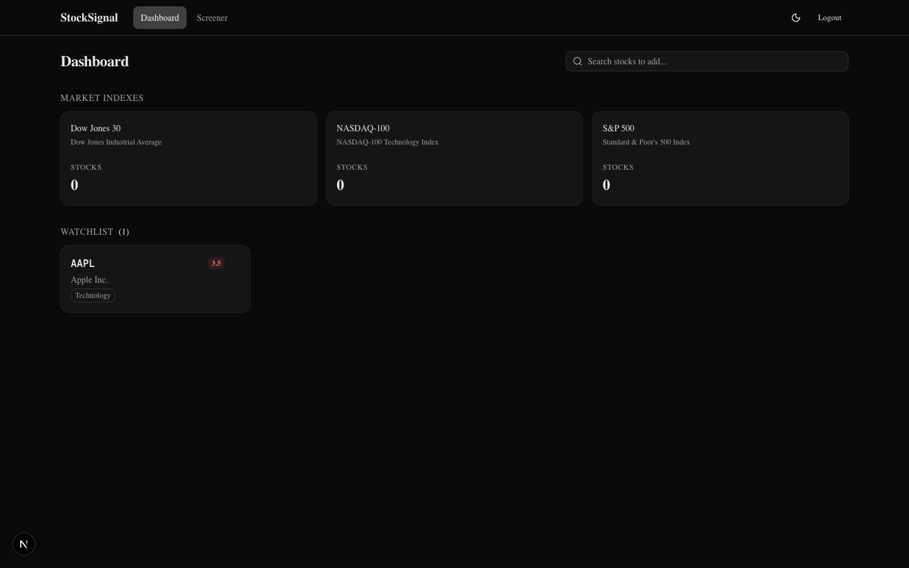
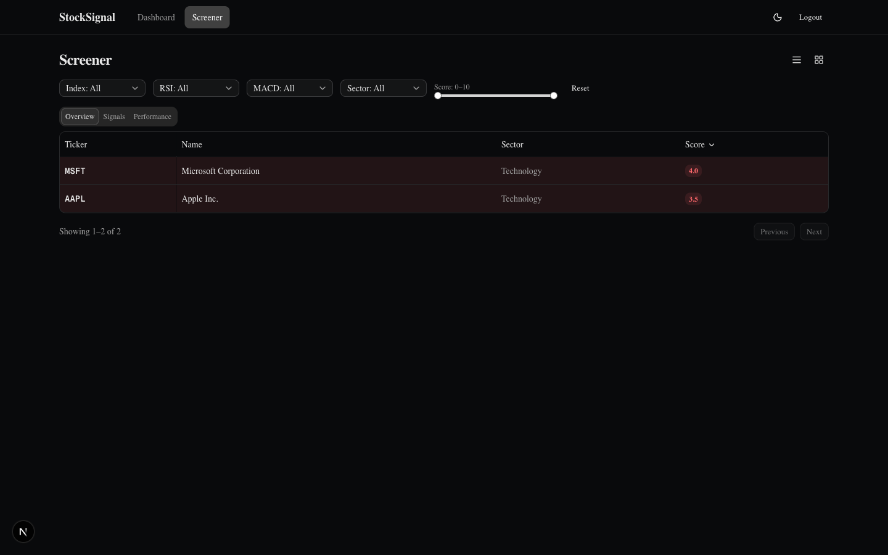
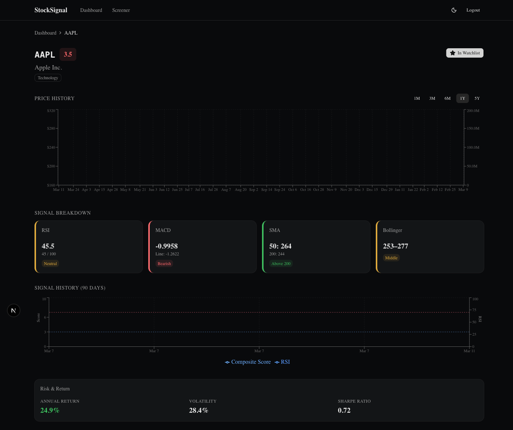
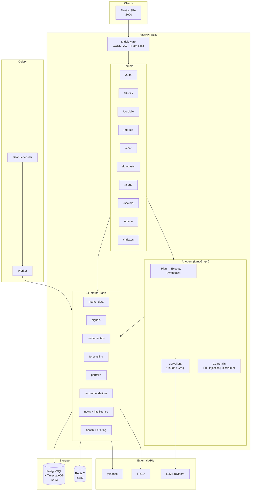

# Stock Signal Platform

A personal investment decision-support system for US equities. Combines technical analysis, fundamental scoring, Prophet forecasting, portfolio tracking, and an AI financial analyst — all in a dark command-center UI designed for busy professionals who want data-driven guidance without becoming full-time traders.

> **Philosophy:** "Tell me what to do and show me why." Every recommendation comes with confidence scoring, evidence lineage, and bull/base/bear scenarios. No hallucinated numbers, no opinions disguised as facts.

## Screenshots

| Dashboard | Screener | Stock Detail |
|-----------|----------|--------------|
|  |  |  |

## Who Is This For?

Passive investors — professionals who:

- Have savings they want to grow beyond index funds and savings accounts
- Don't have time to monitor markets daily or learn candlestick patterns
- Want to make informed stock picks but feel overwhelmed by the volume of financial data
- Are comfortable with technology and want to automate what can be automated
- Invest primarily in US equity markets (stocks + ETFs)

**Typical user profile:** 30-50 year old tech professional, $15K-$150K portfolio, 15-30 minutes/day for investment decisions.

## What Does It Do?

### Signal Engine

Computes technical and fundamental indicators for 500+ stocks, synthesized into a single **composite score (0-10)** that blends:

| Technical Signals (50%) | Fundamental Signals (50%) |
|------------------------|--------------------------|
| RSI (14-period) — overbought/oversold | P/E Ratio |
| MACD (12,26,9) — momentum | PEG Ratio |
| SMA 50/200 Crossover — golden/death cross | Free Cash Flow Yield |
| Bollinger Bands (20,2) — volatility position | Debt-to-Equity |
| Annualized Return, Volatility, Sharpe Ratio | Piotroski F-Score (9 criteria) |
| | Revenue/Earnings Growth, Margins, ROE |

**Score interpretation:** 8-10 = BUY, 5-7 = WATCH, <5 = AVOID. Scores are portfolio-aware — if you already hold a stock at full allocation, it becomes HOLD instead of BUY.

### AI Financial Analyst (Chat)

A conversational interface powered by LangGraph that can answer questions like:

- *"Should I buy AAPL right now?"*
- *"Compare NVDA and AMD"*
- *"How is my portfolio exposed to tech?"*
- *"What are the risks of holding TSLA?"*

The agent uses a **Plan → Execute → Synthesize** architecture:
1. **Planner** (Claude Sonnet) classifies your question, detects stale data, generates a tool execution plan
2. **Executor** (mechanical, no LLM) calls tools in order, validates results, retries on failure
3. **Synthesizer** (Claude Sonnet) produces confidence-weighted analysis with bull/base/bear scenarios

24 internal tools across market data, signals, fundamentals, forecasting, portfolio, recommendations, dividends, risk analysis, and intelligent aggregation (portfolio health, market briefings, stock intelligence, multi-signal recommendations). Every claim traces back to a specific data source and timestamp.

### Prophet Forecasting

- Stock-level + 11 SPDR sector ETF + portfolio-level forecasts
- 90/180/270-day prediction horizons
- Biweekly model retraining with drift detection (MAPE > 20% triggers automatic retrain)
- VIX regime overlay for forecast confidence
- Forecast accuracy tracking and evaluation against actuals

### Portfolio Tracker

- FIFO-based P&L computation across BUY/SELL transactions
- Real-time position values with unrealized gain/loss
- Sector allocation breakdown with concentration warnings
- Dividend tracking with full payment history
- Divestment rules engine (stop-loss, concentration limits, fundamental deterioration)
- Rebalancing suggestions with specific dollar amounts
- Daily portfolio snapshots for historical value tracking

### Stock Screener

- Filter and sort 500+ stocks by any signal, score, sector, or index membership
- Server-side pagination with URL state for shareable filter configurations
- Color-coded rows: green (strong buy), yellow (watch), red (avoid)
- Column presets: Overview, Signals, Performance

### Nightly Automation Pipeline

An 8-step Celery Beat pipeline runs at 9:30 PM ET every trading day:

1. **Price refresh** — fetch latest prices, recompute all signals
2. **Forecast refresh** — re-predict using active Prophet models
3. **Recommendations** — generate BUY/SELL/WATCH/AVOID per user
4. **Forecast evaluation** — compare matured predictions vs actuals
5. **Recommendation evaluation** — compare past calls vs SPY benchmark at 30/90/180d
6. **Drift detection** — MAPE drift + volatility spikes + VIX regime
7. **Alert generation** — signal flips, new buy opportunities, drift warnings
8. **Portfolio snapshots** — capture end-of-day portfolio value

### In-App Alerts

Bell icon with unread count. Alert categories:
- Signal flip (e.g., RSI moved from oversold to neutral)
- New buy recommendation
- Drift warning (model accuracy degrading)
- Divestment rule triggered

## Data Sources

| Source | Data | Cost |
|--------|------|------|
| [yfinance](https://github.com/ranaroussi/yfinance) | OHLCV prices, fundamentals, analyst targets, earnings, dividends, company profile | Free |
| [FRED API](https://fred.stlouisfed.org/docs/api/) | Macro indicators (yield curve, unemployment, GDP) | Free (API key required) |
| [SerpAPI](https://serpapi.com/) | Web/news search for the AI agent | Free tier (100 searches/month) |
| Wikipedia | S&P 500, NASDAQ-100, Dow 30 constituent lists | Free |

No paid data subscriptions required. All core functionality works with just the free yfinance library.

## Tech Stack

| Layer | Technology |
|-------|-----------|
| **Backend** | Python 3.12, FastAPI, async SQLAlchemy 2.0, Pydantic v2 |
| **Frontend** | Next.js 15, TypeScript, Tailwind CSS, shadcn/ui, Recharts, TanStack Query |
| **Database** | PostgreSQL 16 + TimescaleDB (time-series hypertables) |
| **Cache/Broker** | Redis 7 |
| **AI/ML** | LangGraph (agent orchestration), Claude Sonnet (LLM), Prophet (forecasting) |
| **Background** | Celery + Celery Beat (task scheduling) |
| **Auth** | JWT (httpOnly cookies + Bearer tokens), bcrypt password hashing |
| **Package Management** | uv (Python), npm (Node.js) |
| **CI/CD** | GitHub Actions (lint, test, build), branch protection on main + develop |

## System Requirements

| Requirement | Minimum | Recommended |
|-------------|---------|-------------|
| **OS** | macOS, Linux, or WSL2 | macOS or Ubuntu 22+ |
| **Python** | 3.12+ | 3.12 |
| **Node.js** | 20+ | 22+ |
| **Docker** | Docker Desktop or Docker Engine | Docker Desktop |
| **RAM** | 4 GB | 8 GB (Prophet model training is memory-intensive) |
| **Disk** | 2 GB (deps + data) | 5 GB |
| **CPU** | 2 cores | 4 cores |

> **Note:** Native Windows is not supported. Use WSL2 on Windows.

## API Keys Required

| Key | Required? | Purpose | Get It |
|-----|-----------|---------|--------|
| `ANTHROPIC_API_KEY` | **Yes** | AI agent (Claude Sonnet for planning + synthesis) | [console.anthropic.com](https://console.anthropic.com/settings/keys) |
| `JWT_SECRET_KEY` | **Yes** | Authentication tokens (generate: `python -c "import secrets; print(secrets.token_hex(32))"`) | Self-generated |
| `GROQ_API_KEY` | No | Fast/cheap LLM fallback for tool-calling loops | [console.groq.com](https://console.groq.com/keys) |
| `SERPAPI_API_KEY` | No | Web/news search tool in AI agent | [serpapi.com](https://serpapi.com/manage-api-key) |
| `FRED_API_KEY` | No | Federal Reserve macro data (yield curve, unemployment) | [fred.stlouisfed.org](https://fred.stlouisfed.org/docs/api/api_key.html) |
| `OPENAI_API_KEY` | No | Additional LLM fallback (GPT models) | [platform.openai.com](https://platform.openai.com/api-keys) |

**Minimum to get started:** Just `ANTHROPIC_API_KEY` and a self-generated `JWT_SECRET_KEY`. Everything else is optional.

## Installation

### Automated (Recommended)

```bash
git clone https://github.com/vipulbhatia29/stock-signal-platform.git
cd stock-signal-platform
chmod +x setup.sh run.sh
./setup.sh              # Installs deps, starts Docker, runs migrations
./run.sh start          # Starts all services (backend, frontend, Celery)
```

Run `./setup.sh --check` to verify prerequisites without installing anything.

### Manual Setup

#### 1. Clone and configure

```bash
git clone https://github.com/vipulbhatia29/stock-signal-platform.git
cd stock-signal-platform
cp backend/.env.example backend/.env    # Edit with your API keys
```

#### 2. Start infrastructure

```bash
docker compose up -d                    # TimescaleDB on :5433, Redis on :6380
```

#### 3. Install dependencies

```bash
uv sync                                 # Python dependencies
cd frontend && npm install && cd ..     # Frontend dependencies
```

#### 4. Initialize database

```bash
uv run alembic upgrade head             # Run all migrations (11 total)
```

#### 5. Bootstrap data

Run in order — each step depends on the previous:

```bash
# Step 1: Stock universe — S&P 500 constituents (~503 stocks)
uv run python -m scripts.sync_sp500

# Step 2: ETFs — 12 SPDR sector ETFs + SPY benchmark, 2 years of prices
uv run python -m scripts.seed_etfs

# Step 3: Prices + signals — 10 years of OHLCV, computes all technical indicators
uv run python -m scripts.seed_prices --universe

# Step 4: Index memberships — NASDAQ-100, Dow 30
uv run python -m scripts.sync_indexes

# Step 5: Fundamentals — P/E, Piotroski, analyst targets, earnings, margins
uv run python -m scripts.seed_fundamentals --universe

# Step 6: Dividends — full payment history
uv run python -m scripts.seed_dividends --universe

# Step 7: Forecasts — train Prophet models, generate 90/180/270d predictions
uv run python -m scripts.seed_forecasts --universe
```

**Timing:** Steps 1-4 ~2 min, Steps 5-6 ~10 min each, Step 7 ~3 min. Full bootstrap: ~25 minutes.

All scripts support `--dry-run` (preview without writing) and `--tickers AAPL MSFT` (seed specific tickers).

#### 6. Start services

```bash
# Terminal 1: Backend API
uv run uvicorn backend.main:app --reload --port 8181

# Terminal 2: Frontend
cd frontend && npm run dev              # http://localhost:3000

# Terminal 3: Celery worker (background tasks)
uv run celery -A backend.tasks worker --loglevel=info

# Terminal 4 (optional): Celery Beat (scheduled tasks — nightly pipeline, etc.)
uv run celery -A backend.tasks beat --loglevel=info
```

Or use the convenience script: `./run.sh start` (starts everything), `./run.sh stop`, `./run.sh status`.

#### 7. Create your account

Open http://localhost:3000, register with email + password, and start adding tickers to your watchlist.

## Architecture



## Project Structure

```
stock-signal-platform/
├── backend/
│   ├── main.py              # FastAPI entry point, lifespan, middleware
│   ├── config.py            # Pydantic Settings (.env loader)
│   ├── database.py          # Async SQLAlchemy session factory
│   ├── models/              # SQLAlchemy ORM (Stock, Signal, Portfolio, Chat, Forecast...)
│   ├── routers/             # FastAPI route handlers (auth, stocks, portfolio, chat, alerts)
│   ├── tools/               # Business logic (signals, fundamentals, forecasting, recommendations)
│   ├── agents/              # LangGraph AI agents (planner, executor, synthesizer)
│   ├── tasks/               # Celery background tasks (nightly pipeline, retraining)
│   └── migrations/          # Alembic migrations (11 total)
├── frontend/
│   ├── src/app/             # Next.js App Router pages
│   ├── src/components/      # React components (dashboard, screener, portfolio, chat)
│   ├── src/hooks/           # Custom hooks (auth, streaming, data fetching)
│   ├── src/lib/             # API client, auth, chart theme, utilities
│   └── src/types/           # TypeScript API type definitions
├── scripts/                 # Bootstrap and sync scripts
├── tests/
│   ├── unit/                # Unit tests (by domain: signals, portfolio, agents, forecasting)
│   ├── api/                 # API endpoint tests (testcontainers for DB isolation)
│   ├── integration/         # Integration tests
│   └── e2e/                 # End-to-end Playwright tests
├── docs/                    # PRD, FSD, TDD, specs, plans
├── docker-compose.yml       # TimescaleDB + Redis
├── setup.sh                 # Automated setup script
├── run.sh                   # Service management script
└── pyproject.toml           # Python dependencies (managed by uv)
```

## Testing

```bash
# Backend unit tests
uv run pytest tests/unit/ -v

# Backend API tests (uses testcontainers — spins up isolated Postgres)
uv run pytest tests/api/ -v

# Frontend component tests
cd frontend && npm test

# All backend tests
uv run pytest tests/ -v

# Linting
uv run ruff check backend/ tests/      # Python lint
uv run ruff format backend/ tests/     # Python format
cd frontend && npm run lint             # TypeScript/React lint
```

**Test coverage:** 596 unit + 174 API + 7 e2e + 4 integration + 107 frontend = **888 total tests**.

## API Endpoints

| Endpoint | Method | Description |
|----------|--------|-------------|
| `/api/v1/auth/register` | POST | Create account |
| `/api/v1/auth/login` | POST | Login (returns JWT in httpOnly cookie) |
| `/api/v1/auth/refresh` | POST | Refresh access token |
| `/api/v1/stocks/{ticker}/signals` | GET | Current technical + fundamental signals |
| `/api/v1/stocks/{ticker}/prices` | GET | Historical OHLCV prices |
| `/api/v1/stocks/{ticker}/fundamentals` | GET | P/E, PEG, FCF yield, Piotroski, margins |
| `/api/v1/stocks/signals/bulk` | GET | Screener — filter/sort/paginate 500+ stocks |
| `/api/v1/stocks/{ticker}/ingest` | POST | On-demand data ingestion for any ticker |
| `/api/v1/stocks/{ticker}/news` | GET | News articles from yfinance + Google News RSS |
| `/api/v1/stocks/{ticker}/intelligence` | GET | Analyst upgrades, insider trades, earnings calendar |
| `/api/v1/portfolio/transactions` | POST/GET/DELETE | Log and manage BUY/SELL transactions |
| `/api/v1/portfolio/positions` | GET | Current holdings with live P&L |
| `/api/v1/portfolio/summary` | GET | KPI totals + sector allocation |
| `/api/v1/portfolio/rebalancing` | GET | Position sizing suggestions |
| `/api/v1/chat/stream` | POST | AI agent chat (NDJSON streaming) |
| `/api/v1/forecasts/{ticker}` | GET | Prophet forecast with confidence bands |
| `/api/v1/alerts` | GET | In-app alerts (signal flips, new buys, drift) |
| `/api/v1/recommendations` | GET | Today's actionable BUY/SELL/WATCH items |
| `/api/v1/portfolio/health` | GET | Portfolio health score + component breakdown |
| `/api/v1/market/briefing` | GET | Market overview with portfolio context |

Full API docs available at http://localhost:8181/docs (Swagger UI) when the backend is running.

## Configuration

All configuration is via environment variables in `backend/.env`. See `backend/.env.example` for the full list with descriptions.

Key settings:

| Variable | Default | Description |
|----------|---------|-------------|
| `DATABASE_URL` | `postgresql+asyncpg://...localhost:5433/stocksignal` | Postgres connection string |
| `REDIS_URL` | `redis://localhost:6380/0` | Redis connection string |
| `CORS_ORIGINS` | `http://localhost:3000` | Allowed frontend origins |
| `RATE_LIMIT_PER_MINUTE` | `60` | API rate limit per user |
| `ACCESS_TOKEN_EXPIRE_MINUTES` | `60` | JWT access token TTL |
| `REFRESH_TOKEN_EXPIRE_DAYS` | `7` | JWT refresh token TTL |
| `USER_TIMEZONE` | `America/New_York` | Timezone for market hours |
| `AGENT_V2` | `true` | Enable Plan→Execute→Synthesize agent (vs legacy ReAct) |

## Development

- **Package manager:** [uv](https://docs.astral.sh/uv/) for Python, npm for Node.js. Never use `pip install`.
- **Branching:** `main` (production) ← `develop` (integration) ← `feat/KAN-*` (feature branches). All PRs target `develop`.
- **Pre-commit hooks:** Ruff lint + format, frontend lint — installed automatically.
- **CI:** GitHub Actions runs on every PR: backend lint, frontend lint, backend tests (with testcontainers), frontend tests.

## License

Private project. Not licensed for redistribution.
