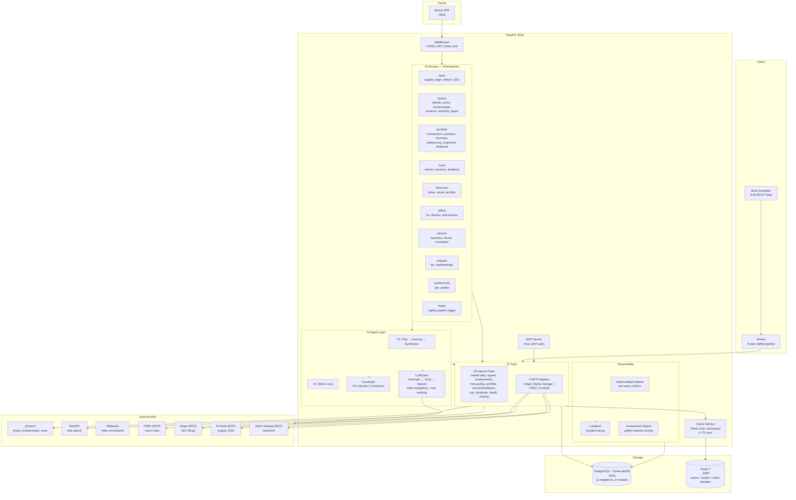

# Stock Signal Platform

An investment decision-support platform for US equities. Combines technical analysis, fundamental scoring, Prophet forecasting, portfolio tracking, and an AI financial analyst — all in a dark command-center UI designed for busy professionals who want data-driven guidance without becoming full-time traders.

> **Philosophy:** "Tell me what to do and show me why." Every recommendation comes with confidence scoring, evidence lineage, and bull/base/bear scenarios. No hallucinated numbers, no opinions disguised as facts.

## Screenshots

| Dashboard | Screener | Stock Detail |
|-----------|----------|--------------|
|  |  |  |

## Who Is This For?

Part-time investors — professionals who:

- Have savings they want to grow beyond index funds and savings accounts
- Don't have time to monitor markets daily or learn candlestick patterns
- Want to make informed stock picks but feel overwhelmed by the volume of financial data
- Are comfortable with technology and want to automate what can be automated
- Invest primarily in US equity markets (stocks + ETFs)

**Typical user profile:** 30-50 year old tech professional, $15K-$150K portfolio, 15-30 minutes/day for investment decisions.

## What Does It Do?

### Signal Engine

Computes technical and fundamental indicators for 500+ stocks, synthesized into a single **composite score (0-10)** that blends:

| Technical Signals (50%) | Fundamental Signals (50%) |
|------------------------|--------------------------|
| RSI (14-period) — overbought/oversold | P/E Ratio |
| MACD (12,26,9) — momentum | PEG Ratio |
| SMA 50/200 Crossover — golden/death cross | Free Cash Flow Yield |
| Bollinger Bands (20,2) — volatility position | Debt-to-Equity |
| Annualized Return, Volatility, Sharpe Ratio | Piotroski F-Score (9 criteria) |
| | Revenue/Earnings Growth, Margins, ROE |

**Score interpretation:** 8-10 = BUY, 5-7 = WATCH, <5 = AVOID. Scores are portfolio-aware — if you already hold a stock at full allocation, it becomes HOLD instead of BUY.

### AI Financial Analyst (Chat)

A conversational interface powered by LangGraph that can answer questions like:

- *"Should I buy AAPL right now?"*
- *"Compare NVDA and AMD"*
- *"How is my portfolio exposed to tech?"*
- *"What are the risks of holding TSLA?"*

The agent uses a dual architecture:

**Plan-Execute-Synthesize (V2)** — structured pipeline for complex queries:
1. **Planner** (Claude Sonnet) classifies your question, detects stale data, generates a tool execution plan
2. **Executor** (mechanical, no LLM) calls tools in order, validates results, retries on failure
3. **Synthesizer** (Claude Sonnet) produces confidence-weighted analysis with bull/base/bear scenarios

**ReAct Loop (V1)** — iterative reasoning for open-ended exploration:
1. **Intent** — understand what the user is asking
2. **Plan** — decide which tool to call next
3. **Execute** — call the tool and observe results
4. **Reason** — decide if more tools are needed or if the answer is ready

Both architectures share 20 internal tools and 4 MCP adapters, with guardrails for PII detection, prompt injection defense, and automatic disclaimer insertion. Every claim traces back to a specific data source and timestamp.

### LLM Factory

Multi-provider cascade with automatic failover:

| Provider | Role | Use Case |
|----------|------|----------|
| **Anthropic** (Claude Sonnet) | Primary | Planning, synthesis, complex reasoning |
| **Groq** (Llama/Mixtral) | Fast fallback | Tool-calling loops, simple queries |
| **OpenAI** (GPT-4o) | Secondary fallback | Additional capacity |

Features token budgeting per tier (planner/executor/synthesizer), cost tracking per query, and Redis-backed rate limiting with Lua scripts for atomic operations.

### Prophet Forecasting

- Stock-level + 11 SPDR sector ETF + portfolio-level forecasts
- 90/180/270-day prediction horizons
- Biweekly model retraining with drift detection (MAPE > 20% triggers automatic retrain)
- VIX regime overlay for forecast confidence
- Forecast accuracy tracking and evaluation against actuals

### Portfolio Tracker

- FIFO-based P&L computation across BUY/SELL transactions
- Real-time position values with unrealized gain/loss
- Sector allocation breakdown with concentration warnings
- Dividend tracking with full payment history
- Divestment rules engine (stop-loss, concentration limits, fundamental deterioration)
- Rebalancing suggestions with specific dollar amounts
- Daily portfolio snapshots for historical value tracking

### Stock Screener

- Filter and sort 500+ stocks by any signal, score, sector, or index membership
- Server-side pagination with URL state for shareable filter configurations
- Color-coded rows: green (strong buy), yellow (watch), red (avoid)
- Column presets: Overview, Signals, Performance

### Nightly Automation Pipeline

An 8-step Celery Beat pipeline runs at 9:30 PM ET every trading day:

1. **Price refresh** — fetch latest prices, recompute all signals
2. **Forecast refresh** — re-predict using active Prophet models
3. **Recommendations** — generate BUY/SELL/WATCH/AVOID per user
4. **Forecast evaluation** — compare matured predictions vs actuals
5. **Recommendation evaluation** — compare past calls vs SPY benchmark at 30/90/180d
6. **Drift detection** — MAPE drift + volatility spikes + VIX regime
7. **Alert generation** — signal flips, new buy opportunities, drift warnings
8. **Portfolio snapshots** — capture end-of-day portfolio value

### In-App Alerts

Bell icon with unread count, severity-colored badges, and undo dismiss. Alert categories:
- Signal flip (e.g., RSI moved from oversold to neutral)
- New buy recommendation
- Drift warning (model accuracy degrading)
- Divestment rule triggered

### Observability

Every AI interaction is instrumented end-to-end:
- **Per-query cost tracking** — see exactly what each chat message costs across LLM providers
- **Langfuse tracing** — parallel traces for chat sessions, ReAct loop spans, and LLM generations
- **Provider cascade metrics** — fallback rates, latency percentiles, token usage by tier
- **Assessment engine** — golden dataset of 20 queries scored across 5 dimensions for regression detection

### MCP Tool Server

The platform exposes its tool registry via [Model Context Protocol](https://modelcontextprotocol.io/) (MCP), mounted at `/mcp` with JWT authentication. This lets external AI tools (Claude Code, Cursor, etc.) call any of the 24 registered tools directly — search stocks, get signals, run forecasts, check portfolio exposure — all through a standardized protocol.

### Cache Service

Redis-backed caching with a 3-tier namespace system:

| Namespace | Scope | Example |
|-----------|-------|---------|
| `app:` | Shared across all users | Market data, stock metadata |
| `user:` | Per-user isolation | Portfolio summaries, recommendations |
| `session:` | Per-chat session | Agent tool results during a conversation |

Four TTL tiers: volatile (60s), standard (5min), stable (1hr), session (until chat ends). Warm-up on startup, nightly invalidation after pipeline runs.

## Data Sources

| Source | Data | Cost |
|--------|------|------|
| [yfinance](https://github.com/ranaroussi/yfinance) | OHLCV prices, fundamentals, analyst targets, earnings, dividends, news | Free |
| [FRED API](https://fred.stlouisfed.org/docs/api/) | Macro indicators — yield curve, unemployment, GDP (via MCP) | Free (API key) |
| [Edgar](https://www.sec.gov/edgar/) | SEC filings — 10-K, 10-Q, 8-K (via MCP) | Free |
| [Finnhub](https://finnhub.io/) | Analyst ratings, ESG scores, supply chain data (via MCP) | Free tier |
| [Alpha Vantage](https://www.alphavantage.co/) | News sentiment analysis (via MCP) | Free tier |
| [SerpAPI](https://serpapi.com/) | Web/news search for the AI agent | Free tier (100/month) |
| Wikipedia | S&P 500, NASDAQ-100, Dow 30 constituent lists | Free |

No paid data subscriptions required. All core functionality works with just the free yfinance library.

## Tech Stack

| Layer | Technology |
|-------|-----------|
| **Backend** | Python 3.12, FastAPI, async SQLAlchemy 2.0, Pydantic v2 |
| **Frontend** | Next.js 15, TypeScript, Tailwind CSS v4, shadcn/ui (base-ui), Recharts, TanStack Query |
| **Database** | PostgreSQL 16 + TimescaleDB (time-series hypertables) |
| **Cache/Broker** | Redis 7 (cache + Celery broker + JWT token blocklist) |
| **AI/ML** | LangGraph (agent orchestration), Claude Sonnet (LLM), Prophet (forecasting) |
| **LLM Providers** | Anthropic (primary), Groq (fast fallback), OpenAI (secondary) |
| **Observability** | Langfuse (tracing), ObservabilityCollector (metrics), Assessment Engine (eval) |
| **Background** | Celery + Celery Beat (task scheduling) |
| **Auth** | JWT (httpOnly cookies + Bearer tokens), bcrypt password hashing |
| **MCP** | FastMCP server (tool exposure), 4 MCP adapters (external data) |
| **Package Management** | uv (Python), npm (Node.js) |
| **CI/CD** | GitHub Actions (lint, test, build), branch protection on main + develop |

## System Requirements

| Requirement | Minimum | Recommended |
|-------------|---------|-------------|
| **OS** | macOS, Linux, or WSL2 | macOS or Ubuntu 22+ |
| **Python** | 3.12+ | 3.12 |
| **Node.js** | 20+ | 22+ |
| **Docker** | Docker Desktop or Docker Engine | Docker Desktop |
| **RAM** | 4 GB | 8 GB (Prophet model training is memory-intensive) |
| **Disk** | 2 GB (deps + data) | 5 GB |
| **CPU** | 2 cores | 4 cores |

> **Note:** Native Windows is not supported. Use WSL2 on Windows.

## API Keys Required

| Key | Required? | Purpose | Get It |
|-----|-----------|---------|--------|
| `ANTHROPIC_API_KEY` | **Yes** | AI agent (Claude Sonnet for planning + synthesis) | [console.anthropic.com](https://console.anthropic.com/settings/keys) |
| `JWT_SECRET_KEY` | **Yes** | Authentication tokens (generate: `python -c "import secrets; print(secrets.token_hex(32))"`) | Self-generated |
| `GROQ_API_KEY` | No | Fast/cheap LLM fallback for tool-calling loops | [console.groq.com](https://console.groq.com/keys) |
| `OPENAI_API_KEY` | No | Additional LLM fallback (GPT models) | [platform.openai.com](https://platform.openai.com/api-keys) |
| `SERPAPI_API_KEY` | No | Web/news search tool in AI agent | [serpapi.com](https://serpapi.com/manage-api-key) |
| `FRED_API_KEY` | No | Federal Reserve macro data (yield curve, unemployment) | [fred.stlouisfed.org](https://fred.stlouisfed.org/docs/api/api_key.html) |
| `FINNHUB_API_KEY` | No | Analyst ratings, ESG scores, supply chain | [finnhub.io](https://finnhub.io/register) |
| `ALPHA_VANTAGE_API_KEY` | No | News sentiment analysis | [alphavantage.co](https://www.alphavantage.co/support/#api-key) |

**Minimum to get started:** Just `ANTHROPIC_API_KEY` and a self-generated `JWT_SECRET_KEY`. Everything else is optional.

## Installation

### Automated (Recommended)

```bash
git clone https://github.com/vipulbhatia29/stock-signal-platform.git
cd stock-signal-platform
chmod +x setup.sh run.sh
./setup.sh              # Installs deps, starts Docker, runs migrations
./run.sh start          # Starts all services (backend, frontend, Celery)
```

Run `./setup.sh --check` to verify prerequisites without installing anything.

### Manual Setup

#### 1. Clone and configure

```bash
git clone https://github.com/vipulbhatia29/stock-signal-platform.git
cd stock-signal-platform
cp backend/.env.example backend/.env    # Edit with your API keys
```

#### 2. Start infrastructure

```bash
docker compose up -d                    # TimescaleDB on :5433, Redis on :6380
```

#### 3. Install dependencies

```bash
uv sync                                 # Python dependencies
cd frontend && npm install && cd ..     # Frontend dependencies
```

#### 4. Initialize database

```bash
uv run alembic upgrade head             # Run all 12 migrations
```

#### 5. Bootstrap data

Run in order — each step depends on the previous:

```bash
# Step 1: Stock universe — S&P 500 constituents (~503 stocks)
uv run python -m scripts.sync_sp500

# Step 2: ETFs — 12 SPDR sector ETFs + SPY benchmark, 2 years of prices
uv run python -m scripts.seed_etfs

# Step 3: Prices + signals — 10 years of OHLCV, computes all technical indicators
uv run python -m scripts.seed_prices --universe

# Step 4: Index memberships — NASDAQ-100, Dow 30
uv run python -m scripts.sync_indexes

# Step 5: Fundamentals — P/E, Piotroski, analyst targets, earnings, margins
uv run python -m scripts.seed_fundamentals --universe

# Step 6: Dividends — full payment history
uv run python -m scripts.seed_dividends --universe

# Step 7: Forecasts — train Prophet models, generate 90/180/270d predictions
uv run python -m scripts.seed_forecasts --universe
```

**Timing:** Steps 1-4 ~2 min, Steps 5-6 ~10 min each, Step 7 ~3 min. Full bootstrap: ~25 minutes.

All scripts support `--dry-run` (preview without writing) and `--tickers AAPL MSFT` (seed specific tickers).

#### 6. Start services

```bash
# Terminal 1: Backend API
uv run uvicorn backend.main:app --reload --port 8181

# Terminal 2: Frontend
cd frontend && npm run dev              # http://localhost:3000

# Terminal 3: Celery worker (background tasks)
uv run celery -A backend.tasks worker --loglevel=info

# Terminal 4 (optional): Celery Beat (scheduled tasks — nightly pipeline, etc.)
uv run celery -A backend.tasks beat --loglevel=info
```

Or use the convenience script: `./run.sh start` (starts everything), `./run.sh stop`, `./run.sh status`.

#### 7. Create your account

Open http://localhost:3000, register with email + password, and start adding tickers to your watchlist.

## Architecture



## Project Structure

```
stock-signal-platform/
├── backend/
│   ├── main.py              # FastAPI entry point, lifespan, middleware, tool registration
│   ├── config.py            # Pydantic Settings (.env loader)
│   ├── database.py          # Async SQLAlchemy session factory
│   ├── validation.py        # Input validation (TickerPath, signal enums, dedup)
│   ├── guards.py            # Guardrails (PII, injection, disclaimer, decline count)
│   ├── models/              # 24 SQLAlchemy ORM models (Stock, Signal, Portfolio, Chat, Forecast...)
│   ├── schemas/             # Pydantic v2 request/response schemas
│   ├── routers/             # 10 FastAPI route handlers (46 endpoints total)
│   ├── services/            # Service layer (stock_data, signals, recommendations, portfolio...)
│   ├── tools/               # 20 internal tools + 4 MCP adapters
│   │   └── adapters/        # MCP adapters (Edgar, Alpha Vantage, FRED, Finnhub)
│   ├── agents/              # LangGraph AI agents
│   │   ├── graph.py         # V1 ReAct StateGraph
│   │   ├── graph_v2.py      # V2 Plan→Execute→Synthesize StateGraph
│   │   ├── planner.py       # Query classification + tool plan generation
│   │   ├── executor.py      # Mechanical tool executor with retry
│   │   ├── synthesizer.py   # Confidence-weighted response generation
│   │   ├── llm_client.py    # Multi-provider cascade with token budgeting
│   │   └── providers/       # Anthropic, Groq, OpenAI provider implementations
│   ├── mcp_server/          # FastMCP server (expose tools via MCP protocol)
│   ├── tasks/               # Celery background tasks (nightly pipeline, retraining)
│   └── migrations/          # 12 Alembic migrations
├── frontend/
│   ├── src/app/             # Next.js App Router pages
│   ├── src/components/      # React components (dashboard, screener, portfolio, chat)
│   ├── src/hooks/           # Custom hooks (auth, streaming, data fetching)
│   ├── src/lib/             # API client, auth, chart theme, utilities
│   └── src/types/           # 105 TypeScript API type definitions
├── scripts/                 # Bootstrap and sync scripts
├── tests/
│   ├── unit/                # 705 unit tests (by domain: signals, portfolio, agents, forecasting)
│   ├── api/                 # 196 API endpoint tests (testcontainers for DB isolation)
│   ├── integration/         # 4 integration tests (MCP, end-to-end flows)
│   ├── e2e/                 # 7 Playwright E2E tests
│   └── eval/                # Assessment engine (golden dataset scoring)
├── frontend/src/__tests__/  # 66 frontend component tests
├── docs/                    # PRD, FSD, TDD, specs, plans
├── docker-compose.yml       # TimescaleDB + Redis + Langfuse
├── setup.sh                 # Automated setup script
├── run.sh                   # Service management script
└── pyproject.toml           # Python dependencies (managed by uv)
```

## Testing

```bash
# Backend unit tests
uv run pytest tests/unit/ -v

# Backend API tests (uses testcontainers — spins up isolated Postgres)
uv run pytest tests/api/ -v

# Integration tests (MCP server, end-to-end flows)
uv run pytest tests/integration/ -v

# Frontend component tests
cd frontend && npm test

# All backend tests
uv run pytest tests/ -v

# Linting
uv run ruff check backend/ tests/      # Python lint
uv run ruff format backend/ tests/     # Python format
cd frontend && npm run lint             # TypeScript/React lint
```

**Test coverage:** 705 unit + 196 API + 7 e2e + 4 integration + 66 frontend = **978 total tests**.

## API Endpoints

46 endpoints across 10 routers. Key endpoints listed below — full interactive docs at http://localhost:8181/docs (Swagger UI).

<details>
<summary><strong>Auth</strong> — 4 endpoints</summary>

| Endpoint | Method | Description |
|----------|--------|-------------|
| `/api/v1/auth/register` | POST | Create account |
| `/api/v1/auth/login` | POST | Login (returns JWT in httpOnly cookie) |
| `/api/v1/auth/refresh` | POST | Refresh access token |
| `/api/v1/auth/logout` | POST | Logout (blocklist refresh token) |

</details>

<details>
<summary><strong>Stocks</strong> — 13 endpoints</summary>

| Endpoint | Method | Description |
|----------|--------|-------------|
| `/api/v1/stocks/search` | GET | Search stocks by name or ticker |
| `/api/v1/stocks/{ticker}/prices` | GET | Historical OHLCV prices |
| `/api/v1/stocks/{ticker}/signals` | GET | Current technical + fundamental signals |
| `/api/v1/stocks/{ticker}/signals/history` | GET | Signal history over time |
| `/api/v1/stocks/{ticker}/fundamentals` | GET | P/E, PEG, FCF yield, Piotroski, margins |
| `/api/v1/stocks/{ticker}/ingest` | POST | On-demand data ingestion for any ticker |
| `/api/v1/stocks/signals/bulk` | GET | Screener — filter/sort/paginate 500+ stocks |
| `/api/v1/stocks/watchlist` | GET | User's watchlist with latest signals |
| `/api/v1/stocks/watchlist` | POST | Add ticker to watchlist |
| `/api/v1/stocks/watchlist/{ticker}` | DELETE | Remove from watchlist |
| `/api/v1/stocks/watchlist/{ticker}/acknowledge` | POST | Acknowledge signal change |
| `/api/v1/stocks/watchlist/refresh-all` | POST | Refresh all watchlist prices |
| `/api/v1/stocks/recommendations` | GET | Today's BUY/SELL/WATCH/AVOID items |

</details>

<details>
<summary><strong>Portfolio</strong> — 8 endpoints</summary>

| Endpoint | Method | Description |
|----------|--------|-------------|
| `/api/v1/portfolio/transactions` | POST | Log a BUY/SELL transaction |
| `/api/v1/portfolio/transactions` | GET | Transaction history |
| `/api/v1/portfolio/transactions/{id}` | DELETE | Delete a transaction |
| `/api/v1/portfolio/positions` | GET | Current holdings with live P&L |
| `/api/v1/portfolio/summary` | GET | KPI totals + sector allocation |
| `/api/v1/portfolio/rebalancing` | GET | Position sizing suggestions |
| `/api/v1/portfolio/snapshots` | GET | Historical portfolio value |
| `/api/v1/portfolio/dividends` | GET | Dividend payment history |

</details>

<details>
<summary><strong>Chat</strong> — 5 endpoints</summary>

| Endpoint | Method | Description |
|----------|--------|-------------|
| `/api/v1/chat/stream` | POST | AI agent chat (NDJSON streaming) |
| `/api/v1/chat/sessions` | GET | List chat sessions |
| `/api/v1/chat/sessions/{id}` | GET | Get session messages |
| `/api/v1/chat/sessions/{id}` | PATCH | Rename session |
| `/api/v1/chat/sessions/{id}` | DELETE | Delete session |

</details>

<details>
<summary><strong>Forecasts</strong> — 4 endpoints</summary>

| Endpoint | Method | Description |
|----------|--------|-------------|
| `/api/v1/forecasts/{ticker}` | GET | Prophet forecast with confidence bands |
| `/api/v1/forecasts/sectors/{sector}` | GET | Sector ETF forecast |
| `/api/v1/forecasts/portfolio` | GET | Portfolio-level forecast |
| `/api/v1/forecasts/compare` | GET | Compare forecasts across tickers |

</details>

<details>
<summary><strong>Alerts, Sectors, Indexes, Preferences, Tasks</strong> — 12 endpoints</summary>

| Endpoint | Method | Description |
|----------|--------|-------------|
| `/api/v1/alerts` | GET | In-app alerts (signal flips, drift, new buys) |
| `/api/v1/alerts/{id}/dismiss` | POST | Dismiss an alert |
| `/api/v1/alerts/bulk-dismiss` | POST | Dismiss multiple alerts |
| `/api/v1/sectors/summary` | GET | Sector performance overview |
| `/api/v1/sectors/{sector}/stocks` | GET | Stocks in a sector with drill-down |
| `/api/v1/sectors/correlation` | GET | Sector correlation matrix |
| `/api/v1/indexes` | GET | List tracked indexes (S&P 500, NASDAQ-100, Dow 30) |
| `/api/v1/indexes/{index}/stocks` | GET | Index constituents |
| `/api/v1/preferences` | GET | User preferences |
| `/api/v1/preferences` | PATCH | Update preferences |
| `/api/v1/tasks/run-nightly` | POST | Manually trigger nightly pipeline |
| `/health` | GET | Health check |

</details>

## Configuration

All configuration is via environment variables in `backend/.env`. See `backend/.env.example` for the full list with descriptions.

<details>
<summary><strong>Key settings</strong></summary>

| Variable | Default | Description |
|----------|---------|-------------|
| `DATABASE_URL` | `postgresql+asyncpg://...localhost:5433/stocksignal` | Postgres connection string |
| `REDIS_URL` | `redis://localhost:6380/0` | Redis connection string |
| `CORS_ORIGINS` | `http://localhost:3000` | Allowed frontend origins |
| `RATE_LIMIT_PER_MINUTE` | `60` | API rate limit per user |
| `ACCESS_TOKEN_EXPIRE_MINUTES` | `60` | JWT access token TTL |
| `REFRESH_TOKEN_EXPIRE_DAYS` | `7` | JWT refresh token TTL |
| `USER_TIMEZONE` | `America/New_York` | Timezone for market hours |
| `AGENT_V2` | `true` | Enable Plan-Execute-Synthesize agent (vs ReAct) |
| `MCP_TOOLS` | `false` | Enable MCP tool server at `/mcp` |
| `LANGFUSE_SECRET_KEY` | — | Langfuse secret for tracing (optional) |
| `LANGFUSE_PUBLIC_KEY` | — | Langfuse public key (optional) |
| `LANGFUSE_HOST` | `http://localhost:3001` | Langfuse server URL |
| `FINNHUB_API_KEY` | — | Finnhub API key for MCP adapter |
| `ALPHA_VANTAGE_API_KEY` | — | Alpha Vantage key for MCP adapter |

</details>

## Development

- **Package manager:** [uv](https://docs.astral.sh/uv/) for Python, npm for Node.js. Never use `pip install`.
- **Branching:** `main` (production) <- `develop` (integration) <- `feat/KAN-*` (feature branches). All PRs target `develop`.
- **Pre-commit hooks:** Ruff lint + format, frontend lint — installed automatically.
- **CI:** GitHub Actions runs on every PR: backend lint, frontend lint, backend tests (with testcontainers), frontend tests, MCP integration tests, E2E lint.

## License

Private project. Not licensed for redistribution.
