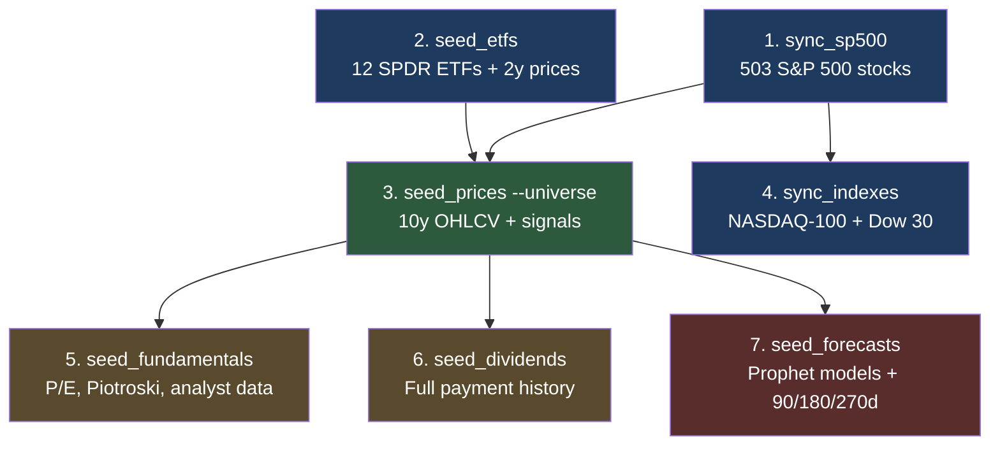
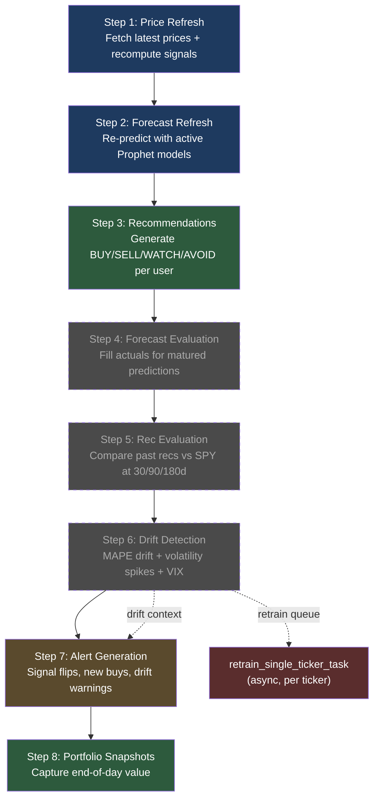

# Stock Signal Platform

Personal stock analysis platform for US equities — signal detection, portfolio tracking, Prophet forecasting, and AI-powered chat agent.

## Quick Start

### Prerequisites

- Python 3.12+ with [uv](https://docs.astral.sh/uv/)
- Node.js 20+
- Docker (for Postgres + Redis)
- macOS, Linux, or WSL2 (native Windows not supported)

### Automated Setup

```bash
git clone <repo-url> && cd stock-signal-platform
chmod +x setup.sh run.sh
./setup.sh              # Installs deps, starts Docker, runs migrations
./run.sh start          # Starts all services (backend, frontend, Celery)
```

Run `./setup.sh --check` to verify prerequisites without installing anything.

### Manual Setup

#### 1. Infrastructure

```bash
docker compose up -d                  # TimescaleDB on :5433, Redis on :6380
cp backend/.env.example backend/.env  # Configure secrets
uv sync                               # Install Python dependencies
cd frontend && npm install && cd ..    # Install frontend dependencies
```

#### 2. Database

```bash
uv run alembic upgrade head           # Run migrations
```

### 3. Bootstrap Data

Run in order — each step depends on the previous:



```bash
# Step 1: Stock universe (S&P 500 constituents from Wikipedia)
uv run python -m scripts.sync_sp500

# Step 2: ETFs (12 SPDR sector ETFs + SPY benchmark, 2y prices)
uv run python -m scripts.seed_etfs

# Step 3: Prices + signals (10y OHLCV via yfinance, computes technicals)
uv run python -m scripts.seed_prices --universe

# Step 4: Index memberships (NASDAQ-100, Dow 30)
uv run python -m scripts.sync_indexes

# Step 5: Fundamentals (P/E, Piotroski, analyst targets, earnings)
uv run python -m scripts.seed_fundamentals --universe

# Step 6: Dividends (full payment history)
uv run python -m scripts.seed_dividends --universe

# Step 7: Forecasts (train Prophet models, generate 90/180/270d predictions)
uv run python -m scripts.seed_forecasts --universe
```

All scripts support `--dry-run` to preview without writing and `--tickers AAPL MSFT` to seed specific tickers.

**Timing:** Steps 1-4 take ~2 minutes. Steps 5-6 take ~10 minutes each. Step 7 takes ~3 minutes. Full bootstrap: ~25 minutes.

**Data persistence:** Postgres and Redis use named Docker volumes. Data survives restarts. Only `docker compose down -v` destroys it.

### 4. Run Services

**Quick:** `./run.sh start` starts everything. `./run.sh stop` stops everything. `./run.sh status` shows what's running. `./run.sh logs backend` tails logs.

**Manual:**

```bash
# Backend API
uv run uvicorn backend.main:app --reload --port 8181

# Frontend
cd frontend && npm run dev              # http://localhost:3000

# Celery worker (executes background tasks)
uv run celery -A backend.tasks worker --loglevel=info

# Celery Beat (schedules tasks on cron — optional for local dev)
uv run celery -A backend.tasks beat --loglevel=info
```

## Nightly Pipeline

The nightly pipeline runs as a Celery Beat task at **9:30 PM ET** and executes 8 steps sequentially:



> Steps 4-6 shown with dashed borders — they run but produce no results until forecasts/recommendations mature (30-90 days).

| Step | Task | What it does |
|------|------|-------------|
| 1 | Price refresh | Fetch latest prices for all universe tickers + recompute signals |
| 2 | Forecast refresh | Re-predict using existing active Prophet models |
| 3 | Recommendation generation | Generate BUY/SELL/WATCH/AVOID per user's watchlist + portfolio |
| 4 | Forecast evaluation | Fill actual prices for matured forecasts, compute MAPE |
| 5 | Recommendation evaluation | Compare past BUY/SELL recs vs SPY at 30/90/180d horizons |
| 6 | Drift detection | Check model MAPE drift, volatility spikes, VIX regime |
| 7 | Alert generation | Create in-app alerts for signal flips, new buys, drift warnings |
| 8 | Portfolio snapshots | Capture end-of-day portfolio value |

Steps 4-6 will produce no results until forecasts and recommendations have matured (30-90 days after initial bootstrap).

### Full Beat Schedule (US/Eastern)

```mermaid
gantt
    title Celery Beat Schedule (US/Eastern)
    dateFormat HH:mm
    axisFormat %H:%M

    section Weekly (Sunday)
    Model Retrain (biweekly)        :crit, 02:00, 60min
    Institutional Holders Sync      :02:00, 30min

    section Pre-Market
    Analyst Consensus Sync          :06:00, 15min
    FRED Indicators Sync            :07:00, 15min

    section Market Hours
    Watchlist Refresh (every 30m)   :active, 09:30, 390min

    section Post-Market
    Portfolio Snapshots              :16:30, 15min
    Nightly Pipeline (8 steps)      :crit, 21:30, 60min
```



| Time | Task |
|------|------|
| 2:00 AM Sun | Retrain all Prophet models (biweekly) |
| 2:00 AM Sun | Sync institutional holders (Redis cache) |
| 6:00 AM | Sync analyst consensus (Redis cache) |
| 7:00 AM | Sync FRED macro indicators (Redis cache) |
| Every 30 min | Refresh watchlist ticker prices (intraday) |
| 4:30 PM | Snapshot all portfolios |
| 9:30 PM | Full nightly pipeline chain (8 steps above) |

### Manual Triggers

**Via Celery** (requires a running worker):

```bash
# Full nightly chain
uv run celery -A backend.tasks call backend.tasks.market_data.nightly_pipeline_chain_task

# Individual tasks
uv run celery -A backend.tasks call backend.tasks.market_data.nightly_price_refresh_task
uv run celery -A backend.tasks call backend.tasks.forecasting.forecast_refresh_task
uv run celery -A backend.tasks call backend.tasks.forecasting.model_retrain_all_task
uv run celery -A backend.tasks call backend.tasks.recommendations.generate_recommendations_task
uv run celery -A backend.tasks call backend.tasks.evaluation.evaluate_forecasts_task
uv run celery -A backend.tasks call backend.tasks.evaluation.check_drift_task
uv run celery -A backend.tasks call backend.tasks.evaluation.evaluate_recommendations_task
uv run celery -A backend.tasks call backend.tasks.alerts.generate_alerts_task

# Retrain a single ticker
uv run celery -A backend.tasks call backend.tasks.forecasting.retrain_single_ticker_task --args '["AAPL"]'
```

**Direct invocation** (no worker needed — runs synchronously):

```bash
uv run python -c "
from backend.tasks.market_data import nightly_pipeline_chain_task
result = nightly_pipeline_chain_task()
print(result)
"
```

## Testing

```bash
uv run pytest tests/unit/ -v              # Unit tests
uv run pytest tests/api/ -v               # API tests (uses testcontainers)
cd frontend && npm test                    # Frontend component tests
```

## Project Structure

```
backend/
  main.py              # FastAPI app entry point
  config.py            # Pydantic Settings (.env loader)
  database.py          # Async SQLAlchemy session factory
  models/              # SQLAlchemy ORM models
  routers/             # FastAPI route handlers
  tools/               # Business logic (signals, forecasting, fundamentals)
  agents/              # LangGraph AI agents
  tasks/               # Celery background tasks
  migrations/          # Alembic migrations
frontend/              # Next.js 15 app
scripts/               # Bootstrap and sync scripts
tests/                 # Unit, API, integration, e2e tests
```

See `CLAUDE.md` for development conventions and `docs/PRD.md` for product requirements.
