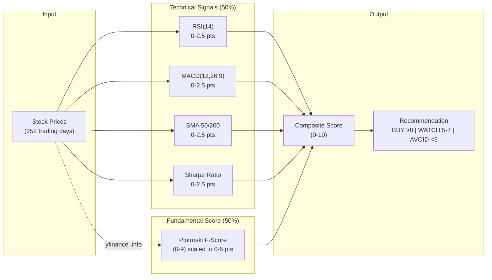
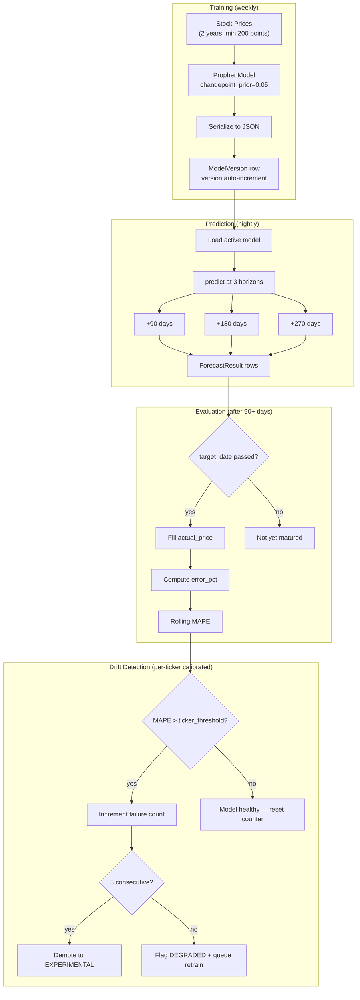

# Functional Specification Document (FSD)

## Stock Signal Platform

**Version:** 2.1
**Date:** April 2026
**Status:** Living Document
**Prerequisite reading:** docs/PRD.md

---

## 1. Purpose

This document translates the PRD's product requirements into detailed
functional and non-functional specifications. It defines exactly WHAT the
system does, how it behaves under normal and edge conditions, and what
constitutes correct behavior. The TDD (docs/TDD.md) defines HOW to build it.

---

## 2. User Roles & Permissions

| Role | Description | Permissions |
|------|-------------|-------------|
| ADMIN | Platform owner (you) | Full access: CRUD all data, manage users, system config |
| USER | Regular investor | Own portfolio, own watchlist, own chat, read signals |

**Email verification enforcement:** Unverified users are soft-blocked on 11 write endpoints (portfolio transactions, watchlist add/remove, preferences, alerts, chat, etc.). Read endpoints are unaffected. A dismissible verification banner is shown in the app shell until the email is confirmed. ADMIN users bypass verification checks.

---

## 3. Functional Requirements

### FR-1: Authentication & User Management

**FR-1.1: Registration**
- Input: email, password
- Validation: email must be unique, password ≥ 8 chars with ≥1 uppercase,
  ≥1 digit
- Output: user record created, UserPreference created with defaults
- Side effect: none (no auto-login)

**FR-1.2: Login**
- Input: email, password
- Output: { access_token, refresh_token, token_type, expires_in }
- access_token: JWT, expires in ACCESS_TOKEN_EXPIRE_MINUTES (default 60)
- refresh_token: JWT, expires in REFRESH_TOKEN_EXPIRE_DAYS (default 7). Token rotation (invalidation of old refresh tokens) not implemented.
- Error: 401 if credentials invalid

**FR-1.3: Token Refresh**
- Input: refresh_token
- Output: new { access_token, refresh_token } pair
- Token rotation not implemented — both old and new refresh JWTs remain valid until expiry
- Error: 401 if refresh_token expired or invalid

**FR-1.4: User Preferences**
- Users can update: timezone, notification settings, composite score weights,
  position/sector caps, stop-loss defaults
- Preferences used by recommendation engine, alert system, and background jobs

**FR-1.5: httpOnly Cookie Authentication** ✅ IMPLEMENTED
- Login and refresh endpoints set JWT tokens as httpOnly, Secure, SameSite=Lax cookies
- Frontend cannot access tokens via JavaScript (XSS protection)
- Server reads tokens from cookies OR `Authorization: Bearer` header (dual-mode)
- `POST /api/v1/auth/logout` clears cookies (Set-Cookie with Max-Age=0)
- CORS must set `allow_credentials=True` with explicit `allow_origins` (no wildcard)

**FR-1.6: Google OAuth 2.0** ✅ IMPLEMENTED
- User story: "As a new user, I can sign in with my Google account without creating a password."
- Authorization code flow with PKCE-equivalent state + nonce parameters (CSRF protection)
- JWKS validation via PyJWT; `aud` and `exp` claims verified
- Auto-link: if Google email matches an existing OAuth account, the user is logged in
- Account conflict: if Google email matches a password account, return 409 with instructions to link manually
- New OAuth users have `email_verified=True` immediately (Google already verified it)
- `GET /api/v1/auth/google/authorize` — returns auth URL; `GET /api/v1/auth/google/callback` — handles redirect

**FR-1.7: Email Verification** ✅ IMPLEMENTED
- On registration, a verification email is sent via Resend API with a signed token (24-hour expiry)
- `GET /api/v1/auth/verify-email?token=...` — marks user `email_verified=True`
- `POST /api/v1/auth/resend-verification` — resends email (rate-limited, auth required)
- Soft-block: 11 write endpoints check `email_verified`; unverified users receive 403 with "verify your email" message
- Verification banner displayed in app shell (dismissible per session, reappears on next login)

**FR-1.8: Password Reset** ✅ IMPLEMENTED
- `POST /api/v1/auth/forgot-password` — always returns 200 (prevents email enumeration); sends reset link if email exists
- Reset token: signed JWT with 1-hour expiry, single-use (invalidated in Redis on use)
- `POST /api/v1/auth/reset-password` — validates token, hashes new password, invalidates all existing sessions via user-level token revocation
- OAuth-only users (no password) receive a "set up password" variant email

**FR-1.9: Account Settings Page** ✅ IMPLEMENTED
- Route: `/account`
- Four sections:
  1. **Profile** — display name, email (read-only)
  2. **Security** — change password; shows last-login timestamp
  3. **Linked Accounts** — Google OAuth connection status; Connect/Disconnect button
  4. **Danger Zone** — Delete Account (requires typed confirmation "DELETE")

**FR-1.10: Account Deletion** ✅ IMPLEMENTED
- `DELETE /api/v1/auth/account` — soft-delete: sets `deleted_at` timestamp, clears httpOnly cookies
- Deleted accounts cannot log in; all API requests return 401
- 30-day grace period: Celery task runs nightly and hard-deletes accounts where `deleted_at + 30d < now`
- Hard delete cascades to all user data (portfolio, watchlist, chat sessions, alerts, preferences)
- Admin can recover a soft-deleted account within 30 days via `POST /api/v1/admin/users/{id}/recover`

**FR-1.11: Admin User Management** ✅ IMPLEMENTED
- `GET /api/v1/admin/users` — paginated user list with verification status and deletion state (ADMIN only)
- `POST /api/v1/admin/users/{id}/verify` — manually verify a user's email
- `POST /api/v1/admin/users/{id}/recover` — restore a soft-deleted account

### FR-2: Stock Universe & Watchlist

**FR-2.1: Stock Universe**
- System maintains S&P 500 constituents (is_in_universe=True)
- Universe synced quarterly via script
- Screener operates on universe; watchlist is user's personal subset

**FR-2.2: Watchlist Management**
- Add ticker to watchlist: ticker must exist in Stock table
- Remove ticker from watchlist
- List watchlist with composite_score (joined from latest signal snapshot). `current_price` and full signal summary not returned.
- Maximum 100 tickers per user watchlist

**FR-2.3: Stock Lookup**
- Search stocks by ticker or name (prefix match)
- If ticker not in database, attempt to add via yfinance lookup
- Return: ticker, name, exchange, sector, industry

**FR-2.4: Stock Index Management** ✅ IMPLEMENTED
- System maintains multiple stock indexes: S&P 500, NASDAQ-100, Dow 30
- Each index is a `StockIndex` record with name, description, last sync timestamp
- Stocks belong to indexes via `StockIndexMembership` (many-to-many with dates)
- Membership tracks `added_date` and `removed_date` (null = still a member)
- Dashboard groups stocks by index; screener can filter by index
- Replaces the `is_in_universe` boolean approach with proper index membership
- Seed scripts sync membership from public sources (Wikipedia, etc.)

> **Note:** `removed_date` and `last_synced_at` fields not implemented. The `is_in_universe` boolean on `Stock` model coexists with the index membership system.

**FR-2.5: On-Demand Data Ingestion** ✅ IMPLEMENTED
- When user searches for a ticker not yet in the system, UI can trigger ingestion
- `POST /api/v1/stocks/{ticker}/ingest` fetches 10Y of OHLCV data from yfinance
- If ticker already has data: delta fetch only (from `last_fetched_at` to today)
- After price fetch: compute signals and store snapshot
- Upsert logic (ON CONFLICT DO NOTHING) ensures idempotent re-runs
- Rate-limited aggressively (5 requests/minute) — yfinance calls are expensive

### FR-3: Signal Engine



**FR-3.1: Technical Signal Computation**

For a given ticker, using the last 252 trading days of price data:

| Signal | Computation | Output Label |
|--------|------------|-------------|
| RSI(14) | Wilder's smoothed RSI | <30: OVERSOLD, 30-70: NEUTRAL, >70: OVERBOUGHT |
| MACD(12,26,9) | MACD line - Signal line | histogram > 0: BULLISH, ≤ 0: BEARISH |
| SMA Crossover | Compare SMA(50) vs SMA(200) vs current price | GOLDEN_CROSS (50 crosses above 200), DEATH_CROSS (50 crosses below 200), ABOVE_200 (price > SMA200), BELOW_200 (price < SMA200) |
| Bollinger(20,2) | Price position relative to bands | UPPER (> upper band), MIDDLE (between), LOWER (< lower band) |
| Annualized Return | (latest_close / close_252d_ago)^(252/trading_days) - 1 | Percentage |
| Volatility | std(daily_returns) × √252 | Percentage |
| Sharpe Ratio | (annualized_return - risk_free_rate) / volatility | Decimal (risk_free_rate from FRED or default 4.5%) |

**FR-3.2: Composite Score Calculation**

Technical-only scoring (composite_weights stored per snapshot):

```
score = 0
max_score = 10

# RSI contribution (0-2.5 points)
if RSI < 30: +2.5     # oversold = buying opportunity
elif RSI < 45: +1.5
elif RSI > 70: +0     # overbought = risky
else: +1.0            # neutral

# MACD contribution (0-2.5 points)
if MACD histogram > 0 and magnitude > 0.5: +2.5  # Uses magnitude as proxy for 'increasing' (only latest value available, not series)
elif MACD histogram > 0: +1.5
elif MACD histogram < 0 and decreasing: +0
else: +0.5

# SMA contribution (0-2.5 points)
if GOLDEN_CROSS: +2.5
elif ABOVE_200: +1.5
elif BELOW_200: +0.5
elif DEATH_CROSS: +0

# Sharpe contribution (0-2.5 points)
if sharpe > 1.5: +2.5
elif sharpe > 1.0: +2.0
elif sharpe > 0.5: +1.0
elif sharpe > 0: +0.5
else: +0

composite_score = score  # 0-10 range
```

When fundamental signals (FR-5) are added, scoring rebalances to 50/50 weight.

**FR-3.3: Signal Staleness**
- Signals older than 24 hours are flagged as STALE
- Stale signals are flagged in API responses (`is_stale` field). Staleness is not enforced in the recommendation engine — recommendations can still be generated from stale signals.

**FR-3.4: Per-Stock Risk Analytics** ✅ IMPLEMENTED
- Technical indicators (RSI, MACD, SMA, Bollinger) computed via `pandas-ta-openbb` library (replaces hand-rolled)
- Per-stock QuantStats metrics materialized to `signal_snapshots`: Sortino, max_drawdown (positive), alpha, beta (vs SPY benchmark)
- `data_days` field tracks how many common trading days were used for computation
- Minimum 30 days of SPY benchmark overlap required; below threshold → null with `data_days` field
- SPY auto-refreshed at start of nightly pipeline regardless of watchlist membership
- NaN/Inf guarded: degenerate inputs (constant prices, zero downside deviation) return null, not NaN
- Dashboard shows "last updated" timestamp prominently

### FR-4: Recommendation Engine

**FR-4.1: Decision Rules**

> **Current Implementation:** Basic score-threshold rules:
> - Score >=9 → BUY (HIGH confidence); >=8 → BUY (MEDIUM)
> - Score >=6.5 → WATCH (MEDIUM); >=5 → WATCH (LOW)
> - Score <2 → AVOID (HIGH); <5 → AVOID (MEDIUM)
>
> Actions HOLD and SELL are defined but require portfolio context. No portfolio awareness, no position sizing, no macro regime.

Run daily after signal computation. For each stock in watchlist + universe:

```
INPUT: composite_score, portfolio_state (optional), macro_regime (future)

IF composite_score >= 8:
    IF stock is held AND allocation >= max_position_pct:
        action = HOLD, confidence = HIGH
        reason = "Strong signals but already at target allocation"
    ELIF macro_regime == RISK_OFF (not implemented):
        action = BUY, confidence = LOW
        reason = "Strong signals but macro environment is cautious"
    ELSE:
        action = BUY, confidence = HIGH
        suggested_amount = calculate_position_size()

ELIF composite_score >= 5:
    IF stock is held:
        action = HOLD, confidence = MEDIUM
    ELSE:
        action = WATCH, confidence = MEDIUM

ELIF composite_score < 5:
    IF stock is held:
        IF trailing_stop_breached:
            action = SELL, confidence = HIGH
            reason = "Stop-loss triggered at X%"
        ELIF piotroski < 4 (not implemented):
            action = SELL, confidence = HIGH
            reason = "Fundamental deterioration"
        ELSE:
            action = SELL, confidence = MEDIUM
    ELSE:
        action = AVOID, confidence = MEDIUM
```

**FR-4.2: Position Sizing**

```
calculate_position_size(ticker, portfolio):
    total_value = portfolio.total_value
    target_pct = min(max_position_pct, equal_weight_pct)
        # equal_weight_pct = 100% / number_of_target_positions
        # max_position_pct from UserPreference (default 5%)
    current_pct = portfolio.allocation[ticker] or 0
    gap_pct = target_pct - current_pct

    # Enforce cash reserve
    available_cash = portfolio.cash - (total_value * min_cash_reserve_pct)
    if available_cash <= 0:
        return 0

    # Enforce sector cap
    sector = stock.sector
    sector_allocation = sum(portfolio.allocation for stocks in sector)
    if sector_allocation >= max_sector_pct:
        return 0

    suggested_amount = min(gap_pct * total_value, available_cash)
    if suggested_amount < 100:  # minimum trade size
        return 0

    return round(suggested_amount, 2)
```

**FR-4.3: Recommendation Surfacing**
- `GET /api/v1/stocks/recommendations` returns today's actionable items
- Sorted by: composite_score DESC
- Filterable by: action (BUY/SELL/HOLD), confidence level
- "Action Required" panel on dashboard shows only BUY and SELL with HIGH confidence
- User can acknowledge a recommendation (marks acknowledged=True)

### FR-5: Fundamental Analysis ✅ PARTIALLY IMPLEMENTED

**FR-5.1: Piotroski F-Score** ✅ IMPLEMENTED
- Piotroski F-Score (0-9) computed from yfinance financials, scaled to 0-5 points
- Blended 50/50 with technical score in composite calculation
- Score stored per `signal_snapshot` with `composite_weights` JSONB for audit

**FR-5.2: Combined Composite Score** ✅ IMPLEMENTED
```
composite = (technical_score * 0.5) + (piotroski_score_scaled * 0.5)
```
Users can override weights via `UserPreference.composite_weights`.

**FR-5.3: Extended Fundamentals** (not implemented)
Remaining fundamental signals (P/E, PEG, FCF Yield, Debt/Equity, Interest Coverage) are not yet implemented as scoring inputs. However, the data is materialized to the Stock model during ingestion (revenue_growth, gross_margins, operating_margins, ROE) and accessible via `GET /stocks/{ticker}/fundamentals`.

### FR-6: Portfolio Management ✅ IMPLEMENTED

**FR-6.1: Transaction Logging** ✅
- Input: ticker, transaction_type (BUY/SELL), shares, price_per_share, transacted_at, notes
- Validation: SELL shares cannot exceed current FIFO-computed holdings (422 if exceeded)
- Ticker FK validation: unknown ticker returns 422 with "Add to watchlist first" message
- Side effect: Position table recomputed via `recompute_position()` after every write
- Endpoint: `POST /api/v1/portfolio/transactions`

**FR-6.2: Position Calculation (FIFO)** ✅
- `_run_fifo()` is a pure function (no DB) — takes list of transaction dicts, returns {shares, avg_cost_basis, closed_at}
- Transactions sorted by `transacted_at` before processing (handles back-dated entries)
- Positions stored in `positions` table (recomputed from scratch on each write — personal portfolio is small)
- `opened_at` preserved on upsert (never overwritten by ON CONFLICT)
- `closed_at` set when shares reach 0; cleared when new BUY restores position
- Unrealized P&L = (current_price − avg_cost_basis) × shares
- Endpoint: `GET /api/v1/portfolio/positions`

**FR-6.2a: Transaction Deletion** ✅
- Pre-delete simulation: run FIFO excluding target transaction (ID-based) → 422 if it would strand a SELL
- Endpoint: `DELETE /api/v1/portfolio/transactions/{id}`

**FR-6.2b: Portfolio Summary** ✅
- Aggregates: total_value, total_cost_basis, unrealized_pnl, unrealized_pnl_pct, position_count
- Sector allocation: grouped by Stock.sector (null → "Unknown"), with over_limit flag (>30%)
- Endpoint: `GET /api/v1/portfolio/summary`

**FR-6.3: Stock Split Handling**
- On split detection (via yfinance): create CorporateAction record
- Adjust all open position quantities: multiply by ratio_to/ratio_from
- Adjust avg_cost: divide by ratio_to/ratio_from
- Historical prices use adj_close (already split-adjusted by yfinance)

**FR-6.4: Dividend Tracking** ✅ IMPLEMENTED
- Fetch dividends from yfinance dividend history via `fetch_dividends()` tool
- Store as DividendPayment rows (TimescaleDB hypertable, composite PK: ticker + ex_date)
- `GET /api/v1/portfolio/dividends/{ticker}` — summary with total received, trailing-12-month annual dividends, dividend yield, payment history
- Stock detail page: DividendCard component with KPI row + collapsible payment history table
- Idempotent upserts via ON CONFLICT DO NOTHING

**FR-6.5: Portfolio Snapshots** ✅ IMPLEMENTED
- Celery Beat daily task at 21:00 UTC (4 PM ET after market close)
- Stores PortfolioSnapshot: total_value, total_cost_basis, unrealized_pnl, position_count
- `GET /api/v1/portfolio/history?days=N` — returns daily snapshots
- PortfolioValueChart: area chart with value line + cost basis dashed line
- Upsert (ON CONFLICT DO UPDATE) for idempotent daily re-runs

**FR-6.6: Divestment Rules Engine** ✅ IMPLEMENTED
- On-demand alerts bundled into positions endpoint response (`PositionWithAlerts`)
- 4 rule types: stop_loss (critical), position_concentration (warning), sector_concentration (warning), weak_fundamentals (warning)
- All thresholds configurable via UserPreference model (not hardcoded)
- `GET /api/v1/preferences` and `PATCH /api/v1/preferences` for threshold management
- Settings sheet on portfolio page (gear icon → shadcn Sheet)
- Alert badges on positions table with severity-based coloring
- Pure function `check_divestment_rules()` in `backend/tools/divestment.py`
- Null safety: skips rules when dependent values are None

**FR-6.7: Portfolio Analytics** ✅ IMPLEMENTED
- Portfolio-level QuantStats metrics materialized to `portfolio_snapshots`: Sharpe, Sortino, max_drawdown, max_drawdown_duration (days), Calmar, alpha, beta (vs SPY), VaR 95%, CAGR, data_days
- `GET /api/v1/portfolio/analytics` — reads latest materialized row
- Minimum 30 days of snapshots required; below threshold → all null with `data_days` count
- Dashboard shows QuantStats KPIs (Sortino, Max Drawdown, Alpha) when `data_days >= 30`
- Calmar ratio isolated (can be infinite when drawdown is zero) — stored as null, not inf
- VaR stored as positive (absolute loss at 95% confidence)

**FR-6.8: Optimized Rebalancing** ✅ IMPLEMENTED
- Replaces equal-weight with PyPortfolioOpt optimization
- 3 strategies via `UserPreference.rebalancing_strategy`: min_volatility (default), max_sharpe, risk_parity
- Position caps from `UserPreference.max_position_pct` applied as weight bounds (min 1/n for feasibility)
- Materialized to `rebalancing_suggestions` table during nightly pipeline
- `GET /api/v1/portfolio/rebalancing` reads materialized data; falls back to equal-weight if none exists
- Actions: BUY_MORE, HOLD, REDUCE (was: BUY_MORE, HOLD, AT_CAP)
- Risk Parity uses Hierarchical Risk Parity (HRPOpt) — takes returns, not prices
- Graceful degradation: < 2 positions or < 30 days of data → equal-weight fallback

### FR-7: Screener ✅ IMPLEMENTED

**FR-7.1: Stock Universe**
- Operates on stocks belonging to a selected index (S&P 500, NASDAQ-100, Dow 30)
- Uses pre-computed signals (not live computation)
- Default view: all indexes combined

**FR-7.2: Filtering**
- Index: S&P 500 / NASDAQ-100 / Dow 30 / All
- RSI state: OVERSOLD / NEUTRAL / OVERBOUGHT
- MACD state: BULLISH / BEARISH
- Sector: multi-select from GICS sectors
- Composite score: range slider (0-10)
- Sharpe ratio: sortable (no dedicated filter param)

**FR-7.3: Sorting**
- Default: composite_score DESC
- Sortable by any visible column
- Server-side sorting via query params

**FR-7.4: Display**
- Color coding: ≥8 green, 5-7 amber, <5 red
- Click row → navigate to stock detail page
- Server-side pagination using offset-based approach (limit + offset params; default limit=50, max 200)
- URL state: filters + sort + offset reflected in query params. Note: column tab selection and view mode (table/grid) are ephemeral UI state, not in URL.

**FR-7.5: Bulk Signals Endpoint**
- `GET /api/v1/stocks/signals/bulk` returns latest signal snapshot per stock
- Supports index, RSI, MACD, sector, and score range filters via query params
- Sortable by any numeric field (composite_score, sharpe, annual_return, etc.)
- Paginated response with total count for UI pagination controls
- Performance target: 500 stocks in <3 seconds

**FR-7.6: Signal History**
- `GET /api/v1/stocks/{ticker}/signals/history` returns chronological snapshots
- Default: last 90 days; configurable up to 365 days
- Used by stock detail page to render signal trend charts (composite score, RSI over time)

**FR-7.7: Screener Column Preset Tabs** ✅ IMPLEMENTED
- TradingView-style tab bar above screener table: Overview | Signals | Performance
- Each tab shows a different column set (column definitions in `COL` record + `TAB_COLUMNS` presets)
- Tab selection is ephemeral UI state (not URL-persisted)

**FR-7.8: Screener Grid View** ✅ IMPLEMENTED
- Toggle between table view and chart grid view (miniature sparkline cards per stock)
- Grid cards show: full-width Sparkline, ticker, signal badges, composite score
- `price_history: list[float]` (last 30 daily closes) returned in bulk signals endpoint
- Grid/table toggle via `viewMode` state; density toggle hidden in grid mode

**FR-7.9: Screener Density Toggle** ✅ IMPLEMENTED
- Comfortable (default) and compact row padding modes
- Persisted to localStorage via `DensityProvider` context
- Toggle visible only in table view

**FR-7.10: Dashboard Composition** ✅ IMPLEMENTED
- Index cards: S&P 500, NASDAQ-100, Dow 30 with stock count, displayed at top
- Watchlist section: stock cards with ticker, price, sentiment badge, composite score
- Ticker search bar triggering on-demand ingestion
- Sector filter toggle
- Staggered fade-in entry animations

**FR-7.11: Stock Detail Page** ✅ IMPLEMENTED
- Breadcrumb navigation (Dashboard > TICKER)
- Price chart (Recharts) with sentiment-tinted gradient, 1M/3M/6M/1Y/2Y/5Y timeframe selector
- Signal breakdown cards: RSI, MACD, SMA, Bollinger (staggered animation)
- Signal history chart (dual-axis: composite score + RSI over time)
- Risk & return section: annualized return, volatility, Sharpe ratio

**FR-7.12: Shell Layout + Design System** ✅ IMPLEMENTED
- Dark-only application (`forcedTheme="dark"`) — light mode removed; `enableSystem` disabled
- Shell layout: 54px icon-only `SidebarNav` + `Topbar` + docked right `ChatPanel`
- `ChatPanel`: drag-resizable via DOM events, width persisted to localStorage (`stocksignal:cp-width`), hides via `transform: translateX(100%)` (preserves width when closed)
- New dashboard components: `StatTile` (5-tile KPI row with accent gradient top border), `AllocationDonut` (CSS conic-gradient, no chart library), `PortfolioDrawer` (bottom slide-up with portfolio value chart)
- `Sparkline` replaced with raw SVG `<polyline>` for jagged financial chart aesthetics
- Typography: Sora (UI labels) + JetBrains Mono (numbers/metrics) loaded via `next/font/google`
- All components restyed to navy design tokens (card2, hov, bhi, warning, cyan)

### FR-8: AI Chatbot — Financial Intelligence Platform ✅ IMPLEMENTED

**FR-8.1: Agent Selection**
- General Agent: web search + news Q&A (limited tool access)
- Stock Agent: full tool access across all 5 data layers
- User selects agent type per conversation
- Agent type bound at session creation (cannot switch mid-session)

**FR-8.2: Tool Orchestration**
- Tool Registry with 25+ internal tools and 4 MCPAdapter external sources
- **Active architecture: ReAct loop** — LLM tool-calling with max 15 iterations
- All data in responses must come from tool results (no hallucination)
- If a tool fails, result marked "unavailable" with reason; response acknowledges gap
- Scope enforcement: financial-only queries. Non-financial/speculative queries declined gracefully.
- Enriched tools (get_fundamentals, get_analyst_targets, get_earnings_history, get_company_profile) read from DB — data materialized during ingestion

**FR-8.3: External Data Integration (5 layers)**
- SEC Filings: 10-K, 10-Q, 8-K, 13F, Form 4 (via EdgarTools MCP)
- News + Sentiment: financial news with sentiment scores (via Alpha Vantage MCP)
- Macroeconomic: FRED data — Fed rate, CPI, treasury yields, employment (via FRED MCP)
- Geopolitical: event detection + sector impact mapping (via GDELT API)
- Analyst + Alternative: consensus ratings, ESG, social sentiment, supply chain (via Finnhub MCP)
- Web search: general web search for current information (via SerpAPI)

**FR-8.4: Warm Data Pipeline**
- Daily: analyst consensus per tracked ticker, key FRED macro indicators
- Weekly: top institutional holders (13F) per portfolio stock
- On-demand with cache: 10-K/10-Q section extraction (cached 24h after first query)

**FR-8.5: Streaming**
- Response streams via NDJSON over SSE
- Events: thinking, tool_start, tool_result, token, done, provider_fallback, error, plan, tool_error, evidence, decline
- Frontend renders incrementally as tokens arrive
- Tool execution status shown as progress indicators (ToolCard component)
- Plan display shows research steps with checkmarks (PlanDisplay)
- Evidence section with collapsible source citations (EvidenceSection)
- Decline messages for out-of-scope queries (DeclineMessage)

**FR-8.6: Conversation History**
- Stored per ChatSession (user + agent_type)
- ChatMessage records: role, content, tool_calls, tokens_used, model_used, latency_ms
- Sliding window: last 20 messages as LLM context (16K token budget)
- History summary when context exceeds 12K tokens
- Sessions auto-expire after 24 hours of inactivity

**FR-8.7: MCP Server** ✅ IMPLEMENTED
- Platform intelligence exposed as MCP server at `/mcp` (Streamable HTTP)
- Same Tool Registry powers both chat endpoint and MCP server
- Callable by Claude Code, Cursor, or any MCP-compatible client
- Authenticated via JWT (same as REST API)

**FR-8.8: Graceful Degradation**
- Individual tool failures don't crash the response
- LLM provider fallback: Groq → Anthropic → Local
- Exponential backoff for transient errors, immediate switch for quota/timeout
- MCP server health tracking — disconnected adapters excluded from tool set
- User informed of degraded data availability in response

**FR-8.9: Evidence Display & User Feedback** ✅ IMPLEMENTED
- Every assistant response can include an evidence section showing source citations
- Evidence items: claim text, source tool name, value, timestamp
- Evidence section is collapsible (hidden by default, "Show Evidence" toggle)
- Users can provide thumbs up/down feedback on any assistant message
- Feedback persisted via `PATCH /chat/sessions/{id}/messages/{id}/feedback`
- Feedback stored as "up"/"down" on ChatMessage model

**FR-8.10: Onboarding Experience** ✅ IMPLEMENTED
- Welcome banner on dashboard when watchlist AND positions are empty (loading-state gated to prevent flash)
- Also dismissible via localStorage
- Banner shows 5 suggested tickers (AAPL, MSFT, GOOGL, TSLA, NVDA) as one-click add buttons
- Quick-add: ingests stock data + adds to watchlist in one action
- Trending stocks section on dashboard (top 5 by composite score, visible even with empty watchlist)
- Uses existing `GET /stocks/signals/bulk?sort_by=composite_score&limit=5` endpoint

**FR-8.11: Enriched Data Layer** ✅ IMPLEMENTED
- All yfinance data materialized to DB during ingestion (ingest-time enrichment pattern)
- Stock model enriched with: business summary, employees, website, market cap, revenue growth, gross/operating/profit margins, ROE, analyst targets (mean/high/low), analyst buy/hold/sell counts
- Quarterly earnings stored in EarningsSnapshot table (EPS estimate, actual, surprise %)
- `GET /stocks/{ticker}/fundamentals` returns all enriched fields
- Agent tools read from DB at query time (fast, reliable, no external API calls)

### FR-9: Alerts & Notifications ✅ IMPLEMENTED (in-app only)

**FR-9.1: Alert Rules**
- Trailing stop-loss: price drops X% from recent high (X from UserPreference)
- Position concentration: allocation exceeds max_position_pct
- Sector concentration: sector allocation exceeds max_sector_pct
- Cash reserve: cash drops below min_cash_reserve_pct
- Fundamental deterioration: Piotroski drops below 4
- Signal flip: stock's composite action changes (e.g., HOLD → SELL)

**FR-9.2: Alert Deduplication**
- Same alert rule + same ticker cannot fire more than once per 24 hours
- Acknowledged alerts don't re-fire until condition clears and re-triggers

**FR-9.3: Notification Channels**
- In-app alerts only. Telegram integration removed from roadmap.
- Morning briefing contents: overnight signal changes, portfolio P&L,
  today's recommendations, any triggered alerts
- Quiet hours: no notifications between quiet_hours_start and quiet_hours_end
  (from UserPreference)

**FR-9.4: Data Quality Alerts** ✅ IMPLEMENTED
- Nightly DQ scanner runs 10 checks (negative prices, RSI range, composite score range, null sectors, extreme forecasts, orphan positions, duplicate signals, stale coverage, negative volume, bollinger violations)
- Critical findings auto-create in-app alerts via dedup_key
- Findings persisted to `dq_check_history` table for trend tracking
- Beat schedule: 04:00 ET daily

**FR-9.5: Data Retention**  ✅ IMPLEMENTED
- Forecast results purged after 30 days
- News articles purged after 90 days (daily aggregates retained forever)
- Beat schedule: 03:30/03:45 ET daily

### FR-10: Recommendation Evaluation ✅ IMPLEMENTED

This is the feedback loop that answers: "Is this platform giving good advice?"
Without it, the recommendation engine runs on assumptions that are never
validated against reality.

**FR-10.1: Outcome Capture**

Nightly task `evaluate_recommendations.py`:

```
For each RecommendationSnapshot WHERE:
    generated_at + horizon <= today
    AND no matching RecommendationOutcome exists for this (recommendation, horizon):

    For horizon in [30d, 90d, 180d]:
        price_at_rec = recommendation.price_at_recommendation
        price_now = StockPrice.close WHERE ticker AND date = generated_at + horizon
        spy_at_rec = StockPrice.close WHERE ticker='SPY' AND date = generated_at
        spy_now = StockPrice.close WHERE ticker='SPY' AND date = generated_at + horizon

        return_pct = (price_now - price_at_rec) / price_at_rec
        benchmark_return_pct = (spy_now - spy_at_rec) / spy_at_rec
        alpha = return_pct - benchmark_return_pct

        IF action == BUY:
            action_was_correct = (return_pct > benchmark_return_pct)
        ELIF action == SELL:
            action_was_correct = (return_pct < benchmark_return_pct)
        ELIF action == HOLD:
            action_was_correct = (abs(return_pct - benchmark_return_pct) < 0.05)
        ELSE:
            action_was_correct = NULL  # WATCH/AVOID not evaluated

        Store RecommendationOutcome row
```

**FR-10.2: Key Metrics (derived from outcome data)**

After 3+ months of data accumulation, the following metrics become available:

| Metric | Query | What It Tells You |
|--------|-------|-------------------|
| BUY hit rate | % of BUY outcomes where action_was_correct | Are buy calls beating the market? |
| SELL hit rate | % of SELL outcomes where action_was_correct | Are sell calls avoiding losses? |
| Hit rate by confidence | Group by confidence, compare hit rates | Are HIGH confidence calls better? |
| Mean alpha by score bucket | Group by composite_score ranges, avg alpha | Does the 0-10 score actually predict returns? |
| Signal contribution | Join reasoning JSONB, correlate signal presence with alpha | Which signals matter most? |
| Score threshold validation | Hit rate above vs below threshold (8.0) | Is ≥8 the right BUY threshold? |

**FR-10.3: Weight Calibration (manual, not automated)**
- After 6 months of data, user reviews outcome metrics
- If a signal (e.g., RSI) shows no correlation with alpha → reduce its weight
- If a signal (e.g., Sharpe) strongly correlates → increase its weight
- Weight changes are applied via UserPreference.composite_weights
- Previous snapshots retain their original weights (composite_weights JSONB)
  so historical analysis remains valid

**FR-10.4: Data Requirements**
- SPY must ALWAYS be in the stock universe with daily price data
  (required for benchmark calculations)
- price_at_recommendation must be captured at recommendation time
  (not reconstructed later — avoids look-ahead bias)
- Outcome evaluation uses closing prices only (no intraday)

### FR-11: Forecasting & Scorecard UI ✅ IMPLEMENTED



**FR-11.0: Drift Detection (updated Phase 8.6+)**
- Drift threshold is **per-ticker calibrated**: `backtest_mape × 1.5` (not a flat 20%)
- Fallback threshold: 20% when no backtest data exists for a ticker
- Consecutive failure tracking: 3 failures → experimental demotion (self-healing)
- Validate-before-promote: new model must beat incumbent on backtest metrics before activation
- VIX regime check: high volatility periods exempt from strict drift enforcement
- ADR-010 documents the rationale

**FR-11.1: Forecast Card (Stock Detail Page)**
- 3 horizon pills (90d/180d/270d) showing predicted price, % change from current, confidence range
- Confidence badge (High/Moderate/Low) with color coding
- Sharpe direction indicator (improving/flat/declining)
- Loading skeleton while data fetches; empty state when no forecast available
- Data refreshed nightly — 30-min stale time on TanStack Query

**FR-11.2: Dashboard StatTiles**
- "Portfolio Outlook" tile: 90d weighted expected return % across held positions with forecast coverage
- "Accuracy" tile: overall hit rate + alpha, click opens ScorecardModal

**FR-11.3: Scorecard Modal**
- Dialog showing: overall hit rate, average alpha, buy/sell breakdown, worst miss (ticker + return %), per-horizon breakdown grid
- Opens from Accuracy StatTile click

**FR-11.4: Alert Bell (Topbar)**
- Popover dropdown replacing notification stub
- Unread badge count (red, updates every 30s)
- Alert list: severity colors, title, message, ticker tag, time-ago
- "Mark all read" button with batch PATCH
- Max 20 alerts displayed in dropdown

**FR-11.5: Agent Tools for Conversational Access**
- 7 new agent tools allow chat queries: "forecast for AAPL", "compare AAPL and MSFT", "is AAPL's dividend safe?", "what are the risks?", "how accurate are your calls?"
- Entity Registry enables pronoun resolution: "compare them", "what about it?"

### FR-17: Dashboard Redesign — Daily Intelligence Briefing ✅ IMPLEMENTED

The dashboard is a 5-zone Daily Intelligence Briefing designed for passive investors who check once daily.

**FR-17.1: Zone 1 — Market Pulse**
- Market open/closed status badge (FINRA holidays, ET timezone)
- Index performance cards from market briefing
- Top movers (gainers/losers) from latest signal snapshots

**FR-17.2: Zone 2 — Your Signals**
- BUY/STRONG_BUY recommendation cards with ScoreRing (0-10), ActionBadge, MetricsStrip
- Signal reason text from `buildSignalReason()` (MACD + RSI + Piotroski, 3-factor limit)
- Top movers sidebar with MoverRow components

**FR-17.3: Zone 3 — Portfolio Overview**
- KPI tiles: Health Grade, Unrealized P&L, Total Value
- HealthGradeBadge (A-F letter grade with color coding)
- SectorPerformanceBars from market briefing

**FR-17.4: Zone 4 — Alerts**
- AlertTile grid with severity coloring (critical/high/medium/low)
- Unread count badge

**FR-17.5: Zone 5 — News Feed**
- Per-user news from `/news/dashboard` endpoint
- General market news from market briefing
- NewsArticleCard with sentiment classification (bullish/bearish/neutral)

**FR-17.6: Screener Watchlist Tab**
- "All Stocks" / "Watchlist" tab switching with URL deep-linking
- Badge count on watchlist tab
- One-time migration toast for watchlist relocation

**Components:** ScoreRing, ActionBadge, MetricsStrip, SignalStockCard, MoverRow, PortfolioKPITile, HealthGradeBadge, SectorPerformanceBars, AlertTile, NewsArticleCard, MigrationToast

---

### FR-18: Observability Dashboard — Query Analytics ✅ IMPLEMENTED

**FR-18.1: Query List Sorting & Filtering**
- Users (admin) can sort the query list by: timestamp, cost, duration, call_count, or eval_score
- Sort direction (asc/desc) is configurable per sort field
- Users can filter queries by status: `completed`, `error`, `declined`, or `timeout`
- Users can filter queries by cost range (cost_min / cost_max in USD)
- Date range filters (date_from / date_to) allow time-bounded analysis

**FR-18.2: Grouped Aggregations**
- Users can view query aggregations grouped by 9 dimensions: agent_type, date, model, status, provider, tier, tool_name, user, intent_category
- Each group bucket surfaces: query_count, total_cost_usd, avg_cost_usd, avg_latency_ms, error_rate
- Date grouping supports day / week / month buckets
- `group_by=user` dimension is restricted to admin role (403 for non-admin)

**FR-18.3: Query Step Detail**
- Query detail view shows each ReAct / tool-execution step
- Each step includes input_summary and output_summary (truncated, PII-sanitised)
- PII sanitisation applied before storage: email addresses, account numbers, and SSNs redacted

**FR-18.4: Langfuse Deep-Link**
- Query detail includes a `langfuse_trace_url` for one-click navigation to the full trace in Langfuse
- Link constructed from stored `langfuse_trace_id`; null when Langfuse is not configured

**FR-18.5: Declined Query Logging**
- Queries declined by input guards (injection, PII, abuse, out-of-scope) are logged with `status=declined`
- Declined queries appear in the query list and contribute to error_rate aggregations
- Enables admin review of guard effectiveness and false-positive rates

### FR-19: Observability Frontend — User-Facing Analytics ✅ IMPLEMENTED

> SaaS differentiator: users see how their subscription money works. NOT internal admin tooling.

**FR-19.1: Observability Page Route**
- `/observability` page accessible from sidebar navigation
- Single route, role-aware rendering: regular users see own data, admins see additional sections

**FR-19.2: KPI Strip**
- 5 KPI cards: Queries Today, Avg Latency, Avg Cost/Query, Pass Rate, Fallback Rate
- Color-coded accents based on health thresholds

**FR-19.3: Query History Table**
- Paginated, sortable, filterable (status, cost range)
- Inline accordion expansion for step-by-step execution trace
- Score column visible to admins only
- URL param persistence for all filter/sort/page state

**FR-19.4: Query Detail Expansion**
- Step timeline with action name, type tag, cache hit indicator
- Input/output summaries (PII-sanitized by backend)
- Langfuse deep-link when trace URL available

**FR-19.5: Grouped Analytics Charts**
- 8 dimension tabs (6 user + 2 admin-only: By User, By Intent)
- Date range quick selectors: 7d / 30d / 90d with day/week/month bucket granularity
- All chart state persisted in URL params

**FR-19.6: Assessment Quality Section**
- Latest assessment summary: pass rate, queries tested, cost
- Admin-only: assessment history table
- Coming-soon empty state when no assessment data

### FR-20: Platform Operations Command Center ✅ IMPLEMENTED

> Admin-only operations dashboard. Single-pane-of-glass for the entire platform.

**FR-20.1: Command Center Page**
- `/admin/command-center` route, admin role-gated (non-admins redirected to dashboard)
- Sidebar nav link with Monitor icon, visible only to admin users
- 2x2 responsive grid layout (1-col on mobile), 15s auto-polling
- Degraded zone badges when zones timeout or fail
- "Last refreshed" indicator with color-coded staleness

**FR-20.2: System Health Zone (Zone 1)**
- Database: latency, pool active/size/overflow
- Redis: latency, memory used/max, total keys
- MCP: healthy/mode/tool count/restarts
- Celery: worker count, queue depth, beat active
- Langfuse: connected, traces today, spans today
- Overall status: "ok" when all critical services healthy, "degraded" otherwise

**FR-20.3: API Traffic Zone (Zone 2)**
- RPS average, P50/P95/P99 latency (null when < 20 samples)
- Error rate %, total requests/errors today
- Top endpoints table (top 10 by count)
- Drill-down: full endpoint breakdown

**FR-20.4: LLM Operations Zone (Zone 3)**
- Per-tier health cards (model, status, failures/successes, latency)
- Cost comparison: today vs yesterday vs week
- Cascade rate percentage
- Token budget gauges per model (TPM/RPM used %)
- Drill-down: per-model cost breakdown, cascade error log (last 50)

**FR-20.5: Pipeline Zone (Zone 4)**
- Last run: status, duration, ticker success/fail/total counts
- Next run countdown
- Data watermarks per pipeline with gap status
- Drill-down: run history (7 days), expandable rows with step durations and error summaries

**FR-20.6: Forecast Health Zone (Zone 5)** ✅ IMPLEMENTED (Phase 8.6+)
- Backtest accuracy: % of tickers passing ≥60% direction accuracy threshold
- Sentiment coverage: % of tracked tickers with sentiment data in last 7 days
- Data sourced from `BacktestRun` and `NewsSentimentDaily` models
- Added in Phase 8.6+ Sprint 13 (Spec C)

**FR-20.7: Drill-Down Sheets**
- Slide-out panels (right side, 640px max)
- Manual refresh button, scrollable content
- Each panel opened via "View Details" button on the corresponding zone
- Data fetched on-demand (not pre-loaded)

### FR-21: Extended Agent Tools ✅ IMPLEMENTED

**FR-21.1: Geopolitical Events**
- `get_geopolitical_events` — event detection with sector impact mapping via GDELT API
- Returns events with relevance scores and affected sectors

**FR-21.2: Stock Intelligence**
- `get_stock_intelligence` — aggregated intelligence for a ticker including:
  - Insider trades (buy/sell transactions from Form 4 filings)
  - Analyst upgrades/downgrades with price target changes
  - EPS revisions (consensus estimate changes over time)
  - Short interest (shares short, days to cover, % of float)

**FR-21.3: Recommend Stocks**
- `recommend_stocks` — returns actionable recommendations from the recommendation engine
- Filterable by action type (BUY, SELL, HOLD, WATCH, AVOID) and confidence level

**FR-21.4: Portfolio Analytics Tool**
- `get_portfolio_analytics` — returns QuantStats metrics (Sharpe, Sortino, max drawdown, alpha, beta, VaR, CAGR)
- Reads from materialized `portfolio_snapshots` data

**FR-21.5: Portfolio Health Scoring**
- `get_portfolio_health` — letter grade (A-F) with component scores for diversification, risk, and performance
- Surfaces concentration warnings and rebalancing suggestions

**FR-21.6: Market Briefing**
- `get_market_briefing` — daily summary including index performance, top movers, sector rotation, and macro indicators

### FR-22: Recommendation Evaluation Scorecard ✅ IMPLEMENTED

**FR-22.1: Scorecard Metrics**
- Overall hit rate (% of recommendations where action was correct vs benchmark)
- Per-action hit rates: BUY, SELL breakdown
- Per-horizon accuracy: 30d, 90d, 180d
- Average alpha (excess return vs SPY)

**FR-22.2: Scorecard UI**
- ScorecardModal accessible from dashboard Accuracy StatTile
- Worst miss identification (ticker + actual return %)
- Per-horizon breakdown grid

**FR-22.3: Agent Access**
- `get_scorecard` agent tool for conversational queries ("how accurate are your calls?")

### FR-23: Admin Pipeline Control — DONE (Sprints 5-6)

> Pipeline orchestration service (PipelineRegistry) decouples task definitions from Celery Beat, enabling dynamic modification of execution plans and admin-triggered runs without code changes.

**FR-23.1: PipelineRegistry Backend** (Sprint 5 — DONE)
- `backend/services/pipeline_registry.py` — TaskDefinition dataclass with dependency graph
- `resolve_execution_plan()` — topological sort with parallelization hints
- `run_group()` async function — Celery dispatch with 3 failure modes (stop_on_failure, continue, threshold:N)
- `GroupRunManager` — Redis-based run lifecycle tracking with atomic SET NX for concurrent protection
- 7 task groups: seed (9 tasks), nightly (11), intraday (1), warm_data (3), maintenance (2), model_training (3), news_sentiment (2)
- Seed tasks idempotent via database state checks; admin_user reads ADMIN_EMAIL + ADMIN_PASSWORD from .env

**FR-23.2: Manual Pipeline Triggers UI** (Sprint 6 — DONE)
- `/admin/pipelines` page — admin-only route with group cards
- Trigger buttons for each task group with run state (success/failure/in-progress)
- Real-time run monitor with per-task status and phase visualization
- Backend endpoints: `POST /admin/pipelines/groups/{group}/run` with failure_mode control

**FR-23.3: Pipeline Run History & Metrics** (Sprint 6 — DONE)
- Run history table via `GET /admin/pipelines/groups/{group}/history` endpoint
- Active run tracking via `GET /admin/pipelines/groups/{group}/runs`
- Per-task status tracking in run state (task_statuses dict)
- Failure reason logs in run state (errors dict)

### FR-24: Backtesting & Model Validation — DONE (Sprints 1-4)

> Walk-forward validation for Prophet forecasting models. Expanding window backtesting with 5 accuracy metrics. Per-ticker calibrated drift detection with self-healing demotion.

**FR-24.1: BacktestEngine** (Sprint 2 — DONE)
- Walk-forward expanding window generation with configurable train/test splits
- 5 metrics computed per run: MAPE, MAE, RMSE, direction accuracy, CI containment + bias
- `_safe_float()` guard against NaN/Inf propagation in all metric computations
- WindowSpec dataclass for clean window boundary management
- Market regime tagging on backtest results

**FR-24.2: Per-Ticker Calibrated Drift Detection** (Sprint 3 — DONE)
- Drift threshold = ticker's own `backtest_mape × 1.5` (not global threshold)
- Consecutive failure tracking: 3 failures → experimental demotion (self-healing)
- Validate-before-promote: new model must beat incumbent on backtest metrics
- ADR-010 documents the design rationale

**FR-24.3: Backtest API** (Sprint 4 — DONE)
- `GET /backtests/summary/all` — paginated summary across all tickers
- `GET /backtests/{ticker}` — latest backtest for a ticker (with horizon_days filter)
- `GET /backtests/{ticker}/history` — paginated backtest history
- `POST /backtests/run` — admin-only trigger for backtest runs (async Celery task)
- `POST /backtests/calibrate` — admin-only trigger for seasonality calibration

**FR-24.4: AccuracyBadge Component** (Sprint 4 — DONE)
- Frontend badge showing MAPE-based accuracy tier (Excellent/Good/Fair/Poor)
- Color-coded: green (MAPE < 5%), yellow (5-10%), orange (10-15%), red (>15%)

### FR-25: News Sentiment Pipeline — DONE (Sprints 7-9)

> Multi-provider news ingestion with LLM-based sentiment scoring. Three sentiment channels (stock, sector, macro) feed Prophet as regressors.

**FR-25.1: News Providers** (Sprint 7 — DONE)
- 4 providers implementing `NewsProvider` ABC:
  - **Finnhub** — primary stock + market news (premium API)
  - **EDGAR** — SEC 8-K/10-K filings for company events
  - **Fed RSS** — Federal Reserve press releases + FRED economic data releases
  - **Google News** — RSS fallback for broad coverage
- Parallel fetching via `asyncio.gather` in `NewsIngestionService`
- Batch dedup via `dedupe_hash` (no N+1 queries)
- XML parsing uses `defusedxml` for XXE safety

**FR-25.2: Sentiment Scoring** (Sprint 8 — DONE)
- LLM-based scoring via GPT-4o-mini with batch processing
- Event type allowlist classification (earnings, M&A, regulatory, etc.)
- Exponential decay aggregation for daily sentiment rollup
- 3 regressor channels: stock sentiment, sector sentiment, macro sentiment
- Quality flags: `ok`, `suspect` (low confidence), `invalidated` (manual override)

**FR-25.3: Prophet Integration** (Sprint 8 — DONE)
- 3 sentiment regressors added to Prophet via `add_regressor()` (feature-flagged)
- Regressors: `news_sentiment_stock`, `news_sentiment_sector`, `news_sentiment_macro`
- CacheInvalidator wired for sentiment score updates

**FR-25.4: Sentiment API** (Sprint 9 — DONE)
- `GET /sentiment/{ticker}` — daily sentiment timeseries
- `GET /sentiment/{ticker}/articles` — paginated articles with scores
- `GET /sentiment/bulk` — bulk sentiment for multiple tickers (max 100, DISTINCT ON)
- `GET /sentiment/macro` — macro sentiment timeseries

**FR-25.5: Celery Tasks** (Sprint 8 — DONE)
- News ingestion: 4x/day schedule
- Sentiment scoring: runs after ingestion
- Single-transaction processing with CacheInvalidator wiring

### FR-26: Signal Convergence & Divergence UX — DONE (Sprints 10-13)

> Multi-signal convergence analysis with divergence alerting. Traffic light UX showing agreement/disagreement across 5+ signal sources.

**FR-26.1: Convergence Service** (Sprint 11 — DONE)
- 5 signal classifiers: RSI, MACD, SMA crossover, Piotroski F-Score, Prophet forecast direction
- News sentiment as 6th optional signal
- Convergence labels: `strong_bull` (5-6 aligned), `weak_bull` (4), `mixed` (3), `weak_bear` (2), `strong_bear` (0-1)
- Divergence detection: triggers when forecast direction opposes technical signal majority
- Historical hit rate computation for divergence patterns
- Portfolio-level and sector-level aggregation

**FR-26.2: Rationale Generation** (Sprint 11 — DONE)
- Natural-language explanations for convergence state
- Explains signal alignment, divergence context, and forecast rationale
- User-facing text (no internal jargon)

**FR-26.3: Convergence API** (Sprint 11 — DONE)
- `GET /convergence/{ticker}` — single ticker convergence with rationale + divergence alert
- `GET /convergence/{ticker}/history` — historical convergence snapshots
- `GET /convergence/portfolio/{portfolio_id}` — portfolio convergence summary (bullish/bearish/mixed %)
- `GET /sectors/{sector}/convergence` — sector convergence summary

**FR-26.4: Convergence Frontend** (Sprints 12a-12b — DONE)
- `TrafficLightRow` — signal-by-signal bullish/bearish/neutral indicator with color coding
- `DivergenceAlert` — warning banner when forecast diverges from technical consensus
- `AccuracyBadge` — MAPE-based model accuracy tier display
- `RationaleSection` — collapsible natural-language explanation panel
- `ConvergenceSummary` — portfolio-level convergence overview with position breakdown
- Integrated into stock detail page and portfolio page

**FR-26.5: E2E Tests** (Sprint 13 — DONE)
- Convergence page E2E tests (signal rendering, divergence alerts, history)
- Portfolio forecast E2E tests (BL card, Monte Carlo chart, CVaR card)
- Command center integration (convergence data in pipeline monitoring)

### FR-27: Portfolio Forecast (BL + Monte Carlo + CVaR) — DONE (Sprint 10)

> Portfolio-level forecasting combining Black-Litterman, Monte Carlo simulation, and Conditional Value at Risk.

**FR-27.1: Black-Litterman** (Sprint 10 — DONE)
- Idzorek method for view confidence calibration
- Prophet forecast views as BL opinion inputs
- Market-implied equilibrium returns from covariance matrix
- Posterior expected returns blending prior + views

**FR-27.2: Monte Carlo Simulation** (Sprint 10 — DONE)
- 10,000 simulations using Cholesky decomposition for correlated returns
- 1-year horizon with daily steps
- Probability of loss, expected return, volatility metrics
- Vectorized implementation for performance

**FR-27.3: CVaR Analysis** (Sprint 10 — DONE)
- 95th and 99th percentile Conditional Value at Risk
- Terminal portfolio value and annualized return
- Based on Monte Carlo terminal distribution

**FR-27.4: Portfolio Forecast API** (Sprint 10 — DONE)
- `GET /portfolio/{portfolio_id}/forecast` — BL + Monte Carlo + CVaR combined response
- `GET /portfolio/{portfolio_id}/forecast/health` — forecast data freshness check

**FR-27.5: Portfolio Forecast Frontend** (Sprint 12b — DONE)
- `BLForecastCard` — Black-Litterman expected returns with confidence intervals
- `MonteCarloChart` — fan chart visualization of simulation paths (Recharts)
- `CVaRCard` — risk metrics display (95th/99th percentile losses)
- Integrated into portfolio page

### FR-28: Observability Instrumentation — DONE (Phases 6-8)

> Backend observability stack that powers the admin dashboards (FR-18, FR-19, FR-20). Langfuse for LLM tracing, Redis-backed HTTP metrics, and multi-dimensional agent assessment.

**FR-28.1: Langfuse LLM Tracing** ✅ IMPLEMENTED
- `LangfuseService` wrapper (`backend/observability/langfuse.py`) — fire-and-forget design
- Feature-flagged on `LANGFUSE_SECRET_KEY` (no-op when absent)
- Trace per chat query, generation per LLM call, span per ReAct iteration
- All errors caught and logged — never propagated to user response
- Deep-link URL construction for admin trace inspection

**FR-28.2: ObservabilityCollector** ✅ IMPLEMENTED
- In-memory + DB state tracking for tier health, cost aggregation, cascade rate
- `backend/observability/writer.py` — fire-and-forget event writer to `llm_call_log` table
- `backend/observability/token_budget.py` — Redis sorted-set tracking per model with budget alerts
- `backend/observability/queries.py` — 695 lines of DB queries for stats, tier health, traces

**FR-28.3: HttpMetricsMiddleware** ✅ IMPLEMENTED
- Redis-backed sorted sets with 5-minute sliding window
- Path normalization: UUIDs → `{id}`, tickers → `{param}` (prevents high cardinality)
- Excluded paths: `/admin/command-center`, `/health` (avoid self-monitoring loops)
- Metrics: RPS, latency percentiles (p50/p95/p99), error rate, daily totals

**FR-28.4: Agent Assessment Framework** ✅ IMPLEMENTED
- `backend/tasks/scoring_engine.py` — multi-dimensional agent scoring:
  - Tool selection alignment (expected vs actual tools called)
  - Grounding score (response references tool data, not hallucinations)
  - Termination criterion (efficient loop exit)
  - External resilience (graceful degradation on API failures)
  - Reasoning coherence (async LLM-based evaluation)
- `backend/tasks/assessment_runner.py` — runs against golden dataset
- `backend/tasks/golden_dataset.py` — curated query set with expected behaviors

**FR-28.5: Context Variables** ✅ IMPLEMENTED
- 5 ContextVars in `backend/observability/context.py`: `user_id`, `session_id`, `query_id`, `agent_type`, `agent_instance_id`
- Propagated through middleware → router → agent → tool chain for full request attribution

**FR-28.6: Admin LLM Model Management** ✅ IMPLEMENTED
- `GET /admin/llm-models` — list all model configs (provider, tier, priority, cost)
- `PATCH /admin/llm-models/{model_id}` — update priority, enabled, cost_per_1k_tokens
- `POST /admin/llm-models/reload` — hot-reload configs from DB without restart
- Model cascade loaded from DB at startup, per-provider tier configs with priority ordering

**FR-28.7: Admin Chat Audit** ✅ IMPLEMENTED
- `GET /admin/chat-sessions` — paginated list of all user sessions (filterable by user, date)
- `GET /admin/chat-sessions/{session_id}` — full transcript with tool calls, costs, latency per step
- `GET /admin/chat-stats` — aggregate usage (sessions/day, avg cost, top tools, error rate)

**FR-28.8: Anomaly Detection Engine** ✅ IMPLEMENTED (KAN-460, Sessions 124-125)
- 12 rule-based anomaly detectors running every 5 min via Celery Beat
- Rules 1-6 (PR1): external API error rate, LLM cost spike, slow query regression, DB pool exhaustion, rate limiter fallback, watermark staleness
- Rules 7-12 (PR2): worker heartbeat missing, beat schedule drift, 5xx rate elevated, frontend error burst, DQ critical findings, agent decline rate
- Findings persisted to `observability.finding_log` with dedup on `(dedup_key, status)`
- Auto-close: 3 consecutive negative checks (15 min) → finding auto-resolves
- `negative_check_count` column tracks consecutive clears, resets on re-fire

### FR-29: Forecast Quality & Scale — DONE (KAN-424, Spec E)

> Raises nightly new-model cap, switches Prophet retrain to weekly, and splits intraday refresh into fast/slow paths.

**FR-29.1: Nightly Model Cap** ✅ IMPLEMENTED
- `MAX_NEW_MODELS_PER_NIGHT` raised from 20 to 100
- User-initiated retrain via `ingest_ticker` passes `priority=True` to bypass the nightly sweep cap

**FR-29.2: Weekly Prophet Retrain** ✅ IMPLEMENTED
- Prophet retrain schedule changed from biweekly to weekly (Sunday 2 AM ET)
- Beat entry renamed `model-retrain-biweekly` → `model-retrain-weekly`

**FR-29.3: Intraday Fast/Slow Path Split** ✅ IMPLEMENTED
- Fast path: prices + signals + QuantStats, parallelized via `Semaphore(5)`
- Slow path: yfinance info + dividends, sequential — runs only in nightly Phase 1.5
- Config: `INTRADAY_REFRESH_CONCURRENCY=5`

**Acceptance:**
- New-ticker forecast cap = 100 per nightly sweep
- User-initiated ingest bypasses cap via `priority=True`
- Weekly Sunday 02:00 ET retrain (not biweekly)
- Fast path completes 600 tickers in ~2 min via Semaphore(5)
- Slow path runs only in nightly Phase 1.5

### FR-30: API Rate Limiting — DONE (KAN-425, Spec F2/F3/F4)

> Redis-backed token-bucket rate limiters for all outbound API calls and per-user ingest endpoint.

**FR-30.1: Token Bucket Limiter** ✅ IMPLEMENTED
- Redis-backed `TokenBucketLimiter` with atomic Lua script and NOSCRIPT recovery

**FR-30.2: Named Provider Instances** ✅ IMPLEMENTED
- yfinance (30 RPM), Finnhub (60 RPM), EDGAR (10 RPS), Google News (20 RPM), FRED (30 RPM)

**FR-30.3: Per-User Ingest Limit** ✅ IMPLEMENTED
- `@limiter.limit("20/hour")` on `POST /stocks/{ticker}/ingest`

**FR-30.4: Graceful Degradation** ✅ IMPLEMENTED
- Fail-open if Redis unavailable — rate limiting bypassed, operations continue

**Acceptance:**
- All outbound API calls rate-limited per provider
- Ingest endpoint limited to 20/hour per user
- Redis failure doesn't block operations

### FR-31: Data Quality Scanning — DONE (KAN-446, Spec F1)

> Automated nightly data quality checks with findings persisted and critical alerts generated.

**FR-31.1: Nightly DQ Scan** ✅ IMPLEMENTED
- 10 automated checks at 4 AM ET via `dq_scan_task`

**FR-31.2: Check Suite** ✅ IMPLEMENTED
- Negative prices, RSI out of range, composite score out of range, null sectors, extreme forecast ratios, orphan positions, duplicate snapshots, stale universe coverage, negative volume, Bollinger Band violations

**FR-31.3: Findings Persistence** ✅ IMPLEMENTED
- Findings persisted to `DqCheckHistory` table
- Critical findings auto-generate in-app alerts

**Acceptance:**
- 10 checks run nightly at 4 AM ET
- Critical findings create alerts
- All findings persisted with metadata

### FR-32: Nightly Retention Purge — DONE (KAN-447, Spec F5)

> Automated nightly purge of stale forecasts and news articles to control table growth.

**FR-32.1: Forecast Purge** ✅ IMPLEMENTED
- `purge_old_forecasts_task` — deletes `ForecastResult` rows older than 30 days
- Runs 3:30 AM ET

**FR-32.2: News Purge** ✅ IMPLEMENTED
- `purge_old_news_articles_task` — deletes `NewsArticle` rows older than 90 days
- Runs 3:45 AM ET

**FR-32.3: Sentiment Retention** ✅ IMPLEMENTED
- Daily sentiment aggregates retained indefinitely (no purge)

**Acceptance:**
- Forecasts older than 30 days purged nightly
- News articles older than 90 days purged nightly
- Sentiment aggregates never purged

---

## 4. Non-Functional Requirements

### NFR-1: Performance

| Operation | Target | Measurement |
|-----------|--------|-------------|
| Dashboard page load | < 2s | Lighthouse, pre-computed data |
| Signal computation per ticker | < 5s | Backend timing |
| Screener load (500 stocks) | < 3s | Full table render |
| Chat first token | < 2s | SSE first byte |
| Chat full response (multi-tool) | < 15s | Last token |
| API response (cached) | < 200ms | P95 latency |
| Convergence computation (single ticker) | < 500ms | 4-5 DB queries + classification |
| Portfolio forecast (BL + MC + CVaR) | < 5s | 10K Monte Carlo simulations |
| Sentiment scoring batch (50 articles) | < 10s | LLM batch call |
| Nightly batch (500 tickers) | < 30 min | Celery task completion |
| News ingestion (4 providers) | < 2 min | Parallel asyncio.gather |

### NFR-2: Scalability

| Dimension | Target |
|-----------|--------|
| Tracked stocks (universe) | 500 |
| Watchlist per user | 100 |
| Portfolio positions | 100 |
| Concurrent users | 10 |
| Signal history retention | Indefinite |
| Price history | 20 years |

### NFR-3: Availability & Reliability

- Target uptime: 99% (personal tool, ~7 hours downtime/month acceptable)
- yfinance failures: retry 3x with exponential backoff, skip ticker on final failure
- LLM API failures: fall through Groq → Claude → LM Studio → error message
- Background job failures: retry 3x, log to TaskLog, alert on 3 consecutive failures
- Database: daily pg_dump backup (local), Azure automated backup (production)

### NFR-4: Security

- All API endpoints require JWT (except /auth/login, /auth/register, /health)
- Password hashing: bcrypt with cost factor 12
- JWT tokens: RS256 or HS256, short-lived access (60 min), rotating refresh (7 days)
- JWT storage: httpOnly, Secure, SameSite=Lax cookies
- Rate limiting: 60 requests/minute per user (configurable); 5/min for data ingestion
- CORS: whitelist frontend origin only, `allow_credentials=True`
- Secrets: environment variables only, never in code or git
- HTTPS: enforced in production via reverse proxy
- SQL injection: prevented by SQLAlchemy parameterized queries
- XSS: prevented by React's default escaping + CSP headers

### NFR-5: Data Integrity

- Portfolio transactions are immutable — no edits, only new entries
- All time-series data is append-only
- Every recommendation and forecast traces to its input data
- Stock splits adjust positions atomically (single transaction)
- FIFO cost basis is deterministic and reproducible

### NFR-6: Observability ✅ IMPLEMENTED

- **Logging:** stdlib `logging.getLogger(__name__)` with structured key-value pairs
- **LLM Tracing:** Langfuse integration — trace per query, generation per call, span per iteration (feature-flagged on `LANGFUSE_SECRET_KEY`)
- **HTTP Metrics:** `HttpMetricsMiddleware` — Redis-backed RPS, latency percentiles, error rate with 5-min sliding window
- **Request Attribution:** 5 ContextVars propagated through full request chain (user_id, session_id, query_id, agent_type, agent_instance_id)
- **LLM Cost Tracking:** per-call cost_usd, token counts, provider, model stored in `llm_call_log`
- **Token Budget:** Redis sorted-set per-model TPM/RPM tracking with alerting thresholds
- **Agent Assessment:** multi-dimensional scoring engine (tool selection, grounding, termination, resilience, reasoning coherence) against golden dataset
- **Command Center:** 5-zone admin dashboard with 15s auto-polling (see FR-20)
- **Background Job Monitoring:** Pipeline run history with step durations, watermarks, next-run countdown
- **Observability SDK (1a):** `ObservabilityClient` with buffered async/sync emission, 3 pluggable targets (DirectTarget, InternalHTTPTarget, MemoryTarget), JSONL disk spool, `ObservedHttpClient` for 10 external providers, strangler-fig migration of legacy emitters
- **Full-stack instrumentation (1b):** 19 tables across 8 layers — HTTP request/error logging, auth/OAuth/email events, SQLAlchemy slow query detection (>500ms) + pool monitoring, Redis cache ops (1% sampled), Celery heartbeat (30s) + queue depth polling (60s), agent intent classification + ReAct reasoning snapshots with termination reason tracking, frontend JS error beacon (batched sendBeacon + fetch fallback, 10/min rate-limited), CI/CD deploy event webhook (Bearer token auth, secrets.compare_digest). All instrumentation is fire-and-forget with `_in_obs_write` ContextVar feedback loop prevention

### NFR-7: Developer Experience ✅ IMPLEMENTED

- All PRs to `develop` must pass CI gate before merge (lint + unit + API tests + Jest)
- All merges to `main` must pass full CI gate (lint → unit+api → integration stub → build)
- `main` branch is always deployable — no broken builds permitted
- Branch protection enforced via GitHub branch rules (no direct push to `main` or `develop`)

---

## 5. Business Rules Summary

| Rule | Value | Source |
|------|-------|--------|
| Max position allocation | 5% of portfolio | UserPreference.max_position_pct |
| Max sector allocation | 30% of portfolio | UserPreference.max_sector_pct |
| Min cash reserve | 10% of portfolio | UserPreference.min_cash_reserve_pct |
| Default trailing stop-loss | 20% from high | UserPreference.default_stop_loss_pct |
| Minimum trade size | $100 | Hardcoded |
| Signal staleness threshold | 24 hours | Hardcoded |
| Composite score BUY threshold | ≥ 8 | Recommendation engine |
| Composite score SELL threshold | < 5 | Recommendation engine |
| Piotroski deterioration threshold | < 4 | Recommendation engine |
| Recommendation eval horizons | 30d, 90d, 180d | RecommendationOutcome |
| Benchmark ticker | SPY (S&P 500 ETF) | RecommendationOutcome |
| BUY correct definition | stock return > benchmark return | RecommendationOutcome |
| SELL correct definition | stock return < benchmark return | RecommendationOutcome |
| Alert dedup window | 24 hours | AlertLog |
| Max chat tool calls per turn | 15 | Agent loop (25+ tools + 4 MCP adapters available) |
| LLM fallback order | Groq → Claude → LM Studio | Agent config |
| Convergence: strong_bull threshold | ≥5 signals aligned bullish | SignalConvergenceService |
| Convergence: strong_bear threshold | ≤1 signal aligned bullish | SignalConvergenceService |
| Divergence trigger | Forecast direction opposes technical majority | DivergenceAlert |
| Drift threshold | Per-ticker: backtest_mape × 1.5 (fallback 20%) | Calibrated drift (ADR-010) |
| Drift demotion | 3 consecutive failures → experimental | Self-healing demotion |
| Sentiment quality: suspect | article_count < 3 or confidence < 0.3 | SentimentScorer |
| Monte Carlo simulations | 10,000 | PortfolioForecastService |
| CVaR percentiles | 95th + 99th | PortfolioForecastService |
| BL risk aversion | Configurable via `BL_RISK_AVERSION` | Settings |
| News ingestion frequency | 4x/day (6, 10, 14, 18 ET) | Celery Beat |
| Cache invalidation | Event-driven (CacheInvalidator) + TTL hybrid | ADR-011 |

---

## 6. Error Handling

### API Errors (returned to client)

| HTTP Code | When | Response Body |
|-----------|------|--------------|
| 400 | Bad request (invalid ticker format, etc.) | { detail: "description" } |
| 401 | Missing/invalid/expired JWT | { detail: "Not authenticated" } |
| 403 | Insufficient role (USER accessing ADMIN endpoint) | { detail: "Forbidden" } |
| 404 | Resource not found (ticker, portfolio, etc.) | { detail: "Not found" } |
| 409 | Conflict (duplicate email, etc.) | { detail: "Already exists" } |
| 422 | Validation error (Pydantic) | { detail: [field errors] } |
| 429 | Rate limit exceeded | { detail: "Too many requests" } |
| 500 | Unexpected server error | { detail: "Internal error" } (no stack trace) |

### Background Job Errors (logged to TaskLog)

| Error | Handling |
|-------|----------|
| yfinance timeout | Retry 3x, skip ticker, continue batch |
| yfinance rate limit | Exponential backoff (2s, 4s, 8s) |
| LLM API error | Fall through to next provider |
| Database connection lost | Retry with fresh connection |
| Invalid data from yfinance | Log warning, skip ticker, don't corrupt DB |

---

## 7. Implementation Status Summary

| FR | Feature | Status |
|----|---------|--------|
| FR-1 | Authentication & User Management (registration, login, OAuth, email verification, password reset, account settings, admin) | ✅ IMPLEMENTED |
| FR-2 | Stock Universe & Watchlist (indexes, on-demand ingestion) | ✅ IMPLEMENTED |
| FR-3 | Signal Engine (technical signals, composite score, risk analytics) | ✅ IMPLEMENTED |
| FR-4 | Recommendation Engine (score-threshold rules) | ✅ IMPLEMENTED |
| FR-5 | Fundamental Analysis (Piotroski F-Score 50/50 blend; extended fundamentals pending) | ✅ PARTIAL |
| FR-6 | Portfolio Management (FIFO, dividends, snapshots, analytics, rebalancing) | ✅ IMPLEMENTED |
| FR-7 | Screener (filters, grid view, density, shell layout) | ✅ IMPLEMENTED |
| FR-8 | AI Chatbot (ReAct agent, 25+ tools, 4 MCP adapters, streaming, evidence) | ✅ IMPLEMENTED |
| FR-9 | Alerts & Notifications (in-app) | ✅ IMPLEMENTED |
| FR-10 | Recommendation Evaluation (outcome capture, hit rates, alpha) | ✅ IMPLEMENTED |
| FR-11 | Forecasting & Scorecard UI (Prophet, model versioning, drift detection) | ✅ IMPLEMENTED |
| FR-17 | Dashboard Redesign — Daily Intelligence Briefing | ✅ IMPLEMENTED |
| FR-18 | Observability Dashboard — Query Analytics | ✅ IMPLEMENTED |
| FR-19 | Observability Frontend — User-Facing Analytics | ✅ IMPLEMENTED |
| FR-20 | Platform Operations Command Center | ✅ IMPLEMENTED |
| FR-21 | Extended Agent Tools (geopolitical, stock intelligence, market briefing) | ✅ IMPLEMENTED |
| FR-22 | Recommendation Evaluation Scorecard | ✅ IMPLEMENTED |
| FR-23 | Admin Pipeline Control (PipelineRegistry, seed hydration, manual triggers, run history) | ✅ IMPLEMENTED |
| FR-24 | Backtesting & Model Validation (walk-forward, 5 metrics, calibrated drift, AccuracyBadge) | ✅ IMPLEMENTED |
| FR-25 | News Sentiment Pipeline (4 providers, LLM scoring, Prophet regressors, API) | ✅ IMPLEMENTED |
| FR-26 | Signal Convergence & Divergence UX (5 classifiers, traffic lights, rationale, E2E) | ✅ IMPLEMENTED |
| FR-27 | Portfolio Forecast (Black-Litterman, Monte Carlo, CVaR, frontend cards) | ✅ IMPLEMENTED |
| FR-28 | Observability Instrumentation (Langfuse, HttpMetrics, assessment, admin audit) | ✅ IMPLEMENTED |
| FR-29 | Forecast Quality & Scale (nightly cap, weekly retrain, fast/slow split) | ✅ IMPLEMENTED |
| FR-30 | API Rate Limiting (token bucket, 5 provider instances, ingest endpoint) | ✅ IMPLEMENTED |
| FR-32 | Nightly Retention Purge (forecasts 30d, news 90d) | ✅ IMPLEMENTED |
| NFR-6+ | Obs SDK + Full-Stack Instrumentation (19 tables, 8 layers, 21 event types) | ✅ IMPLEMENTED |
