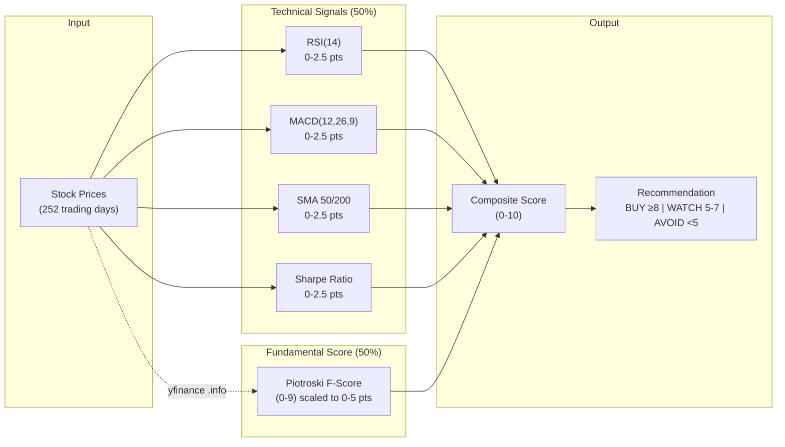
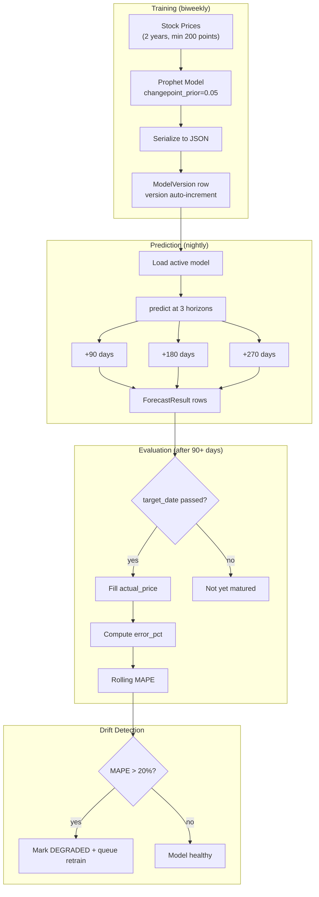

# Functional Specification Document (FSD)

## Stock Signal Platform

**Version:** 2.0
**Date:** March 2026
**Status:** Living Document — Phases 1-7.6 complete, service layer extracted. Phase 8 (Observability + Agent Redesign) planned.
**Prerequisite reading:** docs/PRD.md

---

## 1. Purpose

This document translates the PRD's product requirements into detailed
functional and non-functional specifications. It defines exactly WHAT the
system does, how it behaves under normal and edge conditions, and what
constitutes correct behavior. The TDD (docs/TDD.md) defines HOW to build it.

---

## 2. User Roles & Permissions

| Role | Description | Permissions |
|------|-------------|-------------|
| ADMIN | Platform owner (you) | Full access: CRUD all data, manage users, system config |
| USER | Regular investor | Own portfolio, own watchlist, own chat, read signals |

Phase 1 ships with ADMIN only. USER role added if sharing with others.

---

## 3. Functional Requirements

### FR-1: Authentication & User Management

**FR-1.1: Registration**
- Input: email, password
- Validation: email must be unique, password ≥ 8 chars with ≥1 uppercase,
  ≥1 digit
- Output: user record created, UserPreference created with defaults
- Side effect: none (no auto-login)

**FR-1.2: Login**
- Input: email, password
- Output: { access_token, refresh_token, token_type, expires_in }
- access_token: JWT, expires in ACCESS_TOKEN_EXPIRE_MINUTES (default 60)
- refresh_token: JWT (not opaque — rotation/invalidation NOT implemented, see backlog), expires in REFRESH_TOKEN_EXPIRE_DAYS (default 7)
- Error: 401 if credentials invalid

**FR-1.3: Token Refresh**
- Input: refresh_token
- Output: new { access_token, refresh_token } pair
- **Token rotation:** ✅ Implemented (Phase 5.5, PR #79). Redis-backed JTI blocklist (`backend/services/token_blocklist.py`) invalidates old refresh tokens on rotation. TTL auto-expires entries matching token lifetime.
- Error: 401 if refresh_token expired or invalid

**FR-1.4: User Preferences**
- Users can update: timezone, notification settings, composite score weights,
  position/sector caps, stop-loss defaults
- Preferences used by recommendation engine, alert system, and background jobs

**FR-1.5: httpOnly Cookie Authentication (Phase 2)**
- Login and refresh endpoints set JWT tokens as httpOnly, Secure, SameSite=Lax cookies
- Frontend cannot access tokens via JavaScript (XSS protection)
- Server reads tokens from cookies OR `Authorization: Bearer` header (dual-mode)
- `POST /api/v1/auth/logout` clears cookies (Set-Cookie with Max-Age=0)
- CORS must set `allow_credentials=True` with explicit `allow_origins` (no wildcard)

### FR-2: Stock Universe & Watchlist

**FR-2.1: Stock Universe**
- System maintains S&P 500 constituents (is_in_universe=True)
- Universe synced quarterly via script
- Screener operates on universe; watchlist is user's personal subset

**FR-2.2: Watchlist Management**
- Add ticker to watchlist: ticker must exist in Stock table
- Remove ticker from watchlist
- List watchlist with composite_score (joined from latest signal snapshot). Note: `current_price` and full signal summary are NOT returned — see Phase 3 backlog.
- Maximum 100 tickers per user watchlist

**FR-2.3: Stock Lookup**
- Search stocks by ticker or name (prefix match)
- If ticker not in database, attempt to add via yfinance lookup
- Return: ticker, name, exchange, sector, industry

**FR-2.4: Stock Index Management (Phase 2)**
- System maintains multiple stock indexes: S&P 500, NASDAQ-100, Dow 30
- Each index is a `StockIndex` record with name, description, last sync timestamp
- Stocks belong to indexes via `StockIndexMembership` (many-to-many with dates)
- Membership tracks `added_date` and `removed_date` (null = still a member)
- Dashboard groups stocks by index; screener can filter by index
- Replaces the `is_in_universe` boolean approach with proper index membership
- Seed scripts sync membership from public sources (Wikipedia, etc.)

> **Implementation note:** `removed_date` and `last_synced_at` fields were NOT implemented. The `is_in_universe` boolean on `Stock` model was NOT removed — it coexists with the new index membership system. These are tracked in the Phase 3 backlog.

**FR-2.5: On-Demand Data Ingestion (Phase 2)**
- When user searches for a ticker not yet in the system, UI can trigger ingestion
- `POST /api/v1/stocks/{ticker}/ingest` fetches 10Y of OHLCV data from yfinance
- If ticker already has data: delta fetch only (from `last_fetched_at` to today)
- After price fetch: compute signals and store snapshot
- Upsert logic (ON CONFLICT DO NOTHING) ensures idempotent re-runs
- Rate-limited aggressively (5 requests/minute) — yfinance calls are expensive

### FR-3: Signal Engine



**FR-3.1: Technical Signal Computation**

For a given ticker, using the last 252 trading days of price data:

| Signal | Computation | Output Label |
|--------|------------|-------------|
| RSI(14) | Wilder's smoothed RSI | <30: OVERSOLD, 30-70: NEUTRAL, >70: OVERBOUGHT |
| MACD(12,26,9) | MACD line - Signal line | histogram > 0: BULLISH, ≤ 0: BEARISH |
| SMA Crossover | Compare SMA(50) vs SMA(200) vs current price | GOLDEN_CROSS (50 crosses above 200), DEATH_CROSS (50 crosses below 200), ABOVE_200 (price > SMA200), BELOW_200 (price < SMA200) |
| Bollinger(20,2) | Price position relative to bands | UPPER (> upper band), MIDDLE (between), LOWER (< lower band) |
| Annualized Return | (latest_close / close_252d_ago)^(252/trading_days) - 1 | Percentage |
| Volatility | std(daily_returns) × √252 | Percentage |
| Sharpe Ratio | (annualized_return - risk_free_rate) / volatility | Decimal (risk_free_rate from FRED or default 4.5%) |

**FR-3.2: Composite Score Calculation**

Phase 1 (technical only, composite_weights stored per snapshot):

```
score = 0
max_score = 10

# RSI contribution (0-2.5 points)
if RSI < 30: +2.5     # oversold = buying opportunity
elif RSI < 45: +1.5
elif RSI > 70: +0     # overbought = risky
else: +1.0            # neutral

# MACD contribution (0-2.5 points)
if MACD histogram > 0 and magnitude > 0.5: +2.5  # Uses magnitude as proxy for 'increasing' (only latest value available, not series)
elif MACD histogram > 0: +1.5
elif MACD histogram < 0 and decreasing: +0
else: +0.5

# SMA contribution (0-2.5 points)
if GOLDEN_CROSS: +2.5
elif ABOVE_200: +1.5
elif BELOW_200: +0.5
elif DEATH_CROSS: +0

# Sharpe contribution (0-2.5 points)
if sharpe > 1.5: +2.5
elif sharpe > 1.0: +2.0
elif sharpe > 0.5: +1.0
elif sharpe > 0: +0.5
else: +0

composite_score = score  # 0-10 range
```

Phase 3 adds fundamental signals (see FR-5) and rebalances to 50/50 weight.

**FR-3.3: Signal Staleness**
- Signals older than 24 hours are flagged as STALE
- Stale signals are flagged in API responses (`is_stale` field). **Note:** Staleness is NOT enforced in the recommendation engine — recommendations can still be generated from stale signals. Enforcement planned for Phase 3.
- Dashboard shows "last updated" timestamp prominently

### FR-4: Recommendation Engine

**FR-4.1: Decision Rules**

> **Phase 1 Implementation:** Basic score-threshold rules only:
> - Score >=9 → BUY (HIGH confidence); >=8 → BUY (MEDIUM)
> - Score >=6.5 → WATCH (MEDIUM); >=5 → WATCH (LOW)
> - Score <2 → AVOID (HIGH); <5 → AVOID (MEDIUM)
>
> Actions HOLD and SELL are defined but require portfolio context (Phase 3). No portfolio awareness, no position sizing, no macro regime in Phase 1.

Run daily after signal computation. For each stock in watchlist + universe:

```
INPUT: composite_score, portfolio_state (optional), macro_regime (Phase 5)

IF composite_score >= 8:
    IF stock is held AND allocation >= max_position_pct:
        action = HOLD, confidence = HIGH
        reason = "Strong signals but already at target allocation"
    ELIF macro_regime == RISK_OFF (Phase 5):
        action = BUY, confidence = LOW
        reason = "Strong signals but macro environment is cautious"
    ELSE:
        action = BUY, confidence = HIGH
        suggested_amount = calculate_position_size()

ELIF composite_score >= 5:
    IF stock is held:
        action = HOLD, confidence = MEDIUM
    ELSE:
        action = WATCH, confidence = MEDIUM

ELIF composite_score < 5:
    IF stock is held:
        IF trailing_stop_breached:
            action = SELL, confidence = HIGH
            reason = "Stop-loss triggered at X%"
        ELIF piotroski < 4 (Phase 3):
            action = SELL, confidence = HIGH
            reason = "Fundamental deterioration"
        ELSE:
            action = SELL, confidence = MEDIUM
    ELSE:
        action = AVOID, confidence = MEDIUM
```

**FR-4.2: Position Sizing**

```
calculate_position_size(ticker, portfolio):
    total_value = portfolio.total_value
    target_pct = min(max_position_pct, equal_weight_pct)
        # equal_weight_pct = 100% / number_of_target_positions
        # max_position_pct from UserPreference (default 5%)
    current_pct = portfolio.allocation[ticker] or 0
    gap_pct = target_pct - current_pct

    # Enforce cash reserve
    available_cash = portfolio.cash - (total_value * min_cash_reserve_pct)
    if available_cash <= 0:
        return 0

    # Enforce sector cap
    sector = stock.sector
    sector_allocation = sum(portfolio.allocation for stocks in sector)
    if sector_allocation >= max_sector_pct:
        return 0

    suggested_amount = min(gap_pct * total_value, available_cash)
    if suggested_amount < 100:  # minimum trade size
        return 0

    return round(suggested_amount, 2)
```

**FR-4.3: Recommendation Surfacing**
- `GET /api/v1/stocks/recommendations` returns today's actionable items
- Sorted by: composite_score DESC (confidence is not part of sort order in Phase 1)
- Filterable by: action (BUY/SELL/HOLD), confidence level
- "Action Required" panel on dashboard shows only BUY and SELL with HIGH confidence
- User can acknowledge a recommendation (marks acknowledged=True)

### FR-5: Fundamental Analysis (Phase 3)

**FR-5.1: Fundamental Signals**

| Metric | Source | Scoring |
|--------|--------|---------|
| P/E vs 5Y avg | yfinance | Below avg: +1, Above: 0 |
| PEG < 1 | yfinance | Yes: +1, No: 0 |
| FCF Yield > 5% | yfinance | Yes: +1, No: 0 |
| Debt/Equity < 1 | yfinance | Yes: +1, No: 0 |
| Interest Coverage > 3x | yfinance | Yes: +1, No: 0 |
| Piotroski F-Score | Computed from financials | 7-9: +3, 5-6: +1, <5: 0 |

Fundamental sub-score: 0 to 8 points, normalized to 0-10.

**FR-5.2: Combined Composite Score (Phase 3+)**
```
composite = (technical_score * 0.5) + (fundamental_score * 0.5)
```
Users can override weights via UserPreference.composite_weights.

### FR-6: Portfolio Management (Phase 3) ✅ IMPLEMENTED

**FR-6.1: Transaction Logging** ✅
- Input: ticker, transaction_type (BUY/SELL), shares, price_per_share, transacted_at, notes
- Validation: SELL shares cannot exceed current FIFO-computed holdings (422 if exceeded)
- Ticker FK validation: unknown ticker returns 422 with "Add to watchlist first" message
- Side effect: Position table recomputed via `recompute_position()` after every write
- Endpoint: `POST /api/v1/portfolio/transactions`

**FR-6.2: Position Calculation (FIFO)** ✅
- `_run_fifo()` is a pure function (no DB) — takes list of transaction dicts, returns {shares, avg_cost_basis, closed_at}
- Transactions sorted by `transacted_at` before processing (handles back-dated entries)
- Positions stored in `positions` table (recomputed from scratch on each write — personal portfolio is small)
- `opened_at` preserved on upsert (never overwritten by ON CONFLICT)
- `closed_at` set when shares reach 0; cleared when new BUY restores position
- Unrealized P&L = (current_price − avg_cost_basis) × shares
- Endpoint: `GET /api/v1/portfolio/positions`

**FR-6.2a: Transaction Deletion** ✅
- Pre-delete simulation: run FIFO excluding target transaction (ID-based) → 422 if it would strand a SELL
- Endpoint: `DELETE /api/v1/portfolio/transactions/{id}`

**FR-6.2b: Portfolio Summary** ✅
- Aggregates: total_value, total_cost_basis, unrealized_pnl, unrealized_pnl_pct, position_count
- Sector allocation: grouped by Stock.sector (null → "Unknown"), with over_limit flag (>30%)
- Endpoint: `GET /api/v1/portfolio/summary`

**FR-6.3: Stock Split Handling**
- On split detection (via yfinance): create CorporateAction record
- Adjust all open position quantities: multiply by ratio_to/ratio_from
- Adjust avg_cost: divide by ratio_to/ratio_from
- Historical prices use adj_close (already split-adjusted by yfinance)

**FR-6.4: Dividend Tracking** ✅ (Session 23)
- Fetch dividends from yfinance dividend history via `fetch_dividends()` tool
- Store as DividendPayment rows (TimescaleDB hypertable, composite PK: ticker + ex_date)
- `GET /api/v1/portfolio/dividends/{ticker}` — summary with total received, trailing-12-month annual dividends, dividend yield, payment history
- Stock detail page: DividendCard component with KPI row + collapsible payment history table
- Idempotent upserts via ON CONFLICT DO NOTHING

**FR-6.5: Portfolio Snapshots** ✅ (Session 22)
- Celery Beat daily task at 21:00 UTC (4 PM ET after market close)
- Stores PortfolioSnapshot: total_value, total_cost_basis, unrealized_pnl, position_count
- `GET /api/v1/portfolio/history?days=N` — returns daily snapshots
- PortfolioValueChart: area chart with value line + cost basis dashed line
- Upsert (ON CONFLICT DO UPDATE) for idempotent daily re-runs

**FR-6.6: Divestment Rules Engine** (IMPLEMENTED — Session 24)
- On-demand alerts bundled into positions endpoint response (`PositionWithAlerts`)
- 4 rule types: stop_loss (critical), position_concentration (warning), sector_concentration (warning), weak_fundamentals (warning)
- All thresholds configurable via UserPreference model (not hardcoded)
- `GET /api/v1/preferences` and `PATCH /api/v1/preferences` for threshold management
- Settings sheet on portfolio page (gear icon → shadcn Sheet)
- Alert badges on positions table with severity-based coloring
- Pure function `check_divestment_rules()` in `backend/tools/divestment.py`
- Null safety: skips rules when dependent values are None

### FR-7: Screener (Phase 2)

**FR-7.1: Stock Universe**
- Operates on stocks belonging to a selected index (S&P 500, NASDAQ-100, Dow 30)
- Uses pre-computed signals (not live computation)
- Default view: all indexes combined

**FR-7.2: Filtering**
- Index: S&P 500 / NASDAQ-100 / Dow 30 / All
- RSI state: OVERSOLD / NEUTRAL / OVERBOUGHT
- MACD state: BULLISH / BEARISH
- Sector: multi-select from GICS sectors
- Composite score: range slider (0-10)
- Sharpe ratio: sortable (no dedicated filter param in Phase 1 — see backlog)

**FR-7.3: Sorting**
- Default: composite_score DESC
- Sortable by any visible column
- Server-side sorting via query params

**FR-7.4: Display**
- Color coding: ≥8 green, 5-7 amber, <5 red
- Click row → navigate to stock detail page
- Server-side pagination using offset-based approach (limit + offset params; default limit=50, max 200)
- URL state: filters + sort + offset reflected in query params. Note: column tab selection and view mode (table/grid) are ephemeral UI state, not in URL.

**FR-7.5: Bulk Signals Endpoint**
- `GET /api/v1/stocks/signals/bulk` returns latest signal snapshot per stock
- Supports index, RSI, MACD, sector, and score range filters via query params
- Sortable by any numeric field (composite_score, sharpe, annual_return, etc.)
- Paginated response with total count for UI pagination controls
- Performance target: 500 stocks in <3 seconds

**FR-7.6: Signal History**
- `GET /api/v1/stocks/{ticker}/signals/history` returns chronological snapshots
- Default: last 90 days; configurable up to 365 days
- Used by stock detail page to render signal trend charts (composite score, RSI over time)

**FR-7.7: Screener Column Preset Tabs (Phase 2.5)**
- TradingView-style tab bar above screener table: Overview | Signals | Performance
- Each tab shows a different column set (column definitions in `COL` record + `TAB_COLUMNS` presets)
- Tab selection is ephemeral UI state (not URL-persisted)

**FR-7.8: Screener Grid View (Phase 2.5)**
- Toggle between table view and chart grid view (miniature sparkline cards per stock)
- Grid cards show: full-width Sparkline, ticker, signal badges, composite score
- `price_history: list[float]` (last 30 daily closes) returned in bulk signals endpoint
- Grid/table toggle via `viewMode` state; density toggle hidden in grid mode

**FR-7.9: Screener Density Toggle (Phase 2.5)**
- Comfortable (default) and compact row padding modes
- Persisted to localStorage via `DensityProvider` context
- Toggle visible only in table view

**FR-7.10: Dashboard Composition (Phase 2)**
- Index cards: S&P 500, NASDAQ-100, Dow 30 with stock count, displayed at top
- Watchlist section: stock cards with ticker, price, sentiment badge, composite score
- Ticker search bar triggering on-demand ingestion
- Sector filter toggle
- Staggered fade-in entry animations

**FR-7.11: Stock Detail Page (Phase 2)**
- Breadcrumb navigation (Dashboard > TICKER)
- Price chart (Recharts) with sentiment-tinted gradient, 1M/3M/6M/1Y/2Y/5Y timeframe selector
- Signal breakdown cards: RSI, MACD, SMA, Bollinger (staggered animation)
- Signal history chart (dual-axis: composite score + RSI over time)
- Risk & return section: annualized return, volatility, Sharpe ratio

**FR-7.12: Shell Layout + Design System (Phase 4A)** ✅ IMPLEMENTED
- Dark-only application (`forcedTheme="dark"`) — light mode removed; `enableSystem` disabled
- Shell layout: 54px icon-only `SidebarNav` + `Topbar` + docked right `ChatPanel`
- `ChatPanel`: drag-resizable via DOM events, width persisted to localStorage (`stocksignal:cp-width`), hides via `transform: translateX(100%)` (preserves width when closed)
- New dashboard components: `StatTile` (5-tile KPI row with accent gradient top border), `AllocationDonut` (CSS conic-gradient, no chart library), `PortfolioDrawer` (bottom slide-up with portfolio value chart)
- `Sparkline` replaced with raw SVG `<polyline>` for jagged financial chart aesthetics
- Typography: Sora (UI labels) + JetBrains Mono (numbers/metrics) loaded via `next/font/google`
- All components restyed to navy design tokens (card2, hov, bhi, warning, cyan)

### FR-8: AI Chatbot — Financial Intelligence Platform (Phase 4B ✅ + 4C ✅ + 4D ✅ IMPLEMENTED)

**FR-8.1: Agent Selection**
- General Agent: web search + news Q&A (limited tool access)
- Stock Agent: full tool access across all 5 data layers
- User selects agent type per conversation
- Agent type bound at session creation (cannot switch mid-session)

**FR-8.2: Tool Orchestration**
- Tool Registry with 24 internal tools and 4 MCPAdapter external sources
- Plan→Execute→Synthesize three-phase architecture (V1 ReAct loop removed in Phase 6A):
  - Planner (LLM, tier=planner): classifies intent, generates ordered tool plan (max 10 steps)
  - Executor (mechanical, no LLM): runs tools via registry, $PREV_RESULT resolution, retries, circuit breaker
  - Synthesizer (LLM, tier=synthesizer): confidence scoring, bull/base/bear scenarios, evidence tree with citations
- All data in responses must come from tool results (no hallucination)
- If a tool fails, result marked "unavailable" with reason; synthesizer acknowledges gap
- Scope enforcement: financial-only queries. Non-financial/speculative queries declined gracefully.
- Phase 4D tools (get_fundamentals, get_analyst_targets, get_earnings_history, get_company_profile) read from DB — data materialized during ingestion

**FR-8.3: External Data Integration (5 layers)**
- SEC Filings: 10-K, 10-Q, 8-K, 13F, Form 4 (via EdgarTools MCP)
- News + Sentiment: financial news with sentiment scores (via Alpha Vantage MCP)
- Macroeconomic: FRED data — Fed rate, CPI, treasury yields, employment (via FRED MCP)
- Geopolitical: event detection + sector impact mapping (via GDELT API)
- Analyst + Alternative: consensus ratings, ESG, social sentiment, supply chain (via Finnhub MCP)
- Web search: general web search for current information (via SerpAPI)

**FR-8.4: Warm Data Pipeline**
- Daily: analyst consensus per tracked ticker, key FRED macro indicators
- Weekly: top institutional holders (13F) per portfolio stock
- On-demand with cache: 10-K/10-Q section extraction (cached 24h after first query)

**FR-8.5: Streaming**
- Response streams via NDJSON over SSE
- V1 events: thinking, tool_start, tool_result, token, done, provider_fallback, error
- V2 events (Phase 4D): plan, tool_error, evidence, decline (+ all V1 events)
- Frontend renders incrementally as tokens arrive ✅ (Phase 4C)
- Tool execution status shown as progress indicators ✅ (ToolCard component)
- Plan display shows research steps with checkmarks ✅ (Phase 4D — PlanDisplay)
- Evidence section with collapsible source citations ✅ (Phase 4D — EvidenceSection)
- Decline messages for out-of-scope queries ✅ (Phase 4D — DeclineMessage)

**FR-8.6: Conversation History**
- Stored per ChatSession (user + agent_type)
- ChatMessage records: role, content, tool_calls, tokens_used, model_used, latency_ms
- Sliding window: last 20 messages as LLM context (16K token budget)
- History summary when context exceeds 12K tokens
- Sessions auto-expire after 24 hours of inactivity

**FR-8.7: MCP Server (Phase 4B + 5.6) ✅ IMPLEMENTED**
- **Streamable HTTP** at `/mcp` — for external MCP clients (Claude Code, Cursor). JWT authenticated.
- **stdio transport** (`mcp_server/tool_server.py`) — spawned as subprocess by FastAPI lifespan for internal agent use when `MCP_TOOLS=True` (default). Phase 5.6.
- Same Tool Registry powers chat endpoint, MCP HTTP server, and stdio server
- `MCPToolClient` wraps params as `{"params": {...}}` for FastMCP dispatch
- 20+ integration tests in `tests/integration/`

**FR-8.8: Graceful Degradation & LLM Factory (Phase 6A) ✅ IMPLEMENTED**
- Individual tool failures don't crash the response
- Data-driven multi-model cascade: models configured in `llm_model_config` DB table
- Tier routing: planner uses cheap/fast models, synthesizer uses quality models
- Per-model rate limiting: TokenBudget tracks TPM/RPM/TPD/RPD with 80% threshold
- Error classification: rate_limit/context_length → try next model; auth → stop cascade
- Admin API: `GET/PATCH /admin/llm-models`, `POST /admin/llm-models/reload` (superuser-only)
- Model configs changeable without redeploy via admin endpoints
- Tool result truncation: per-result cap prevents context overflow in synthesizer
- MCP server health tracking — disconnected adapters excluded from tool set
- User informed of degraded data availability in response

**FR-8.9: Evidence Display & User Feedback (Phase 4D) ✅ IMPLEMENTED**
- Every assistant response can include an evidence section showing source citations
- Evidence items: claim text, source tool name, value, timestamp
- Evidence section is collapsible (hidden by default, "Show Evidence" toggle)
- Users can provide thumbs up/down feedback on any assistant message
- Feedback persisted via `PATCH /chat/sessions/{id}/messages/{id}/feedback`
- Feedback stored as "up"/"down" on ChatMessage model

**FR-8.10: Onboarding Experience (KAN-57) ✅ IMPLEMENTED**
- Welcome banner on first visit (localStorage-based detection, dismissible)
- Banner shows 5 suggested tickers (AAPL, MSFT, GOOGL, TSLA, NVDA) as one-click add buttons
- Quick-add: ingests stock data + adds to watchlist in one action
- Empty watchlist state shows quick-add buttons for popular tickers
- Trending stocks section on dashboard (top 5 by composite score, visible even with empty watchlist)
- Uses existing `GET /stocks/signals/bulk?sort_by=composite_score&limit=5` endpoint

**FR-8.11: Enriched Data Layer (Phase 4D) ✅ IMPLEMENTED**
- All yfinance data materialized to DB during ingestion (ingest-time enrichment pattern)
- Stock model enriched with: business summary, employees, website, market cap, revenue growth, gross/operating/profit margins, ROE, analyst targets (mean/high/low), analyst buy/hold/sell counts
- Quarterly earnings stored in EarningsSnapshot table (EPS estimate, actual, surprise %)
- `GET /stocks/{ticker}/fundamentals` returns all enriched fields
- Agent tools read from DB at query time (fast, reliable, no external API calls)

### FR-9: Alerts & Notifications (Phase 5) ✅ IMPLEMENTED (in-app only, Telegram deferred)

**FR-9.1: Alert Rules**
- Trailing stop-loss: price drops X% from recent high (X from UserPreference)
- Position concentration: allocation exceeds max_position_pct
- Sector concentration: sector allocation exceeds max_sector_pct
- Cash reserve: cash drops below min_cash_reserve_pct
- Fundamental deterioration: Piotroski drops below 4
- Signal flip: stock's composite action changes (e.g., HOLD → SELL)

**FR-9.2: Alert Deduplication**
- Same alert rule + same ticker cannot fire more than once per 24 hours
- Acknowledged alerts don't re-fire until condition clears and re-triggers

**FR-9.3: Notification Channels**
- **In-app only** (current) — alerts stored in `in_app_alerts` table, displayed via AlertBell component
- Telegram integration: **NOT IMPLEMENTED — deferred.** Morning briefing, quiet hours, and real-time push are future backlog items.

### FR-10: Recommendation Evaluation (Phase 5) ✅ IMPLEMENTED

This is the feedback loop that answers: "Is this platform giving good advice?"
Without it, the recommendation engine runs on assumptions that are never
validated against reality.

**FR-10.1: Outcome Capture**

Nightly task `evaluate_recommendations.py`:

```
For each RecommendationSnapshot WHERE:
    generated_at + horizon <= today
    AND no matching RecommendationOutcome exists for this (recommendation, horizon):

    For horizon in [30d, 90d, 180d]:
        price_at_rec = recommendation.price_at_recommendation
        price_now = StockPrice.close WHERE ticker AND date = generated_at + horizon
        spy_at_rec = StockPrice.close WHERE ticker='SPY' AND date = generated_at
        spy_now = StockPrice.close WHERE ticker='SPY' AND date = generated_at + horizon

        return_pct = (price_now - price_at_rec) / price_at_rec
        benchmark_return_pct = (spy_now - spy_at_rec) / spy_at_rec
        alpha = return_pct - benchmark_return_pct

        IF action == BUY:
            action_was_correct = (return_pct > benchmark_return_pct)
        ELIF action == SELL:
            action_was_correct = (return_pct < benchmark_return_pct)
        ELIF action == HOLD:
            action_was_correct = (abs(return_pct - benchmark_return_pct) < 0.05)
        ELSE:
            action_was_correct = NULL  # WATCH/AVOID not evaluated

        Store RecommendationOutcome row
```

**FR-10.2: Key Metrics (derived from outcome data)**

After 3+ months of data accumulation, the following metrics become available:

| Metric | Query | What It Tells You |
|--------|-------|-------------------|
| BUY hit rate | % of BUY outcomes where action_was_correct | Are buy calls beating the market? |
| SELL hit rate | % of SELL outcomes where action_was_correct | Are sell calls avoiding losses? |
| Hit rate by confidence | Group by confidence, compare hit rates | Are HIGH confidence calls better? |
| Mean alpha by score bucket | Group by composite_score ranges, avg alpha | Does the 0-10 score actually predict returns? |
| Signal contribution | Join reasoning JSONB, correlate signal presence with alpha | Which signals matter most? |
| Score threshold validation | Hit rate above vs below threshold (8.0) | Is ≥8 the right BUY threshold? |

**FR-10.3: Weight Calibration (manual, not automated)**
- After 6 months of data, user reviews outcome metrics
- If a signal (e.g., RSI) shows no correlation with alpha → reduce its weight
- If a signal (e.g., Sharpe) strongly correlates → increase its weight
- Weight changes are applied via UserPreference.composite_weights
- Previous snapshots retain their original weights (composite_weights JSONB)
  so historical analysis remains valid

**FR-10.4: Data Requirements**
- SPY must ALWAYS be in the stock universe with daily price data
  (required for benchmark calculations)
- price_at_recommendation must be captured at recommendation time
  (not reconstructed later — avoids look-ahead bias)
- Outcome evaluation uses closing prices only (no intraday)

### FR-11: Forecasting & Scorecard UI (Phase 5) ✅ IMPLEMENTED



**FR-11.1: Forecast Card (Stock Detail Page)**
- 3 horizon pills (90d/180d/270d) showing predicted price, % change from current, confidence range
- Confidence badge (High/Moderate/Low) with color coding
- Sharpe direction indicator (improving/flat/declining)
- Loading skeleton while data fetches; empty state when no forecast available
- Data refreshed nightly — 30-min stale time on TanStack Query

**FR-11.2: Dashboard StatTiles**
- "Portfolio Outlook" tile: 90d weighted expected return % across held positions with forecast coverage
- "Accuracy" tile: overall hit rate + alpha, click opens ScorecardModal

**FR-11.3: Scorecard Modal**
- Dialog showing: overall hit rate, average alpha, buy/sell breakdown, worst miss (ticker + return %), per-horizon breakdown grid
- Opens from Accuracy StatTile click

**FR-11.4: Alert Bell (Topbar)**
- Popover dropdown replacing notification stub
- Unread badge count (red, updates every 30s)
- Alert list: severity colors, title, message, ticker tag, time-ago
- "Mark all read" button with batch PATCH
- Max 20 alerts displayed in dropdown

**FR-11.5: Agent Tools for Conversational Access**
- 7 new agent tools allow chat queries: "forecast for AAPL", "compare AAPL and MSFT", "is AAPL's dividend safe?", "what are the risks?", "how accurate are your calls?"
- Entity Registry enables pronoun resolution: "compare them", "what about it?"

### FR-12: Sectors Analysis (Phase 4F) ✅ IMPLEMENTED

- Sector summary: aggregated metrics (stock count, avg composite score, total market cap) per sector
- Drill-down: all stocks in a sector with key metrics
- Correlation matrix: price correlation between top stocks in a sector
- Frontend: SectorAccordion, SectorStocksTable, CorrelationHeatmap components

### FR-13: Portfolio Health Score (Phase 7) ✅ IMPLEMENTED

- Real-time portfolio health score (0-10) with component breakdown: concentration (HHI), diversification, Sharpe ratio, beta exposure
- `PortfolioHealthSnapshot` hypertable for trend tracking
- `GET /portfolio/health` — current score + components
- `GET /portfolio/health/history` — historical trend
- `PortfolioHealthTool` agent tool for chat queries
- Daily snapshots via Celery beat task (4:45 PM ET)

### FR-14: Agent Guardrails (Phase 7/4E) ✅ IMPLEMENTED

- **Input guards:** PII detection + stripping, injection pattern detection, input length validation, ticker/query sanitization
- **Output guards:** mandatory disclaimer appended to financial advice, synthesis validation
- `decline_count` tracked on ChatSession (migration 013) — excessive out-of-scope queries
- Scope enforcement: financial-only queries, data-grounded responses, speculative/non-financial declined

### FR-15: CacheService (Phase 6) ✅ IMPLEMENTED

- 3-tier namespace: `app:` (shared), `user:{id}:` (per-user), `session:{id}:` (per-chat)
- 4 TTL tiers: volatile (2min), standard (15min), stable (60min), session (30min) — all with ±10% jitter
- Shared Redis pool (`backend/services/redis_pool.py`) replaces standalone connections
- Cached endpoints: signals, sectors, forecasts, portfolio summary
- Agent tool session cache: 10 cacheable tools skip re-execution within session
- Cache warmup on startup (indexes), nightly invalidation in pipeline

### FR-16: Stock News & Intelligence (Phase 7) ✅ IMPLEMENTED

- `GET /stocks/{ticker}/news` — Yahoo Finance news feed for a ticker
- `GET /stocks/{ticker}/intelligence` — enriched stock data (beta, dividend yield, forward PE, news, earnings)
- `StockIntelligenceTool` agent tool for chat queries
- Market briefing: `GET /market/briefing` — aggregated market data, portfolio news, upcoming earnings

---

## 4. Non-Functional Requirements

### NFR-1: Performance

| Operation | Target | Measurement |
|-----------|--------|-------------|
| Dashboard page load | < 2s | Lighthouse, pre-computed data |
| Signal computation per ticker | < 5s | Backend timing |
| Screener load (500 stocks) | < 3s | Full table render |
| Chat first token | < 2s | SSE first byte |
| Chat full response (multi-tool) | < 15s | Last token |
| API response (cached) | < 200ms | P95 latency |
| Nightly batch (500 tickers) | < 30 min | Celery task completion |

### NFR-2: Scalability

| Dimension | Target |
|-----------|--------|
| Tracked stocks (universe) | 500 |
| Watchlist per user | 100 |
| Portfolio positions | 100 |
| Concurrent users | 10 |
| Signal history retention | Indefinite |
| Price history | 20 years |

### NFR-3: Availability & Reliability

- Target uptime: 99% (personal tool, ~7 hours downtime/month acceptable)
- yfinance failures: retry 3x with exponential backoff, skip ticker on final failure
- LLM API failures: fall through Groq → Claude → LM Studio → error message
- Background job failures: retry 3x, log to TaskLog, alert on 3 consecutive failures
- Database: daily pg_dump backup (local), Azure automated backup (production)

### NFR-4: Security

- All API endpoints require JWT (except /auth/login, /auth/register, /health)
- Password hashing: bcrypt with cost factor 12
- JWT tokens: RS256 or HS256, short-lived access (60 min), rotating refresh (7 days)
- JWT storage: httpOnly, Secure, SameSite=Lax cookies (Phase 2+)
- Rate limiting: 60 requests/minute per user (configurable); 5/min for data ingestion
- CORS: whitelist frontend origin only, `allow_credentials=True`
- Secrets: environment variables only, never in code or git
- HTTPS: enforced in production via reverse proxy
- SQL injection: prevented by SQLAlchemy parameterized queries
- XSS: prevented by React's default escaping + CSP headers

### NFR-5: Data Integrity

- Portfolio transactions are immutable — no edits, only new entries
- All time-series data is append-only
- Every recommendation and forecast traces to its input data
- Stock splits adjust positions atomically (single transaction)
- FIFO cost basis is deterministic and reproducible

### NFR-6: Observability ✅ ENHANCED (Phase 6B)

- Structured logging: `logging.getLogger(__name__)` (stdlib; structlog for production later)
- Request tracing: correlation ID + ContextVars (`current_session_id`, `current_query_id`) on every chat request
- Background job monitoring: TaskLog table + dashboard widget
- LLM usage tracking: tokens_used and model_used on every ChatMessage
- LLM call logging: every call (success + cascade) writes to `llm_call_log` hypertable (fire-and-forget)
- Tool execution logging: every tool call writes to `tool_execution_log` hypertable
- In-memory metrics: ObservabilityCollector (RPM, cascade events, per-model health, latency p50/p95)
- Admin observability: `GET /admin/llm-metrics`, `GET /admin/tier-health`, `POST /admin/tier-toggle`, `GET /admin/llm-usage`
- Escalation rate: Anthropic calls / total (30-day, queryable via admin API)
- Error alerting: log ERROR level → future integration with monitoring

### NFR-7: Developer Experience (Phase 4.5)

- All PRs to `develop` must pass CI gate before merge (lint + unit + API tests + Jest)
- All merges to `main` must pass full CI gate (lint → unit+api → integration stub → build)
- `main` branch is always deployable — no broken builds permitted
- Branch protection enforced via GitHub branch rules (no direct push to `main` or `develop`)

---

## 5. Business Rules Summary

| Rule | Value | Source |
|------|-------|--------|
| Max position allocation | 5% of portfolio | UserPreference.max_position_pct |
| Max sector allocation | 30% of portfolio | UserPreference.max_sector_pct |
| Min cash reserve | 10% of portfolio | UserPreference.min_cash_reserve_pct |
| Default trailing stop-loss | 20% from high | UserPreference.default_stop_loss_pct |
| Minimum trade size | $100 | Hardcoded |
| Signal staleness threshold | 24 hours | Hardcoded |
| Composite score BUY threshold | ≥ 8 | Recommendation engine |
| Composite score SELL threshold | < 5 | Recommendation engine |
| Piotroski deterioration threshold | < 4 | Recommendation engine |
| Recommendation eval horizons | 30d, 90d, 180d | RecommendationOutcome |
| Benchmark ticker | SPY (S&P 500 ETF) | RecommendationOutcome |
| BUY correct definition | stock return > benchmark return | RecommendationOutcome |
| SELL correct definition | stock return < benchmark return | RecommendationOutcome |
| Alert dedup window | 24 hours | AlertLog |
| Max chat tool calls per turn | 10 | Planner prompt (§5.5) |
| LLM model cascade | Data-driven via `llm_model_config` DB table (Phase 6A) | Per-tier priority order |

---

## 6. Error Handling

### API Errors (returned to client)

| HTTP Code | When | Response Body |
|-----------|------|--------------|
| 400 | Bad request (invalid ticker format, etc.) | { detail: "description" } |
| 401 | Missing/invalid/expired JWT | { detail: "Not authenticated" } |
| 403 | Insufficient role (USER accessing ADMIN endpoint) | { detail: "Forbidden" } |
| 404 | Resource not found (ticker, portfolio, etc.) | { detail: "Not found" } |
| 409 | Conflict (duplicate email, etc.) | { detail: "Already exists" } |
| 422 | Validation error (Pydantic) | { detail: [field errors] } |
| 429 | Rate limit exceeded | { detail: "Too many requests" } |
| 500 | Unexpected server error | { detail: "Internal error" } (no stack trace) |

### Background Job Errors (logged to TaskLog)

| Error | Handling |
|-------|----------|
| yfinance timeout | Retry 3x, skip ticker, continue batch |
| yfinance rate limit | Exponential backoff (2s, 4s, 8s) |
| LLM API error | Fall through to next provider |
| Database connection lost | Retry with fresh connection |
| Invalid data from yfinance | Log warning, skip ticker, don't corrupt DB |

---

## 7. Feature × Phase Matrix

| Feature | Phase 1 | Phase 2 | Phase 3 | Phase 4 | Phase 5 | Phase 6 | Phase 7 |
|---------|---------|---------|---------|---------|---------|---------|---------|
| Auth + JWT refresh | ✓ | httpOnly | | | Token blocklist (5.5) | | |
| User preferences | ✓ | | Enhanced | | Enhanced | | |
| Stock universe + watchlist | ✓ | Index membership | | | | | |
| Technical signals | ✓ | | | | | | |
| Composite score | ✓ | | 50/50 blend | | | | |
| Recommendations | ✓ | | Portfolio-aware | | Macro-aware | | |
| Dashboard UI | | ✓ | Enhanced | Redesign (4A/4F) | Enhanced | | |
| Screener UI | | ✓ | | | | | |
| Stock detail page | | ✓ | Enhanced | | | | News + Intelligence |
| Design system | | ✓ (2.5) | | Navy command center (4A) | | | |
| Fundamental signals | | | ✓ | | | | |
| Portfolio tracker | | | ✓ | | | | Health score |
| Dividends + snapshots | | | ✓ | | | | |
| AI chatbot backend | | | | ✓ (4B) | | | |
| Tool Registry + MCP | | | | ✓ (4B) | stdio (5.6) | | |
| Chat UI | | | | ✓ (4C) | | | |
| Agent V2 (Plan→Execute→Synth) | | | | ✓ (4D) | | V1 removed | |
| Agent guardrails | | | | | | | ✓ (PII, injection) |
| CI/CD pipeline | | | | ✓ | | | |
| Forecasting (Prophet) | | | | | ✓ | | |
| Model versioning + drift | | | | | ✓ | | |
| Rec evaluation + scorecard | | | | | ✓ | | |
| Celery + nightly pipeline | | | | | ✓ | | |
| Sectors page | | | | ✓ (4F) | | | |
| LLM Factory + observability | | | | | | ✓ (6A-6C) | |
| CacheService | | | | | | ✓ | |
| Data enrichment (beta, PE) | | | | | | | ✓ |
| Agent intelligence tools | | | | | | | ✓ (4 new tools) |
| Options flow (Unusual Whales) | | | | | _deferred_ | | |
| Telegram notifications | | | | | _deferred_ | | |
| Cloud deployment | | | | | | _planned_ | |
