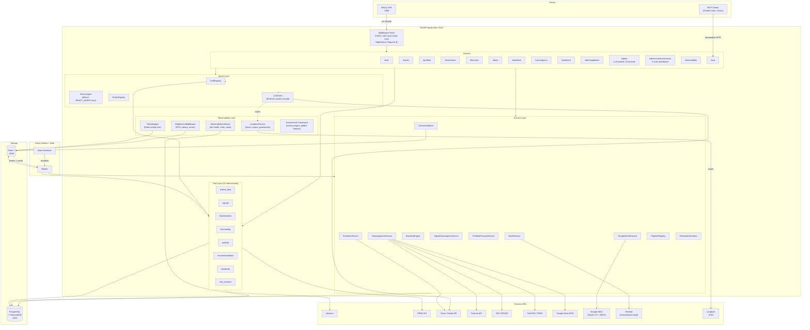
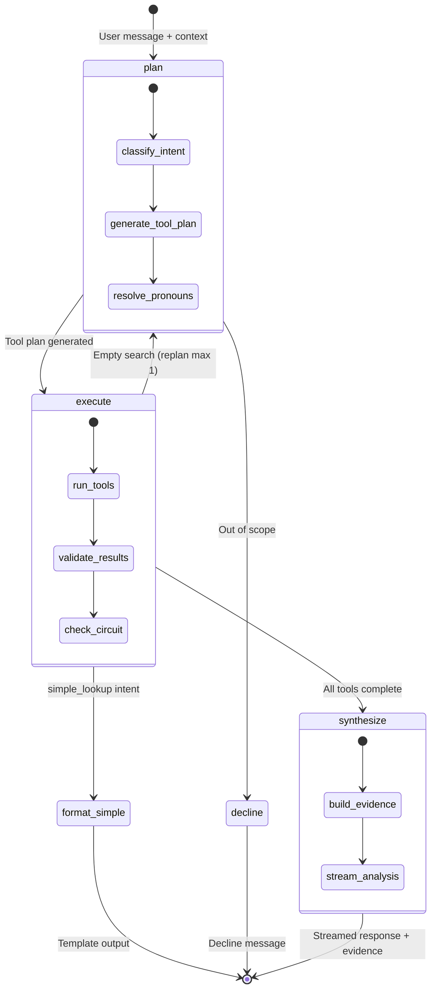
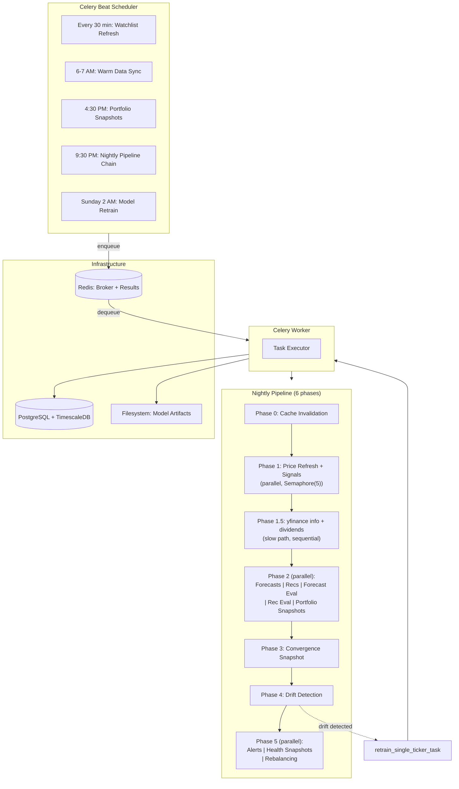
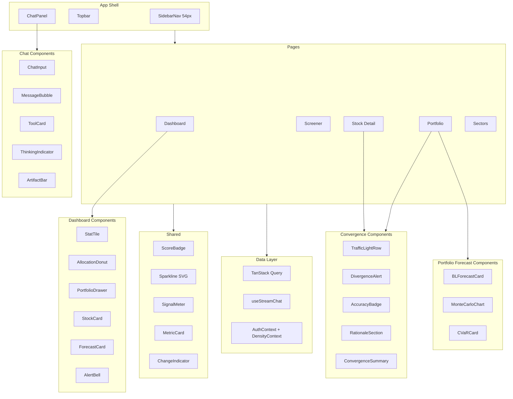
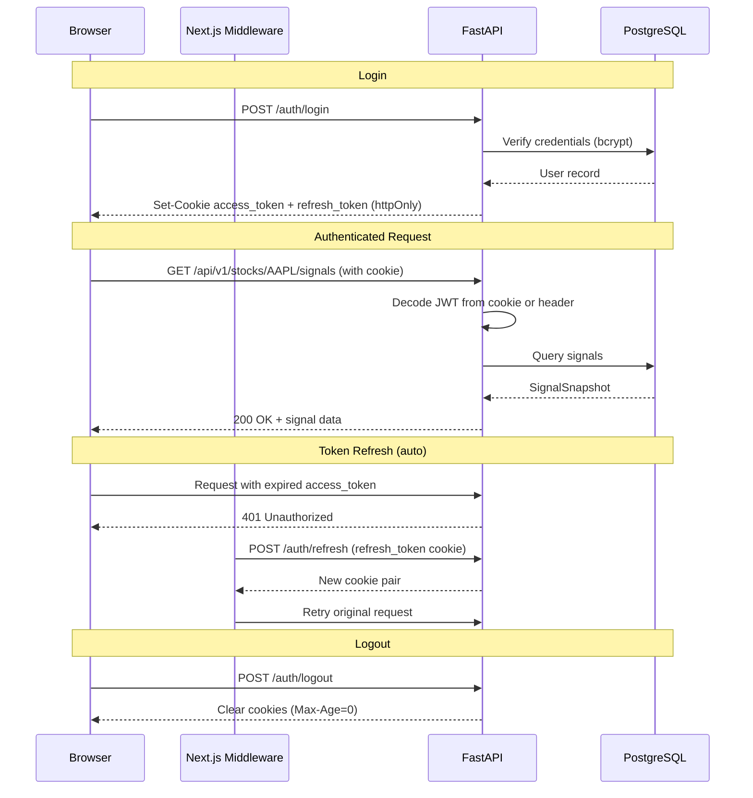
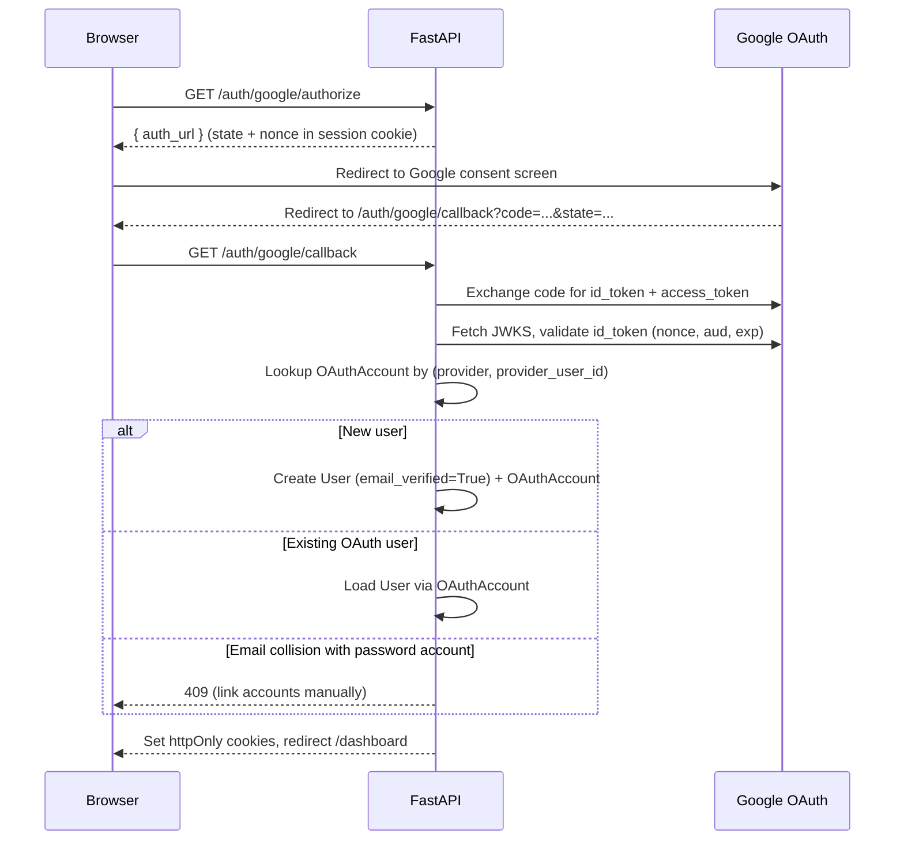
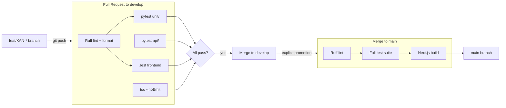

# Technical Design Document (TDD)

## Stock Signal Platform

**Version:** 2.0
**Date:** April 2026
**Status:** Living Document
**Prerequisite reading:** docs/PRD.md, docs/FSD.md, docs/data-architecture.md

---

## 1. Purpose

This document defines HOW the system is built. It covers component architecture,
API contracts, service layer patterns, integration details, and deployment
topology. The FSD defines WHAT the system does; this document defines HOW it
does it.

---

## 2. System Architecture

### 2.1 High-Level Overview



### 2.1.1 Database Entity Relationships

```mermaid
erDiagram
    users ||--o{ portfolios : owns
    users ||--o{ user_preferences : has
    users ||--o{ watchlist : has
    users ||--o{ chat_session : creates
    users ||--o{ recommendation_snapshots : receives
    users ||--o{ in_app_alerts : receives
    users ||--o{ recommendation_outcomes : evaluated
    users ||--o{ oauth_accounts : linked_to

    portfolios ||--o{ positions : contains
    portfolios ||--o{ transactions : records
    portfolios ||--o{ portfolio_snapshots : tracked

    stocks ||--o{ stock_prices : has
    stocks ||--o{ signal_snapshots : computed
    stocks ||--o{ dividend_payments : pays
    stocks ||--o{ earnings_snapshots : reports
    stocks ||--o{ positions : held_in
    stocks ||--o{ forecast_results : predicted
    stocks ||--o{ model_versions : trained
    stocks ||--o{ backtest_runs : validated
    stocks ||--o{ signal_convergence_daily : converges
    stocks ||--o{ news_articles : mentioned_in
    stocks ||--o{ news_sentiment_daily : sentiment_for

    stock_indexes ||--o{ stock_index_memberships : contains
    stocks ||--o{ stock_index_memberships : belongs_to

    model_versions ||--o{ forecast_results : generates
    model_versions ||--o{ backtest_runs : validated_by

    users ||--o{ admin_audit_log : audited

    chat_session ||--o{ chat_message : contains

    users {
        uuid id PK
        string email UK
        string hashed_password "nullable — null for OAuth-only"
        string role
        boolean email_verified
        datetime deleted_at "null = active; set = soft-deleted"
    }

    oauth_accounts {
        uuid id PK
        uuid user_id FK
        string provider "google"
        string provider_user_id UK
        string email
        datetime created_at
    }

    stocks {
        string ticker PK
        string name
        string sector
        boolean is_etf
        float market_cap
        float revenue_growth
    }

    stock_prices {
        string ticker FK
        timestamp time
        float open
        float close
        float adj_close
        bigint volume
    }

    signal_snapshots {
        string ticker FK
        timestamp computed_at
        float composite_score
        float rsi_value
        float sharpe_ratio
    }

    model_versions {
        uuid id PK
        string ticker FK
        string model_type
        int version
        boolean is_active
        string artifact_path
    }

    forecast_results {
        date forecast_date
        string ticker FK
        int horizon_days
        float predicted_price
        float actual_price
        float error_pct
    }

    recommendation_snapshots {
        uuid user_id FK
        string ticker
        string action
        float composite_score
    }

    recommendation_outcomes {
        uuid id PK
        uuid user_id FK
        string action
        int horizon_days
        float return_pct
        float alpha_pct
        boolean action_was_correct
    }

    backtest_runs {
        uuid id PK
        string ticker FK
        uuid model_version_id FK
        string config_label
        date train_start
        date train_end
        date test_start
        date test_end
        int horizon_days
        int num_windows
        float mape
        float mae
        float rmse
        float direction_accuracy
        float ci_containment
        string market_regime "nullable"
        jsonb metadata_
    }

    signal_convergence_daily {
        date date PK
        string ticker PK
        string rsi_direction
        string macd_direction
        string sma_direction
        string piotroski_direction
        string forecast_direction
        float news_sentiment "nullable"
        int signals_aligned
        string convergence_label
        float composite_score "nullable"
        float actual_return_90d "nullable"
        float actual_return_180d "nullable"
    }

    news_articles {
        datetime published_at PK
        uuid id PK
        string ticker "nullable"
        text headline
        string source
        string source_url "nullable"
        string event_type "nullable"
        string dedupe_hash
        datetime scored_at "nullable"
    }

    news_sentiment_daily {
        date date PK
        string ticker PK
        float stock_sentiment
        float sector_sentiment
        float macro_sentiment
        int article_count
        float confidence
        string dominant_event_type "nullable"
        string quality_flag "ok|suspect|invalidated"
    }

    admin_audit_log {
        uuid id PK
        uuid user_id FK
        string action
        string target "nullable"
        jsonb metadata_
    }

    ticker_ingestion_state {
        uuid id PK
        string ticker FK
        string stage "prices|signals|fundamentals|forecast|sentiment|convergence|backtest|recommendation"
        datetime last_updated_at
        datetime created_at
    }

    dq_check_history {
        uuid id PK
        string check_name
        string severity "critical|high|medium|low"
        string ticker "nullable"
        text message
        jsonb metadata_
        datetime detected_at
    }

    pipeline_watermark {
        uuid id PK
        string pipeline_name UK
        date last_completed_date
        datetime last_completed_at
        string status
    }

    stocks ||--o{ ticker_ingestion_state : tracks
```



> 30+ tables total. Hypertables: `stock_prices`, `signal_snapshots`, `portfolio_snapshots`, `news_articles`. Full schema in `docs/data-architecture.md`.

**Additional models (not in ER diagram):**

- **TickerIngestionState** (`backend/models/ticker_ingestion_state.py`, migration 025): Tracks per-ticker, per-stage ingestion freshness. FK to `stocks(ticker)` with CASCADE.
- **DqCheckHistory** (`backend/models/dq_check_history.py`, migration 027): Stores data quality check findings from the nightly DQ scanner.
- **PipelineWatermark** (`backend/models/pipeline.py`): Tracks last successful completion date per pipeline stage for gap detection.
- **PipelineRun** update: `celery_task_id` column (String(64), nullable, indexed) added in migration 026.

### 2.2 Layer Responsibilities

| Layer | Responsibility | Example |
|-------|---------------|---------|
| **Routers** | HTTP handling, request validation, response serialization | Parse JWT, validate Pydantic schema, call service, return response |
| **Services** | Business logic orchestration, transaction management | Combine signal computation + recommendation generation in one flow |
| **Tools** | Domain logic, external API integration, data access | Compute RSI from price data, call yfinance, query TimescaleDB |
| **Agents** | LLM orchestration, tool selection, response synthesis | Interpret "Analyse AAPL", call signal + fundamental + forecast tools, synthesize |
| **Tasks** | Background job execution, scheduling | Nightly: fetch prices → compute signals → generate recommendations → check alerts |

### 2.3 Key Design Rules

1. **Routers never contain business logic.** They validate, call a service, and return.
2. **Services own transactions.** A service method = one database transaction boundary.
3. **Tools are stateless and independently testable.** Each tool is a pure function
   (data in → result out) that can be called by services, agents, or Celery tasks.
4. **Agents never access the database directly.** They call tools through ToolRegistry.
5. **No circular dependencies.** Direction is always: Router → Service → Tool.
   Agents sit alongside services, calling the same tools.

---

## 3. API Design

### 3.1 Base URL & Versioning

- Base: `/api/v1/`
- Versioning: URL-based. If breaking changes needed, create `/api/v2/` routers.
  Old version stays active for 3 months (migration period).

### 3.2 Authentication Endpoints

```
POST /api/v1/auth/register
  Request:  { email: string, password: string }
  Response: { id: uuid, email: string, created_at: datetime }
  Errors:   409 (email exists), 422 (validation)

POST /api/v1/auth/login
  Request:  { email: string, password: string }
  Response: { access_token: string, refresh_token: string,
              token_type: "bearer", expires_in: int }
  Errors:   401 (bad credentials)

POST /api/v1/auth/refresh
  Request:  { refresh_token: string }
  Response: { access_token: string, refresh_token: string,
              token_type: "bearer", expires_in: int }
  Errors:   401 (invalid/expired refresh token)

POST /api/v1/auth/logout
  Response: 204
  Behavior: Clears httpOnly cookies (Set-Cookie with Max-Age=0)

Note: Login and refresh also set httpOnly cookies (access_token + refresh_token).
Server reads tokens from cookies OR Authorization header (dual-mode auth).
```

### 3.2.1 Auth Endpoints (Extended)

```
POST /api/v1/auth/forgot-password
  Request:  { email: string }
  Response: { message: string }   # Always 200 (no email enumeration)

POST /api/v1/auth/reset-password
  Request:  { token: string, new_password: string }
  Response: { message: string }
  Errors:   400 (invalid/expired token)

POST /api/v1/auth/resend-verification
  Response: { message: string }
  Auth:     Required (unverified user)

GET /api/v1/auth/verify-email?token={token}
  Response: { message: string }
  Errors:   400 (invalid/expired token)

GET /api/v1/auth/google/authorize
  Response: { auth_url: string }  # Redirect target with state+nonce

GET /api/v1/auth/google/callback?code={code}&state={state}
  Response: Sets httpOnly cookies; redirects to /dashboard
  Errors:   400 (state mismatch), 409 (email conflict with password account)

DELETE /api/v1/auth/account
  Response: 204
  Auth:     Required
  Behavior: Soft-delete (sets deleted_at); 30-day purge via Celery task.

--- Admin endpoints (ADMIN role required) ---

POST /api/v1/admin/users/{user_id}/verify
  Response: { message: string }

POST /api/v1/admin/users/{user_id}/recover
  Response: { message: string }  # Restores soft-deleted account

GET /api/v1/admin/users
  Response: [{ id, email, role, email_verified, deleted_at, created_at }]

GET /api/v1/admin/users/{user_id}
  Response: UserAdminDetail
```

### 3.2.2 Auth Endpoints (OIDC & Account Management)

```
GET /api/v1/auth/.well-known/openid-configuration
  Response: OIDC discovery document (issuer, jwks_uri, supported scopes)
  Auth:     None (public endpoint)
  Note:     Enables Langfuse SSO. Disabled when OIDC is unconfigured.

GET /api/v1/auth/userinfo
  Response: { sub, email, name }
  Auth:     Required (Bearer token)
  Note:     OIDC userinfo endpoint for Langfuse SSO integration.

POST /api/v1/auth/set-password
  Request:  { new_password: string }
  Response: { message: string }
  Auth:     Required
  Note:     Sets password for OAuth-only accounts (hashed_password is null).
  Errors:   400 (already has password)

POST /api/v1/auth/google/unlink
  Response: { message: string }
  Auth:     Required
  Note:     Unlinks Google OAuth from account. Requires existing password.
  Errors:   400 (no password set — would lock out user), 404 (no linked account)

GET /api/v1/auth/account
  Response: { id, email, role, email_verified, has_password, has_google,
              created_at }
  Auth:     Required
  Note:     Account info including linked providers and password status.
```

### 3.3 Stock & Signal Endpoints

```
GET /api/v1/stocks/search?q={query}
  Response: [{ ticker, name, exchange, sector }]
  Auth:     Required

GET /api/v1/stocks/{ticker}/signals
  Response: { ticker, computed_at, rsi: { value, signal },
              macd: { value, histogram, signal }, sma: { sma_50, sma_200,
              signal }, bollinger: { upper, lower, position },
              returns: { annual_return, volatility, sharpe },
              composite_score, is_stale }
  Errors:   404 (ticker not found)

GET /api/v1/stocks/{ticker}/prices?period={1mo|3mo|6mo|1y|2y|5y|10y}
  Response: [{ time, open, high, low, close, volume }]
  Errors:   404 (ticker not found)

GET /api/v1/stocks/{ticker}/signals/history?period={1m|3m|6m|1y}
  Response: [{ computed_at, composite_score, rsi_value, macd_value }]

POST /api/v1/stocks/watchlist
  Request:  { ticker: string }
  Response: { id, ticker, added_at }
  Errors:   404 (ticker unknown), 409 (already in watchlist)

DELETE /api/v1/stocks/watchlist/{ticker}
  Response: 204

GET /api/v1/stocks/watchlist
  Response: [{ id, ticker, name, sector, composite_score, added_at }]
```

### 3.4 Recommendation Endpoints

```
GET /api/v1/stocks/recommendations?action={BUY|WATCH|AVOID}&confidence={HIGH|MEDIUM|LOW}
  Response: [{ ticker, action, confidence, composite_score,
               price_at_recommendation, reasoning: dict,
               generated_at, is_actionable }]
  Note: suggested_amount_usd, portfolio_weight_pct, target_weight_pct
        require portfolio context

POST /api/v1/recommendations/{id}/acknowledge — Planned
```

### 3.5 Portfolio Endpoints

```
POST /api/v1/portfolio/transactions          [201 Created]
  Request:  { ticker: str, transaction_type: "BUY"|"SELL",
              shares: Decimal, price_per_share: Decimal,
              transacted_at: datetime, notes?: str }
  Response: TransactionResponse
  Errors:   422 (SELL > held shares | ticker not in stocks table)

GET /api/v1/portfolio/transactions           [200 OK]
  Query:    ?ticker=AAPL (optional filter)
  Response: [TransactionResponse] sorted by transacted_at desc

DELETE /api/v1/portfolio/transactions/{id}  [204 No Content]
  Errors:   404 (not found or not owned), 422 (would strand a SELL)

GET /api/v1/portfolio/positions              [200 OK]
  Response: [{ ticker, shares, avg_cost_basis, current_price,
               market_value, unrealized_pnl, unrealized_pnl_pct,
               allocation_pct }]  — open positions only (closed_at IS NULL)

GET /api/v1/portfolio/summary                [200 OK]
  Response: { total_value, total_cost_basis, unrealized_pnl,
              unrealized_pnl_pct, position_count,
              sectors: [{ sector, market_value, pct, over_limit }] }

GET /api/v1/portfolio/history?days={N}                    (value history chart)
GET /api/v1/portfolio/dividends/{ticker}                  (dividend summary + history)
GET /api/v1/preferences                                   (user threshold preferences)
PATCH /api/v1/preferences                                 (update threshold preferences)
GET /portfolio/positions returns alerts[] per position     (divestment alerts)
```

**Tool:** `backend/tools/portfolio.py`
- `_run_fifo(transactions)` — pure function, no DB, O(1) lot consumption via `deque`
- `_group_sectors(positions, total_value, max_sector_pct)` — pure function, groups by sector (null → "Unknown"), flags `over_limit` per user pref
- `get_or_create_portfolio(user_id, db)` — lazy portfolio creation on first use
- `recompute_position(portfolio_id, ticker, db)` — full FIFO recompute after every write; preserves `opened_at`
- `get_positions_with_pnl(portfolio_id, db)` — fetches latest price per position from StockPrice, includes sector
- `get_portfolio_summary(portfolio_id, db, max_sector_pct)` — aggregates KPIs + sector breakdown with user-configurable over_limit threshold
- `snapshot_portfolio_value(portfolio_id, db)` — daily snapshot with upsert
- `get_portfolio_history(portfolio_id, db, days)` — fetch time series snapshots

**Tool:** `backend/tools/dividends.py`
- `fetch_dividends(ticker)` — fetch from yfinance, returns list of {ex_date, amount}
- `store_dividends(ticker, dividends, db)` — upsert to DividendPayment table (ON CONFLICT DO NOTHING)
- `get_dividends(ticker, db)` — query stored dividend payments
- `get_dividend_summary(ticker, db, current_price)` — aggregate stats: total received, annual, yield, history

**Tool:** `backend/tools/divestment.py`
- `check_divestment_rules(position, sector_allocations, signal, prefs)` — pure function, returns list of alert dicts
  - 4 rules: stop_loss (critical, pnl ≤ -threshold), position_concentration (warning, alloc > max), sector_concentration (warning, sector > max), weak_fundamentals (warning, composite < 3)
  - Null-safe: skips rule when dependent value is None

**Router:** `backend/routers/preferences.py`
- `_get_or_create_preference(user_id, db)` — idempotent fetch/create helper (shared with portfolio router)
- `GET /api/v1/preferences` → `UserPreferenceResponse` (includes `rebalancing_strategy`)
- `PATCH /api/v1/preferences` → partial update via `UserPreferenceUpdate` (Field gt=0, le=100; `rebalancing_strategy` Literal["min_volatility", "max_sharpe", "risk_parity"])

--- Portfolio Analytics ---

```
GET /api/v1/portfolio/analytics                     [200 OK]
  Response: { sharpe?, sortino?, max_drawdown?, max_drawdown_duration?,
              calmar?, alpha?, beta?, var_95?, cagr?, data_days? }
  Notes:    Reads materialized QuantStats from latest portfolio_snapshots row.
            All null when < 30 days of snapshots. data_days shows how many.

GET /api/v1/portfolio/rebalancing                   [200 OK]
  Response: RebalancingResponse (same shape as before)
  Notes:    Now reads from materialized rebalancing_suggestions table
            (PyPortfolioOpt). Falls back to equal-weight if no materialized data.
            Suggestions include strategy name in reason field.

GET /api/v1/stocks/{ticker}/analytics               [200 OK]
  Response: { ticker, sortino?, max_drawdown?, alpha?, beta?, data_days? }
  Notes:    Reads materialized per-stock QuantStats from latest signal_snapshots.
            All null when < 30 days of SPY benchmark overlap.
```

**Service:** `backend/services/signals.py`
- `compute_quantstats_stock(closes, spy_closes, rf)` — Sortino, max_drawdown (positive), alpha, beta vs SPY. NaN/Inf guarded. Tz-normalized.
- Signal indicators now use `pandas-ta-openbb` (drop-in replacement for hand-rolled RSI/MACD/SMA/Bollinger). `importlib.metadata` must be imported first (package bug workaround).

**Service:** `backend/services/portfolio.py`
- `compute_quantstats_portfolio(portfolio_id, db)` — 10 metrics from portfolio snapshot history. Calmar isolated (can be inf). Uses `_safe_round()` for NaN/Inf. SPY alpha/beta in separate try/except.
- `compute_rebalancing(portfolio_id, strategy, db, max_position_pct)` — PyPortfolioOpt with 3 strategies. Falls back to equal-weight on < 2 positions, < 30 days, or solver failure.
- `materialize_rebalancing(portfolio_id, db)` — reads UserPreference.rebalancing_strategy, delete + insert.

**Tool:** `backend/tools/portfolio_analytics.py`
- `PortfolioAnalyticsTool` — reads materialized QuantStats from latest portfolio_snapshots row via ContextVar user_id.

**Migration 022** (`c870473fe107`): signal_snapshots +5 cols, portfolio_snapshots +10 cols, user_preferences +1 col, rebalancing_suggestions table, SPY seed.

**Migration 023** (`5c9a05c38ee1`): `oauth_accounts` table; users +`email_verified`, `deleted_at` columns; `hashed_password` made nullable (for OAuth-only users).

### 3.6 Chat Endpoint

```
POST /api/v1/chat/stream
  Request:  { message: string, session_id?: uuid, agent_type: "general"|"stock" }
  Response: NDJSON stream of events (see §3.6.1)
  Auth:     Required (httpOnly cookie)
  Behavior: When REACT_AGENT=true (default), uses ReAct loop (§5.3).
            When REACT_AGENT=false, uses Plan-Execute-Synthesize graph (§5.5).
            User context (portfolio, preferences, watchlist) injected automatically.
            query_id (UUID) generated per request for trace correlation.
```

### 3.6.1 NDJSON Stream Events

```
V1 Events (ReAct graph):
  { type: "thinking", content: "Analyzing your question..." }
  { type: "tool_start", tool: "analyze_stock", params: {...} }
  { type: "tool_result", tool: "analyze_stock", status: "ok", data: {...} }
  { type: "token", content: "..." }                           # Streamed text
  { type: "done", usage: {...} }
  { type: "error", error: "..." }
  { type: "provider_fallback", content: "Switching to..." }

V2 Events (Plan-Execute-Synthesize graph, REACT_AGENT=false):
  { type: "thinking", content: "Planning research approach..." }
  { type: "plan", content: "reasoning...", data: { steps: ["tool1", "tool2"] } }
  { type: "tool_result", tool: "...", status: "ok", data: {...} }
  { type: "tool_error", tool: "...", error: "API timeout" }
  { type: "evidence", data: [{ claim, source_tool, value, timestamp }] }
  { type: "decline", content: "I focus on financial analysis..." }
  { type: "token", content: "..." }                           # Synthesis text
  { type: "done", usage: {...} }
```

### 3.6.2 Feedback Endpoint

```
PATCH /api/v1/chat/sessions/{session_id}/messages/{message_id}/feedback
  Request:  { feedback: "up" | "down" }
  Response: { status: "ok", feedback: "up" | "down" }
  Auth:     Required (session must belong to user)
  Errors:   404 (session or message not found)
```

### 3.6.3 Extended Fundamentals Endpoint

```
GET /api/v1/stocks/{ticker}/fundamentals
  Response: { ticker, pe_ratio, peg_ratio, fcf_yield, debt_to_equity,
              piotroski_score, piotroski_breakdown,
              revenue_growth, gross_margins, operating_margins, profit_margins,
              return_on_equity, market_cap,
              analyst_target_mean, analyst_target_high, analyst_target_low,
              analyst_buy, analyst_hold, analyst_sell }
  Auth:     Required
  Note:     Enriched fields from Stock model (materialized during ingestion).
            P/E, PEG, FCF yield, Piotroski still fetched live from yfinance.
```

### 3.6.4 Stock Intelligence Endpoint

```
GET /api/v1/stocks/{ticker}/intelligence
  Response: { ticker, summary, key_drivers, risks, opportunities, generated_at }
  Auth:     Required
  Note:     AI-generated stock intelligence summary combining signals,
            fundamentals, forecast, and news context.
```

### 3.6.5 Stock News Endpoint

```
GET /api/v1/stocks/{ticker}/news
  Response: [{ title, link, publisher, published, source, ticker }]
  Auth:     Required
  Note:     Recent news articles for a specific ticker.
```

### 3.7 Index Endpoints

```
GET /api/v1/indexes
  Response: [{ id, name, slug, description, stock_count }]
  Auth:     Required

GET /api/v1/indexes/{slug}/stocks
  Response: { index_name, total, items: [{ ticker, name, sector, exchange,
               latest_price, composite_score, rsi_signal, macd_signal }] }
  Auth:     Required
```

### 3.8 Data Ingestion Endpoint

```
POST /api/v1/stocks/{ticker}/ingest
  Response: { ticker, name, rows_fetched, composite_score, status: "created"|"updated" }
  Auth:     Required
  Rate:     20 requests/hour per user (expensive: yfinance + signal computation)
  Behavior: If ticker has no data → full 10Y fetch
            If ticker has data → delta fetch from last_fetched_at
            Always recomputes signals after fetch
  Errors:   404 (invalid ticker on yfinance), 429 (rate limit)

GET /api/v1/stocks/{ticker}/ingest-state
  Response: IngestStateResponse {
              ticker,
              stages: { prices, signals, fundamentals, forecast, news, sentiment, convergence },
                where each stage is StageInfo { updated_at, status: "fresh"|"stale"|"pending"|"missing" },
              overall_status: "ready"|"ingesting"|"stale"|"missing",
              completion_pct: int (0-100)
            }
  Auth:     Required (non-admin — no PII, only timestamps)
  Behavior: Reads ticker_ingestion_state row. Classifies each stage against StalenessSLAs:
              age <= SLA           → fresh
              SLA < age <= 2×SLA   → stale
              age > 2×SLA          → pending
              updated_at is NULL   → missing
            overall_status is "ready" if all 7 stages fresh, "ingesting" if any pending/missing.
            Used by the IngestProgressToast (frontend polls every 2s while ingesting).
  Errors:   404 (ticker has no ticker_ingestion_state row)
```

### 3.9 Bulk Signals Endpoint

```
GET /api/v1/stocks/signals/bulk?index_id={uuid}
                               &rsi_state={OVERSOLD|NEUTRAL|OVERBOUGHT}
                               &macd_state={BULLISH|BEARISH}
                               &sector={Technology|Healthcare|...}
                               &score_min={0-10}&score_max={0-10}
                               &sort_by={composite_score|sharpe_ratio|annual_return}
                               &sort_order={asc|desc}
                               &limit={50}&offset={0}
  Response: { total, items: [{ ticker, name, sector, rsi_value, rsi_signal,
               macd_signal, sma_signal, bb_position, annual_return,
               volatility, sharpe_ratio, composite_score, computed_at, is_stale,
               price_history: list[float] (last 30 daily closes, for sparkline charts) }] }
  Auth:     Required
  Query:    DISTINCT ON (ticker) ORDER BY computed_at DESC
  Perf:     <3 seconds for 500 stocks
```

### 3.10 Signal History Endpoint

```
GET /api/v1/stocks/{ticker}/signals/history?days={90}&limit={100}
  Response: [{ computed_at, composite_score, rsi_value, rsi_signal,
               macd_value, macd_signal, sma_signal, bollinger_signal }]
  Auth:     Required
  Default:  90 days, max 365 days
```

### 3.11 Forecast Endpoints

```
GET /api/v1/forecasts/{ticker}
  Response: ForecastResponse { ticker, horizons: ForecastHorizon[], model_mape, model_status }
  Auth:     Required

GET /api/v1/forecasts/portfolio
  Response: PortfolioForecastResponse { horizons: PortfolioForecastHorizon[], ticker_count, vix_regime }
  Auth:     Required

GET /api/v1/forecasts/sector/{sector}
  Response: SectorForecastResponse { sector, etf_ticker, horizons[], user_exposure_pct, user_tickers_in_sector }
  Auth:     Required

GET /api/v1/recommendations/scorecard
  Response: ScorecardResponse { total_outcomes, overall_hit_rate, avg_alpha, buy_hit_rate, sell_hit_rate, worst_miss_pct, worst_miss_ticker, by_horizon[] }
  Auth:     Required
```

### 3.12 Alert Endpoints

```
GET /api/v1/alerts
  Response: AlertResponse[] { id, alert_type, severity, title, message, ticker, is_read, created_at, metadata }
  Auth:     Required

GET /api/v1/alerts/unread-count
  Response: { unread_count: int }
  Auth:     Required

PATCH /api/v1/alerts/read
  Body:     { alert_ids: string[] }
  Response: { updated: int }
  Auth:     Required
```

### 3.13 Backtest Endpoints

**Router:** `backend/routers/backtesting.py`

```
GET /api/v1/backtests/summary/all
  Query:    limit (1-200, default 50), offset (>=0, default 0)
  Response: BacktestSummaryResponse { items: BacktestSummaryItem[], total }
  Auth:     Required

POST /api/v1/backtests/run
  Body:     BacktestTriggerRequest { ticker?: string, horizon_days: int }
  Response: 202 BacktestTriggerResponse { task_id, status: "queued" }
  Auth:     Admin required

POST /api/v1/backtests/calibrate
  Body:     CalibrateTriggerRequest { ticker?: string }
  Response: 202 CalibrateTriggerResponse { task_id, status: "queued" }
  Auth:     Admin required

GET /api/v1/backtests/{ticker}
  Query:    horizon_days (default 90)
  Response: BacktestRunResponse { id, ticker, model_version_id, config_label, horizon_days, train_start, train_end, test_start, test_end, num_windows, mape, mae, rmse, direction_accuracy, ci_containment, market_regime?, created_at }
  Auth:     Required

GET /api/v1/backtests/{ticker}/history
  Query:    horizon_days (default 90), limit (1-50, default 10), offset (>=0, default 0)
  Response: BacktestRunResponse[]
  Auth:     Required
```

Route ordering: literal paths (`/summary/all`, `/run`, `/calibrate`) are defined before path-parameter routes (`/{ticker}`) to avoid FastAPI path conflicts.

### 3.14 Signal Convergence Endpoints

**Router:** `backend/routers/convergence.py`

```
GET /api/v1/convergence/{ticker}
  Response: ConvergenceResponse { ticker, date, signals: SignalDirectionDetail[], signals_aligned (0-6), convergence_label (strong_bull|weak_bull|mixed|weak_bear|strong_bear), composite_score?, divergence: DivergenceAlert, rationale? }
  Auth:     Required

GET /api/v1/convergence/{ticker}/history
  Query:    days (1-365, default 90), limit (1-200, default 50), offset (>=0, default 0)
  Response: ConvergenceHistoryResponse { ticker, data: ConvergenceHistoryRow[], total, limit, offset }
  Auth:     Required

GET /api/v1/convergence/portfolio/{portfolio_id}
  Response: PortfolioConvergenceResponse { portfolio_id, date, positions: PortfolioPositionConvergence[], bullish_pct, bearish_pct, mixed_pct, divergent_positions }
  Auth:     Required

GET /api/v1/sectors/{sector}/convergence
  Response: SectorConvergenceResponse { sector, date, tickers: SectorTickerConvergence[], bullish_pct, bearish_pct, mixed_pct, ticker_count }
  Auth:     Required
```

**DivergenceAlert schema:**
- `is_divergent` (bool) — true when forecast direction opposes technical signal majority
- `forecast_direction` (bullish|bearish|neutral) — Prophet forecast direction
- `technical_majority` (bullish|bearish|neutral) — majority of 5 technical signals
- `historical_hit_rate` (0-1) — how often this divergence pattern was predictive
- `sample_count` — number of historical observations

**Convergence labels** map signal alignment count: 5-6 aligned bullish = `strong_bull`, 4 = `weak_bull`, 3 = `mixed`, 2 = `weak_bear`, 0-1 = `strong_bear`.

### 3.15 Sentiment Endpoints

**Router:** `backend/routers/sentiment.py`

```
GET /api/v1/sentiment/{ticker}
  Query:    days (1-365, default 30)
  Response: SentimentTimeseriesResponse { ticker, data: DailySentimentResponse[] }
  Auth:     Required

GET /api/v1/sentiment/{ticker}/articles
  Query:    limit (1-200, default 50), offset (>=0, default 0), days (1-365, default 30)
  Response: ArticleListResponse { ticker, articles: ArticleSummaryResponse[], total, limit, offset }
  Auth:     Required

GET /api/v1/sentiment/bulk
  Query:    tickers (comma-separated, max 100)
  Response: BulkSentimentResponse { tickers: DailySentimentResponse[] }
  Auth:     Required

GET /api/v1/sentiment/macro
  Query:    days (1-365, default 30)
  Response: MacroSentimentResponse { data: DailySentimentResponse[] }
  Auth:     Required
```

**DailySentimentResponse:** `{ date, ticker, stock_sentiment, sector_sentiment, macro_sentiment, article_count, confidence, dominant_event_type?, rationale_summary?, quality_flag }`

**Quality flags:** `ok` (normal), `suspect` (low confidence / few articles), `invalidated` (manual override).

### 3.16 Admin Pipeline Endpoints

**Router:** `backend/routers/admin_pipelines.py`

```
GET /api/v1/admin/pipelines/groups
  Response: PipelineGroupListResponse { groups: PipelineGroupResponse[] }
  Auth:     Admin required

GET /api/v1/admin/pipelines/groups/{group}
  Response: PipelineGroupResponse { name, tasks: TaskDefinitionResponse[], execution_plan: string[][] }
  Auth:     Admin required

POST /api/v1/admin/pipelines/groups/{group}/run
  Body:     TriggerGroupRequest { failure_mode: "stop_on_failure"|"continue"|"threshold:N" }
  Response: 202 TriggerGroupResponse { group, status, message }
  Auth:     Admin required
  Error:    409 if group already has an active run

GET /api/v1/admin/pipelines/runs/{run_id}
  Response: PipelineRunResponse { run_id, group, status, started_at, completed_at?, task_names, completed, failed, total, task_statuses, errors }
  Auth:     Admin required

GET /api/v1/admin/pipelines/groups/{group}/runs
  Response: PipelineRunResponse | null
  Auth:     Admin required

GET /api/v1/admin/pipelines/groups/{group}/history
  Query:    limit (1-50, default 10)
  Response: RunHistoryResponse { group, runs: PipelineRunResponse[] }
  Auth:     Admin required

POST /api/v1/admin/pipelines/cache/clear
  Body:     CacheClearRequest { pattern: string }
  Response: CacheClearResponse { pattern, keys_deleted, message }
  Auth:     Admin required
  Error:    400 if pattern not in whitelist

POST /api/v1/admin/pipelines/cache/clear-all
  Response: CacheClearResponse { pattern: "*", keys_deleted, message }
  Auth:     Admin required

POST /api/v1/admin/pipelines/tasks/{task_name}/run
  Response: 202 TriggerTaskResponse { task_name, status, message }
  Auth:     Admin required
  Behavior: Dispatches a single Celery task by fully-qualified name
            (e.g. "backend.tasks.forecasting.model_retrain_all_task").
            Writes AdminAuditLog with action="trigger_task".
  Error:    404 if task_name not in pipeline registry

GET /api/v1/admin/pipelines/health
  Query:    status ("green"|"yellow"|"red"|"unknown" — optional filter)
  Response: HealthResponse { total, tickers: StageStatus[] }
  Auth:     Admin required
  Behavior: Returns per-ticker readiness across 11 stages (prices, signals,
            fundamentals, forecast, forecast_retrain, news, sentiment,
            convergence, backtest, recommendation, overall). Rows sorted
            red → yellow → unknown → green.

GET /api/v1/admin/pipelines/audit-log
  Query:    action (string, optional filter), limit (1-200, default 50), offset (default 0)
  Response: AuditLogResponse { total, limit, offset, entries: AuditLogEntry[] }
  Auth:     Admin required
  Behavior: Paginated listing of admin actions, newest first.
```

**Whitelisted cache patterns:** `app:convergence:*`, `app:forecast:*`, `app:sentiment:*`, `app:bl-forecast:*`, `app:monte-carlo:*`, `app:cvar:*`, `app:sector-forecast:*`, `app:screener:*`, `app:sectors:*`, `app:signals:*`.

### 3.17 News Dashboard Endpoints

**Router:** `backend/routers/news.py`

```
GET  /api/v1/news/dashboard    # Per-user news aggregation
```

Aggregates news for user's top 3 portfolio tickers + top 3 BUY/STRONG_BUY recommendation tickers. Google RSS fetch in parallel via `asyncio.gather`. Per-user Redis cache with `CacheTier.VOLATILE` (5-min TTL). Returns max 15 articles sorted by date.

**Response:** `DashboardNewsResponse`
```json
{
  "articles": [
    {
      "title": "string",
      "link": "string",
      "publisher": "string | null",
      "published": "string | null",
      "source": "google_news",
      "portfolio_ticker": "string | null"
    }
  ],
  "ticker_count": 0
}
```

### 3.18 Observability Endpoints

**Router:** `backend/routers/observability.py`

#### Query List

```
GET /api/v1/observability/queries
```

| Parameter | Type | Default | Description |
|-----------|------|---------|-------------|
| `limit` | int | 50 | Max results (1–200) |
| `offset` | int | 0 | Pagination offset |
| `sort_by` | enum | `timestamp` | `timestamp` \| `cost` \| `duration` \| `call_count` \| `eval_score` |
| `sort_order` | enum | `desc` | `asc` \| `desc` |
| `status` | enum | — | `completed` \| `error` \| `declined` \| `timeout` |
| `cost_min` | float | — | Minimum total cost in USD |
| `cost_max` | float | — | Maximum total cost in USD |
| `date_from` | ISO datetime | — | Filter queries on or after this timestamp |
| `date_to` | ISO datetime | — | Filter queries on or before this timestamp |

**Auth:** Admin role required. Returns 403 for non-admin users.

#### Grouped Aggregations

```
GET /api/v1/observability/queries/grouped
```

| Parameter | Type | Required | Description |
|-----------|------|----------|-------------|
| `group_by` | enum | Yes | `agent_type` \| `date` \| `model` \| `status` \| `provider` \| `tier` \| `tool_name` \| `user` \| `intent_category` |
| `date_from` | ISO datetime | No | Filter start (inclusive) |
| `date_to` | ISO datetime | No | Filter end (inclusive) |
| `bucket` | enum | No | `day` \| `week` \| `month` (only applies when `group_by=date`) |

**Security:** `group_by=user` requires admin role — returns 403 for non-admin callers.

**Response:** `GroupedResponse`

```json
{
  "group_by": "agent_type",
  "bucket": null,
  "groups": [
    {
      "key": "stock_agent",
      "query_count": 142,
      "total_cost_usd": 0.087,
      "avg_cost_usd": 0.000613,
      "avg_latency_ms": 3420,
      "error_rate": 0.021
    }
  ],
  "total_queries": 142
}
```

#### Query Detail

```
GET /api/v1/observability/queries/{query_id}
```

**Response:** `QueryDetail` — includes all `StepDetail` records for the query.

- `StepDetail.input_summary`: truncated, PII-sanitised representation of the tool input
- `StepDetail.output_summary`: truncated, PII-sanitised representation of the tool output
- `langfuse_trace_url`: deep-link to Langfuse trace viewer, constructed from stored `langfuse_trace_id` (null when Langfuse is not configured)

### 3.19 User Profile Endpoint

```
GET /api/v1/auth/me
```

**Response:** `UserProfileResponse`

| Field | Type | Description |
|-------|------|-------------|
| `id` | UUID | User ID |
| `email` | string | User email |
| `role` | string | `"admin"` or `"user"` |
| `is_active` | boolean | Account active status |

**Auth:** JWT required. Returns profile of the authenticated user (no resource ID parameter — IDOR-safe by design). Cached via Redis `CachedUser` (VOLATILE tier, ~300s TTL).

**Frontend usage:** `useCurrentUser()` hook calls this once on auth, caches with `staleTime: Infinity`. Provides `isAdmin` boolean for role-aware rendering (admin-only sections: assessment history, score column, user/intent chart dimensions).

### 3.20 Health Endpoint

**Router:** `backend/observability/routers/health.py` (re-exported via `backend/routers/health.py`)

```
GET /api/v1/health
  Response: HealthResponse { status, postgres, redis, celery, langfuse, ... }
  Auth:     None (public health check)
```

### 3.21 Market Endpoint

**Router:** `backend/routers/market.py`

```
GET /api/v1/market/briefing
  Response: Market briefing — indexes, sector ETFs, portfolio news, upcoming earnings
  Auth:     Required
  Cache:    Per-user, CacheTier.VOLATILE
```

### 3.22 Sectors Endpoints

**Router:** `backend/routers/sectors.py`

```
GET /api/v1/sectors
  Response: SectorSummaryResponse — sector-level aggregate analytics
  Auth:     Required

GET /api/v1/sectors/{sector}/stocks
  Response: SectorStocksResponse — stocks within a sector with signals
  Auth:     Required

GET /api/v1/sectors/{sector}/correlation
  Response: CorrelationResponse — correlation matrix for stocks in sector
  Auth:     Required
```

### 3.23 Command Center Endpoints (Admin)

**Router:** `backend/observability/routers/command_center.py` (mounted via admin)

```
GET /api/v1/admin/command-center
  Response: CommandCenterResponse — 5-zone aggregate (system health, API traffic,
            LLM operations, pipeline status, forecast health).
            asyncio.gather with 3s per-zone timeout.
  Auth:     Admin role required
  Cache:    10s Redis cache (skipped when degraded)

GET /api/v1/admin/command-center/api-traffic
  Response: Endpoint breakdown drill-down
  Auth:     Admin role required

GET /api/v1/admin/command-center/llm
  Response: Per-model cost, cascade log, token consumption
  Auth:     Admin role required

GET /api/v1/admin/command-center/pipeline
  Response: Run history with step durations
  Auth:     Admin role required
```

### 3.24 Admin LLM & Chat Audit Endpoints

**Router:** `backend/observability/routers/admin.py`

```
GET /api/v1/admin/llm-models
  Response: List all LLM model configs (provider, tier, priority, cost)
  Auth:     Admin required

PATCH /api/v1/admin/llm-models/{model_id}
  Body:     Partial update (priority, enabled, cost_per_1k_tokens)
  Response: Updated model config
  Auth:     Admin required

POST /api/v1/admin/llm-models/reload
  Response: Reload model configs from database (hot-reload without restart)
  Auth:     Admin required

GET /api/v1/admin/chat-sessions
  Query:    limit, offset, user_id?, date_from?, date_to?
  Response: Paginated list of all user chat sessions
  Auth:     Admin required

GET /api/v1/admin/chat-sessions/{session_id}
  Response: Full transcript with tool calls, costs, latency per step
  Auth:     Admin required

GET /api/v1/admin/chat-stats
  Response: Aggregate chat usage (sessions/day, avg cost, top tools, error rate)
  Auth:     Admin required
```

### 3.25 User Observability Endpoints

**Router:** `backend/observability/routers/user_observability.py`

```
GET /api/v1/observability/my-queries
  Query:    limit, offset, sort_by, sort_order
  Response: User's own query history (scoped by JWT user_id)
  Auth:     Required (non-admin users see only their own data)

GET /api/v1/observability/my-queries/{query_id}
  Response: Query detail with step breakdown
  Auth:     Required (ownership check)
```

### 3.26 Observability Ingest Endpoint

**Router:** `backend/observability/routers/ingest.py`

> Service-internal endpoint for `InternalHTTPTarget` (and future `ExternalHTTPTarget` at microservice extraction). Uses shared-secret header auth (`X-Obs-Secret`), NOT cookie/JWT auth — CSRF-exempt.

```
POST /obs/v1/events
  Headers:  X-Obs-Secret: <shared secret>
  Body:     { "events": [ObsEventBase...], "schema_version": "v1" }
  Response: 202 { "accepted": <count> }
  Errors:   401 (missing/wrong/unset secret — fail-closed)
            413 (batch > 500 events)
            422 (unsupported schema_version or empty events list)
            503 (event_writer failure, Retry-After: 5)
  Auth:     X-Obs-Secret (constant-time hmac.compare_digest)
  CSRF:     Exempt (not cookie-based)
```

**Note:** Mounted at `/obs/v1/events` (no `/api/v1` prefix) — intentionally separated from application routes per spec §2.2b. At microservice extraction, only `OBS_TARGET_URL` changes.

---

## 4. Service Layer Design

> **Note:** The service layer is largely implemented for Phase 8.6+ features (convergence, forecast, sentiment, pipelines). Older routers (stocks, portfolio CRUD) still call tools directly. New features follow the service-layer pattern below.

### 4.0.1 Implemented Services

| Service | File | Description |
|---------|------|-------------|
| `EmailService` | `backend/services/email.py` | Transactional email via Resend API. Sends: email verification link, password reset link, account deletion confirmation. Fire-and-forget with error logging. Feature-gated on `RESEND_API_KEY`. |
| `GoogleOAuthService` | `backend/services/google_oauth.py` | Authorization URL generation (state + nonce), code exchange, JWKS validation via PyJWT, user lookup/creation, OAuthAccount management. JWKS cached in Redis (stable TTL). |
| `BacktestEngine` | `backend/services/backtesting.py` | Walk-forward validation for Prophet models. Expanding window generation, 5 metrics (MAPE, MAE, RMSE, direction accuracy, CI containment), `_safe_float` NaN/Inf guard. |
| `CacheInvalidator` | `backend/services/cache_invalidator.py` | Event-driven Redis cache invalidation. 7 event methods (`on_prices_updated`, `on_signals_updated`, `on_forecast_updated`, `on_sentiment_scored`, `on_portfolio_changed`, `on_backtest_completed`, `on_stock_ingested`). Batched deletes, fire-and-forget error handling, SCAN-based pattern clearing. |
| `SignalConvergenceService` | `backend/services/signal_convergence.py` | Multi-signal convergence analysis. 5 classifiers (RSI, MACD, SMA, Piotroski, forecast) + news sentiment. Divergence detection (forecast vs technical majority). Portfolio and sector aggregation. Historical hit rate computation. |
| `PortfolioForecastService` | `backend/services/portfolio_forecast.py` | Portfolio-level forecasting. Black-Litterman (Idzorek view confidences), vectorized Monte Carlo (Cholesky decomposition, 10K simulations), CVaR (95th + 99th percentile). Fetches Prophet views as BL opinion inputs. |
| `RationaleGenerator` | `backend/services/rationale.py` | Natural-language rationale generation for convergence signals. Explains signal alignment, divergence alerts, and forecast context in user-friendly text. |
| `NewsIngestionService` | `backend/services/news/ingestion.py` | Multi-provider stock + macro news ingestion. Parallel fetching via `asyncio.gather`. Batch dedup (no N+1). Stores to `news_articles` table. |
| `SentimentScorer` | `backend/services/news/sentiment_scorer.py` | LLM-based article sentiment scoring (GPT-4o-mini). Batch scoring, event_type allowlist, exponential decay daily aggregation. Produces 3 regressor channels (stock, sector, macro). |
| `TokenBucketLimiter` | `backend/services/rate_limiter.py` | Redis-backed token bucket for outbound API rate limiting. Atomic Lua script, NOSCRIPT recovery, permissive fallback. Named instances: yfinance (30 RPM), finnhub (60 RPM), edgar (10 RPS), google_news (20 RPM), fed (30 RPM). |
| `PipelineRegistry` | `backend/services/pipeline_registry.py` | Task registry with dependency resolution. TaskDefinition dataclass, topological sort execution plans, 8 task groups. See section 6.4. |
| `GroupRunManager` | `backend/services/pipeline_registry.py` | Redis-based pipeline run lifecycle. Atomic SET NX for concurrent protection, per-task status tracking, run history (capped at 50). |
| `TickerStateService` | `backend/services/ticker_state.py` | Manages `TickerIngestionState` records. Key functions: `mark_stage_updated(ticker, stage, db)`, `mark_stages_updated(tickers, stage)`, `get_ticker_readiness(ticker, db)`, `get_universe_health(db)`. Used by pipeline tasks to track data freshness per SLA thresholds. |
| `PipelineRunner` | `backend/tasks/pipeline.py` | Lifecycle manager for Celery task execution. Creates `PipelineRun` rows, tracks per-ticker success/failure, manages watermarks. Used via `@tracked_task` decorator on all background tasks. |
| News Providers | `backend/services/news/` | 4 providers implementing `NewsProvider` ABC: `FinnhubProvider` (premium API), `EdgarProvider` (SEC 8-K/10-K), `FedRssProvider` (Fed RSS + FRED), `GoogleNewsProvider` (RSS fallback). Uses `defusedxml` for XXE safety. |

### 4.1 Service Pattern

Every service follows:

```python
class SignalService:
    def __init__(self, db: AsyncSession, redis: Redis):
        self.db = db
        self.redis = redis

    async def get_latest_signals(self, ticker: str) -> SignalResponse:
        """Get latest signals, compute if stale."""
        # 1. Check cache
        cached = await self.redis.get(f"signals:{ticker}")
        if cached:
            return SignalResponse.model_validate_json(cached)

        # 2. Query database
        snapshot = await self._get_latest_snapshot(ticker)
        if snapshot and not snapshot.is_stale:
            response = SignalResponse.from_orm(snapshot)
            await self.redis.set(f"signals:{ticker}", response.model_dump_json(), ex=3600)
            return response

        # 3. Compute fresh if stale or missing
        prices = await market_data_tool.fetch_prices(ticker)
        signals = signal_tool.compute_all(prices)
        await self._store_snapshot(ticker, signals)

        response = SignalResponse.from_signals(signals)
        await self.redis.set(f"signals:{ticker}", response.model_dump_json(), ex=3600)
        return response
```

### 4.2 Dependency Injection

FastAPI `Depends()` chain:

```python
# database.py
async def get_async_session() -> AsyncGenerator[AsyncSession, None]:
    async with async_session_factory() as session:
        yield session

# dependencies.py
async def get_redis() -> Redis:
    return Redis.from_url(settings.REDIS_URL)

async def get_current_user(
    token: str = Depends(oauth2_scheme),
    db: AsyncSession = Depends(get_async_session)
) -> User:
    # decode JWT, query user, return
    ...

async def get_signal_service(
    db: AsyncSession = Depends(get_async_session),
    redis: Redis = Depends(get_redis)
) -> SignalService:
    return SignalService(db, redis)
```

### 4.3 Caching Strategy

| Data | Cache Key | TTL | Invalidation |
|------|-----------|-----|-------------|
| Latest signals | `app:signals:{ticker}` | 1 hour | `CacheInvalidator.on_signals_updated()` |
| Latest price | `price:{ticker}` | 5 minutes | On price fetch |
| Screener results | `app:screener:{hash}` | 30 minutes | `CacheInvalidator.on_prices_updated()` |
| Portfolio positions | `positions:{portfolio_id}` | 0 (no cache) | N/A (always fresh) |
| Recommendations | `recs:{user_id}:{date}` | Until next computation | On daily batch |
| Convergence | `app:convergence:{ticker}` | 1 hour | `CacheInvalidator.on_signals_updated()` / `on_forecast_updated()` |
| Forecast | `app:forecast:{ticker}` | 1 hour | `CacheInvalidator.on_forecast_updated()` |
| BL forecast | `app:bl-forecast:{portfolio}` | 1 hour | `CacheInvalidator.on_portfolio_changed()` / `on_forecast_updated()` |
| Monte Carlo | `app:monte-carlo:{portfolio}` | 1 hour | `CacheInvalidator.on_portfolio_changed()` |
| CVaR | `app:cvar:{portfolio}` | 1 hour | `CacheInvalidator.on_portfolio_changed()` |
| Sentiment | `app:sentiment:{ticker}` | 1 hour | `CacheInvalidator.on_sentiment_scored()` |
| Sector forecast | `app:sector-forecast:{sector}` | 1 hour | `CacheInvalidator.on_forecast_updated()` |
| Sectors list | `app:sectors:*` | 4 hours | `CacheInvalidator.on_prices_updated()` |

Cache invalidation is event-driven via `CacheInvalidator` (see section 4.0.1). All invalidation is fire-and-forget — Redis errors are logged but never propagated. Admin can manually clear patterns via `POST /admin/pipelines/cache/clear`.

---

## 5. Agent Architecture

> **Active architecture:** ReAct loop (`REACT_AGENT=true`, the default). Plan-Execute-Synthesize is available for rollback via `REACT_AGENT=false`. Full spec: `docs/superpowers/specs/2026-03-20-phase-4d-agent-intelligence-design.md`.

### 5.1 Three-Layer Architecture

Layer 1: Consume external MCPs (EdgarTools, Alpha Vantage, FRED, Finnhub, GDELT)
Layer 2: Enrich in backend (Tool Registry + caching + cross-source analysis)
Layer 3: Expose as MCP server at `/mcp` (Streamable HTTP, JWT auth)

### 5.2 Tool Registry

```python
class ToolRegistry:
    """Central registry — all tools (internal + MCP-proxied) discoverable here."""
    def register(tool: BaseTool) -> None
    def register_mcp(adapter: MCPAdapter) -> None
    def discover() -> list[ToolInfo]
    def get(name: str) -> BaseTool
    def execute(name: str, params: dict) -> ToolResult
    def schemas(filter: ToolFilter) -> list[dict]  # JSON schemas for LLM
    def by_category(*categories) -> list[BaseTool]
    def health() -> dict[str, bool]
```

Internal tools (25):
- **Core analysis:** `analyze_stock`, `compute_signals`, `screen_stocks`, `search_stocks`, `ingest_stock`
- **Portfolio:** `portfolio_exposure`, `portfolio_analytics`, `portfolio_health`, `recommend_stocks`
- **Fundamentals:** `fundamentals`, `analyst_targets`, `earnings_history`, `company_profile`
- **Forecasting:** `get_forecast`, `get_sector_forecast`, `get_portfolio_forecast`, `compare_stocks`
- **Recommendations:** `recommendations`, `recommendation_scorecard`, `dividend_sustainability`
- **Intelligence:** `stock_intelligence`, `market_briefing`, `risk_narrative`, `geopolitical_events`
- **Utility:** `web_search`

All tools registered in `backend/tools/build_registry.py`. Forecast tools read pre-computed Prophet data from DB. `dividend_sustainability` is the only runtime yfinance call (payout ratio not persisted). `risk_narrative` combines signals + fundamentals + forecast + sector ETF context. `stock_intelligence` and `market_briefing` provide synthesized multi-source analysis.

**Entity Registry** (`backend/agents/entity_registry.py`): session-scoped ticker tracking for pronoun resolution ("compare them", "what about it?"). Wired into AgentStateV2 — execute_node extracts entities from tool results, plan_node resolves pronouns.

MCPAdapter proxied tools (4 adapters): EdgarAdapter (SEC filings), AlphaVantageAdapter (news), FredAdapter (macro), FinnhubAdapter (analyst/ESG)

Agent types = registry filters:
- Stock agent: all categories (analysis, data, portfolio, macro, news, sec)
- General agent: data + news only

### 5.3 Agentic Loop (two-phase per iteration)

1. Tool-calling phase: LLM called in non-streaming mode. Tool calls detected, executed with per-tool timeout (10s internal, 30s proxied). Safe execution wrapper handles timeouts/errors gracefully.
2. Synthesis phase: when LLM responds without tool calls, stream tokens to client.

Max 15 iterations. Few-shot prompted (prompt templates in `backend/agents/prompts/`).

### 5.4 LLM Client

Provider-agnostic abstraction with data-driven model cascade. Model configuration is stored in the `llm_model_config` database table, loaded by `ModelConfigLoader` (`backend/agents/model_config.py`). Each row specifies provider, model name, tier, priority, rate limits (TPM/RPM/TPD/RPD), cost per 1k tokens, and enabled flag.

**Cascade:** Groq is primary for agent tiers; Anthropic (Claude) is fallback. Priority ordering within each tier is defined in DB, not hardcoded. Disabled models are excluded at load time.

**Tier routing:** `tier_config` groups models by tier (e.g., `planner`, `synthesizer`, `default`). `chat(tier="planner")` selects providers from the tier config. Falls back to default providers if tier not found.

Retry policy: exponential backoff (1s, 2s, 4s) for transient errors. Immediate switch for quota exhaustion, timeouts, connection failures. Provider health tracking skips exhausted providers.

#### 5.4.1 Langfuse Integration

**Service:** `backend/services/langfuse_service.py` — fire-and-forget wrapper around Langfuse SDK.

- Feature-flagged on `LANGFUSE_SECRET_KEY` — disabled when unconfigured
- Chat trace: wraps entire `/chat/stream` request as a Langfuse trace
- ReAct spans: each reasoning/action step logged as a Langfuse span
- LLM generation: each provider call logged with model, tokens, cost
- Self-hosted Langfuse at port 3001 (Docker Compose)
- OIDC SSO for Langfuse login (4 endpoints in auth router, disabled when unconfigured)

### 5.5 Agent V2 — Plan-Execute-Synthesize (Rollback Option)

> **Full spec:** `docs/superpowers/specs/2026-03-20-phase-4d-agent-intelligence-design.md`
> **Feature flag:** `REACT_AGENT=false` in `backend/config.py` activates this pipeline. Default is `REACT_AGENT=true` (ReAct loop, section 5.3).

**Three-phase LangGraph StateGraph:**



**Phase 1 — Plan (`planner.py`):**
- LLM (tier=planner) classifies intent: stock_analysis, portfolio, market_overview, simple_lookup, out_of_scope
- Generates ordered list of tool calls (max 10 steps)
- Scope enforcement: financial-only, data-grounded. Speculative/non-financial queries declined.
- `$PREV_RESULT` references for chaining tool outputs
- Prompt: `backend/agents/prompts/planner.md` (13 few-shot examples)

**Phase 2 — Execute (`executor.py`):**
- **Mechanical** — no LLM calls. Runs tool plan via ToolRegistry.
- Resolves `$PREV_RESULT.ticker` references from prior tool outputs
- Retry: 1 retry per tool on failure
- Circuit breaker: 3 consecutive failures → exit to synthesis with partial data
- Wall clock timeout: 45 seconds
- Replan: empty `search_stocks` result triggers replan (max 1)
- Each result validated via `result_validator.py` (null check, staleness, source annotation)

**Phase 3 — Synthesize (`synthesizer.py`):**
- LLM (tier=synthesizer) produces structured analysis from validated tool results
- Output: confidence score (0-1), bull/base/bear scenarios, evidence tree, portfolio note
- Every claim must cite a tool result with timestamp (enforced by prompt)
- Gaps explicitly acknowledged when tools failed or data stale
- Prompt: `backend/agents/prompts/synthesizer.md`

**Simple path:** For `simple_lookup` intent (e.g., "What's AAPL price?"), skips synthesis entirely. Uses `simple_formatter.py` template-based output.

**State schema (`AgentStateV2`):**
```python
messages, phase, plan, tool_results, synthesis, iteration, replan_count,
start_time, user_context, query_id, skip_synthesis, response_text, decline_message
```

**User context injection:** `build_user_context(user_id, db)` queries portfolio positions, sector allocation, preferences, watchlist. Injected into planner + synthesizer prompts for personalization.

### 5.6 Agent-Related Database Schema

**New table:** `earnings_snapshots` (PK: ticker+quarter)
- `eps_estimate`, `eps_actual`, `surprise_pct`, `reported_at`
- Materialized from yfinance during ingestion

**Extended `stocks` table (+15 columns):**
- Profile: `business_summary` (Text), `employees` (Int), `website` (String)
- Market: `market_cap` (Float)
- Growth: `revenue_growth`, `gross_margins`, `operating_margins`, `profit_margins`, `return_on_equity` (Float)
- Analyst: `analyst_target_mean/high/low` (Float), `analyst_buy/hold/sell` (Int)

**Extended `chat_message`:** `feedback` (String, "up"|"down")
**Extended `llm_call_log`:** `tier` (String), `query_id` (UUID, indexed)
**Extended `tool_execution_log`:** `query_id` (UUID, indexed)

**Migrations:** 009 (enriched stock data + earnings), 010 (feedback + tier + query_id)

---

## 6. Background Job Design

> Celery worker, beat schedule, and nightly pipeline chain. All tasks in `backend/tasks/`. Celery configured in `backend/tasks/__init__.py`.

### 6.1 Celery Architecture



**Nightly pipeline notes:**
- Phase 1 uses `asyncio.gather + Semaphore(settings.INTRADAY_REFRESH_CONCURRENCY)` (default 5) for concurrent per-ticker price refresh + signal computation.
- Phase 1.5 (yfinance info + dividends) was added in KAN-424 (PR #225) as a separate slow-path phase to avoid blocking the fast price/signal path.
- Phase 2 tasks run in parallel via `asyncio.gather`.
- Phase 5 tasks run in parallel via `asyncio.gather`.

### 6.2 Beat Schedule (US/Eastern)

| Time | Task | Frequency | Group |
|------|------|-----------|-------|
| 2:00 AM Sun | `model_retrain_all_task` | Biweekly | model_training |
| 2:00 AM Sun | `sync_institutional_holders_task` | Weekly | warm_data |
| 3:00 AM | `purge_login_attempts_task` | Daily | maintenance |
| 3:15 AM | `purge_deleted_accounts_task` | Daily | maintenance |
| 3:30 AM | `purge_old_forecasts_task` | Daily | maintenance |
| 3:45 AM | `purge_old_news_articles_task` | Daily | maintenance |
| 4:00 AM | `dq_scan_task` | Daily | data_quality |
| 6:00 AM | `sync_analyst_consensus_task` | Daily | warm_data |
| 6:00, 10:00, 14:00, 18:00 | `news_ingest_task` | 4x/day | news_sentiment |
| 7:00, 11:00, 15:00, 19:00 | `news_sentiment_scoring_task` | 4x/day (1hr after ingest) | news_sentiment |
| 7:00 AM | `sync_fred_indicators_task` | Daily | warm_data |
| Every 30 min | `intraday_refresh_all_task` | Intraday | intraday |
| 4:00 PM | `snapshot_all_portfolios_task` | Daily | nightly |
| 4:15 PM | `snapshot_health_task` | Daily | nightly |
| 9:30 PM | `nightly_pipeline_chain_task` (6 phases) | Daily | nightly |

**Task files** (17 in `backend/tasks/`): `market_data`, `portfolio`, `forecasting`, `evaluation`, `convergence`, `alerts`, `recommendations`, `news_sentiment`, `audit`, `warm_data`, `assessment_runner`, `scoring_engine`, `pipeline`, `golden_dataset`, `seed_tasks`, `dq_scan`, `retention`.

Timezone: `US/Eastern`. Tasks use `asyncio.run()` bridge for async code.

### 6.3 Task Error Handling

```python
@celery_app.task(name="backend.tasks.market_data.refresh_ticker", bind=True, max_retries=3)
def refresh_ticker(self, ticker: str):
    try:
        asyncio.run(_refresh_ticker_async(ticker))
    except Exception:
        logger.exception("refresh_ticker failed for %s", ticker)
        raise self.retry(countdown=60 * (2 ** self.request.retries))
```

All tasks use `celery_app.task()` (not the deprecated `@app.task()`). Async code is bridged via `asyncio.run()`.

### 6.4 PipelineRegistry & Pipeline Orchestration

Pipeline orchestration is managed by the `PipelineRegistry` service in `backend/services/pipeline_registry.py`. This decouples task definitions from scheduling, allowing administrators to modify execution plans without code changes.

#### TaskDefinition

```python
@dataclass(frozen=True)
class TaskDefinition:
    name: str                      # Celery task name (e.g. "backend.tasks.seed_tasks.seed_sp500_task")
    display_name: str              # Human-readable label (e.g. "Sync S&P 500")
    group: str                     # Task group name (e.g. "seed", "nightly", "warm_data")
    order: int                     # Execution order within group; same order = parallel
    depends_on: list[str]          # Task names that must complete first (default: [])
    is_seed: bool                  # True if this is a seed/setup task (default: False)
    schedule: str                  # Cron description, informational only (default: "")
    estimated_duration: str        # Human-readable time estimate (default: "")
    idempotent: bool               # Safe to re-run (default: True)
    incremental: bool              # Supports incremental updates (default: False)
    rationale: str                 # WHY this schedule/ordering (default: "")
```

#### PipelineRegistry API

**Register a task:**
```python
registry = PipelineRegistry()
registry.register(admin_user_def)
registry.register(sp500_def)
registry.register(indexes_def)
# ... repeat for all tasks
```

**Query a task:**
```python
task = registry.get_task("backend.tasks.seed_tasks.seed_sp500_task")
```

**Query a group:**
```python
tasks = registry.get_group("seed")
# Returns list of TaskDefinitions sorted by order
```

**Get all groups:**
```python
all_groups = registry.get_groups()
# Returns dict: {group_name → sorted task list}
```

**Resolve execution plan:**
```python
phases = registry.resolve_execution_plan("seed")
# Returns list of phases; each phase is a list of task names
# Example: [["task_a"], ["task_b", "task_c"], ["task_d"]]
# Tasks with same order value run in parallel
```

**Validate registry:**
```python
errors = registry.validate()
# Returns list of error messages (empty if valid)
# Checks: depends_on refs exist, no circular deps
```

**Run a group:**
```python
run_id = await run_group(
    registry=registry,
    group="seed",
    redis_client=redis_conn,
    failure_mode="stop_on_failure",  # or "continue" or "threshold:80"
)
# Returns UUID for tracking; run state stored in Redis
```

#### Task Groups (7 total)

| Group | Tasks | Purpose | Failure Mode | Timeout |
|-------|-------|---------|--------------|---------|
| **seed** | 9 tasks: admin_user → sp500 → [indexes, etfs] → [prices, dividends, fundamentals] → [forecasts, reason_tier] | First-run data hydration | stop_on_failure | 14,400 (4 hrs) |
| **nightly** | 6 phases: cache_invalidation → price_refresh+signals (Semaphore(5)) → yfinance_info+dividends → [forecasts, recs, forecast_eval, rec_eval, portfolio_snapshots] → convergence → drift → [alerts, health, rebalancing] | Daily EOD refresh | continue | 10,800 (3 hrs) |
| **intraday** | 1 task: intraday_refresh_all | 30-minute incremental refresh | continue | 1,800 (30 min) |
| **warm_data** | 3 parallel tasks: analyst_consensus, fred_indicators, institutional_holders | 7 AM daily | continue | 3,600 (1 hr) |
| **maintenance** | 4 sequential: purge_login_attempts → purge_deleted_accounts → purge_old_forecasts → purge_old_news_articles | 3-3:45 AM daily | continue | 1,800 (30 min) |
| **model_training** | 2 sequential: retrain_all → backtest | Sunday 2 AM biweekly | stop_on_failure | 7,200 (2 hrs) |
| **news_sentiment** | 2 tasks: news_ingest → news_sentiment_scoring | News ingestion pipeline | continue | 3,600 (1 hr) |
| **data_quality** | 1 task: dq_scan (10 checks) | 4 AM daily — negative prices, RSI range, forecast extremes, orphan positions, etc. | continue | 300 (5 min) |

#### Failure Modes

- **stop_on_failure** — If any task fails, cancel remaining tasks in group. Used for critical seed operations.
- **continue** — Fail task individually, continue with remaining tasks. Used for nightly operations where missing one ticker doesn't block others.
- **threshold:N** — If N or more tasks fail, cancel group. Used for intraday operations where high failure count indicates infrastructure issue.

#### Redis Key Patterns

- `pipeline:active:{group}` → String containing active run_id (SET NX for atomic lock; TTL: 24 hrs)
- `pipeline:run:{run_id}` → JSON blob with full run state (group, status, started_at, completed_at, task_statuses dict, errors dict; TTL: 24 hrs)
- `pipeline:history:{group}` → List of JSON blobs (capped at 50 entries, newest first)

#### Seed Task Configuration

Seed tasks read the following from `.env`:
- `ADMIN_EMAIL` — Email for initial admin user (must be non-empty)
- `ADMIN_PASSWORD` — Initial admin password (must be at least 8 chars)

Seed is idempotent: running twice will skip already-completed tasks (checked via database state).

---

## 7. Frontend Architecture

### 7.1 Directory Structure

```
frontend/
├── app/
│   ├── layout.tsx              # Root layout: Sora + JetBrains Mono fonts, Providers
│   ├── page.tsx                # Redirect to /dashboard
│   ├── providers.tsx           # ThemeProvider (forcedTheme="dark") + QueryProvider
│   ├── (authenticated)/        # Route group with auth guard
│   │   ├── layout.tsx          # Shell: "use client"; SidebarNav | flex-col(Topbar + main) | ChatPanel
│   │   ├── dashboard/page.tsx  # StatTile grid + AllocationDonut + PortfolioDrawer + watchlist
│   │   ├── screener/page.tsx   # Table/grid views + filters + density toggle
│   │   └── stocks/[ticker]/    # Stock detail (server + client components)
│   ├── login/page.tsx
│   └── register/page.tsx
├── components/
│   ├── ui/                     # shadcn/ui v4 primitives (@base-ui/react, not Radix)
│   ├── sidebar-nav.tsx         # 54px icon-only nav, CSS tooltips, Popover logout
│   ├── topbar.tsx              # Market status chip, signal count chip, AI toggle
│   ├── chat-panel.tsx          # Docked right panel, drag-resize, live streaming chat│   ├── chat/                   # Chat sub-components│   │   ├── thinking-indicator.tsx  # Pulsing dots animation
│   │   ├── error-bubble.tsx        # Error card with retry button
│   │   ├── message-actions.tsx     # Copy + CSV export hover bar
│   │   ├── markdown-content.tsx    # react-markdown wrapper with navy styling
│   │   ├── tool-card.tsx           # Running/completed/error/expanded tool states
│   │   ├── message-bubble.tsx      # User + assistant message rendering
│   │   ├── agent-selector.tsx      # Stock/general agent toggle
│   │   ├── session-list.tsx        # Session list with active/expired/delete
│   │   ├── chat-input.tsx          # Auto-growing textarea, Enter to send, stop button
│   │   └── artifact-bar.tsx        # Pinned tool results with shouldPin rules + CSV export
│   ├── stat-tile.tsx           # Dashboard KPI tile with accent gradient top border
│   ├── allocation-donut.tsx    # CSS conic-gradient donut; exported buildGradient()
│   ├── portfolio-drawer.tsx    # Bottom slide-up; right offset tracks chatIsOpen state
│   ├── stock-card.tsx          # Watchlist card with score badge + inline signal badge
│   ├── signal-badge.tsx        # RSI/MACD/SMA + BUY/HOLD/SELL label badge
│   ├── score-badge.tsx         # Composite score 0-10 with color
│   ├── screener-table.tsx      # TradingView-style tabs + sortable columns
│   ├── screener-grid.tsx       # Sparkline card grid view
│   ├── signal-cards.tsx        # RSI/MACD/SMA/Bollinger breakdown
│   ├── price-chart.tsx         # Recharts line + sentiment gradient
│   ├── signal-history-chart.tsx # Dual-axis composite + RSI over time
│   ├── risk-return-card.tsx    # Annualized return, volatility, Sharpe
│   ├── index-card.tsx          # S&P 500 / NASDAQ / Dow card (navy redesign)
│   ├── change-indicator.tsx    # Gain/loss with arrow + sign + color
│   ├── section-heading.tsx     # Semantic section label
│   ├── chart-tooltip.tsx       # Reusable Recharts tooltip
│   ├── error-state.tsx         # Error display with retry
│   ├── breadcrumbs.tsx         # Back navigation on detail pages
│   ├── sparkline.tsx           # Raw SVG <polyline> (jagged financial chart; no Recharts)
│   ├── signal-meter.tsx        # 10-segment horizontal score bar
│   └── metric-card.tsx         # Standardized KPI block
├── hooks/
│   ├── use-stocks.ts           # 15+ TanStack Query hooks (all API data, portfolio hooks extracted here)
│   ├── use-chat.ts             # TanStack Query hooks: useChatSessions, useChatMessages, useDeleteSession│   ├── use-stream-chat.ts      # Streaming fetch + NDJSON parsing + RAF token batching + abort│   ├── chat-reducer.ts         # Pure state machine: 11 action types, ChatState/ChatMessageUI/ToolCall types│   └── use-container-width.ts  # ResizeObserver for responsive grids
├── lib/
│   ├── api.ts                  # Centralized fetch with cookie auth + auto-refresh
│   ├── auth.ts                 # AuthContext + useAuth hook
│   ├── ndjson-parser.ts        # parseNDJSONLines() with buffer carry-over for streaming│   ├── csv-export.ts           # buildCSV() + downloadCSV() for tabular tool results│   ├── storage-keys.ts         # Namespaced localStorage keys (CHAT_PANEL_WIDTH, DENSITY, ACTIVE_SESSION)
│   ├── signals.ts              # Sentiment classification, CSS var color mappings
│   ├── format.ts               # Currency, percent, volume, date formatters
│   ├── design-tokens.ts        # CSS variable name constants
│   ├── chart-theme.ts          # useChartColors() hook + CHART_STYLE constants
│   ├── typography.ts           # Semantic type scale (PAGE_TITLE, METRIC_PRIMARY, etc.)
│   ├── density-context.tsx     # DensityProvider + useDensity() for screener
│   ├── storage-keys.ts         # Namespaced localStorage key registry (stocksignal: prefix)
│   └── market-hours.ts         # Pure isNYSEOpen() — IANA America/New_York, DST-correct
├── types/
│   └── api.ts                  # Shared TypeScript types
└── middleware.ts               # Auth guard (checks access_token cookie)
```

### 7.1.1 Component Hierarchy



### 7.1.2 Shell Architecture

The authenticated layout is a client component that composes three side-by-side panels:

```
┌────────────────────────────────────────────────────────────┐
│ SidebarNav (54px)  │ Topbar + <page content>  │ ChatPanel  │
│  --sw: 54px        │  flex-col, flex-1         │  --cp: 280px│
└────────────────────────────────────────────────────────────┘
```

- **SidebarNav** — icon-only, CSS tooltip on hover, active left-border indicator. Logout via `PopoverTrigger render={<button/>}` (base-ui v4 — not `asChild`)
- **Topbar** — market status (isNYSEOpen()), signal count, AI Analyst toggle that controls ChatPanel visibility
- **ChatPanel** — hides via `transform: translateX(100%)` so `--cp` CSS var stays set; drag-resize updates `--cp` directly via DOM (no React state); width persisted to `STORAGE_KEYS.CHAT_PANEL_WIDTH`

**CSS layout tokens** (set in `globals.css @theme inline`):
- `--sw: 54px` — sidebar width
- `--cp: 280px` — chat panel width (default; user can drag-resize)

**Font Loading** (`app/layout.tsx`):
- Sora + JetBrains Mono via `next/font/google`
- Set as CSS vars: `--font-sora`, `--font-jetbrains-mono`
- Applied via: `cn(sora.variable, jetbrainsMono.variable)` on `<body>`

**Component Inventory:**

| Component | Purpose |
|-----------|---------|
| `SidebarNav` | Icon-only sidebar with tooltip labels |
| `Topbar` | Market status chip, signal count, AI toggle |
| `ChatPanel` | Live streaming chat — useStreamChat, NDJSON, tool cards, sessions, artifacts |
| `StatTile` | Dashboard KPI tile with accent gradient top border |
| `AllocationDonut` | CSS conic-gradient pie; no chart library |
| `PortfolioDrawer` | Bottom slide-up with PortfolioValueChart |
| `TrafficLightRow` | Signal-by-signal bullish/bearish/neutral indicator with color coding |
| `DivergenceAlert` | Warning banner when forecast diverges from technical consensus |
| `AccuracyBadge` | MAPE-based model accuracy tier (Excellent/Good/Fair/Poor) |
| `RationaleSection` | Collapsible natural-language explanation panel |
| `ConvergenceSummary` | Portfolio-level convergence overview with position breakdown |
| `BLForecastCard` | Black-Litterman expected returns with confidence intervals |
| `MonteCarloChart` | Fan chart visualization of MC simulation paths (Recharts) |
| `CVaRCard` | Risk metrics display (95th/99th percentile losses) |

**Hook Locations (16 files in `hooks/`):**

| Hook | File | Purpose |
|------|------|---------|
| `usePositions()` | `hooks/use-stocks.ts` | Portfolio positions |
| `usePortfolioSummary()` | `hooks/use-stocks.ts` | Portfolio aggregate stats |
| `usePortfolioHistory()` | `hooks/use-stocks.ts` | Portfolio value timeseries |
| `useWatchlist()` | `hooks/use-stocks.ts` | User watchlist |
| `useStockConvergence()` | `hooks/use-convergence.ts` | Single ticker convergence |
| `usePortfolioConvergence()` | `hooks/use-convergence.ts` | Portfolio convergence summary |
| `useConvergenceHistory()` | `hooks/use-convergence.ts` | Historical convergence data |
| `useSectorConvergence()` | `hooks/use-convergence.ts` | Sector convergence summary |
| `useSentiment()` | `hooks/use-sentiment.ts` | Ticker sentiment timeseries |
| `useBulkSentiment()` | `hooks/use-sentiment.ts` | Multi-ticker sentiment |
| `useMacroSentiment()` | `hooks/use-sentiment.ts` | Macro sentiment data |
| `useForecast()` | `hooks/use-forecasts.ts` | Single ticker forecast |
| `usePortfolioForecast()` | `hooks/use-forecasts.ts` | Portfolio BL + MC + CVaR |
| `useScorecard()` | `hooks/use-forecasts.ts` | Recommendation scorecard |
| `useCommandCenter()` | `hooks/use-command-center.ts` | Admin 5-zone dashboard |
| `useAdminPipelines()` | `hooks/use-admin-pipelines.ts` | Pipeline control |
| `useStreamChat()` | `hooks/use-stream-chat.ts` | NDJSON streaming chat |
| `useCurrentUser()` | `hooks/use-current-user.ts` | Auth state + isAdmin |
| `useObservability()` | `hooks/use-observability.ts` | User query analytics |

**localStorage Keys** (all in `lib/storage-keys.ts` with `stocksignal:` namespace prefix):

| Key | Constant | Purpose |
|-----|----------|---------|
| `stocksignal:cp-width` | `CHAT_PANEL_WIDTH` | Chat panel drag width |
| `stocksignal:density` | `SCREENER_DENSITY` | Screener compact/comfortable |

**Market Hours:**
- `lib/market-hours.ts` — pure `isNYSEOpen()` function
- Uses IANA `America/New_York` timezone (DST-correct)
- No API call — client-side only

### 7.2 State Management

- **Server state:** TanStack Query (React Query) for all API data
- **Client state:** React useState/useReducer (minimal — most state is server-derived)
- **Auth state:** React Context via AuthProvider
- **Density state:** React Context via DensityProvider (comfortable/compact, persisted to localStorage)
- **Theme state:** next-themes `forcedTheme="dark"` — dark-only, no system detection, no toggle
- **Chat panel width:** CSS var `--cp` updated directly via DOM in drag handler (not React state); persisted to localStorage via `STORAGE_KEYS.CHAT_PANEL_WIDTH`
- **No Redux, no Zustand** — complexity not justified for this scale

### 7.3 Data Fetching Pattern

```typescript
// hooks/useRecommendations.ts
export function useRecommendations(filters?: RecommendationFilters) {
  return useQuery({
    queryKey: ['recommendations', filters],
    queryFn: () => api.get('/recommendations', { params: filters }),
    staleTime: 5 * 60 * 1000,      // 5 min
    refetchInterval: 5 * 60 * 1000,  // auto-refresh
  });
}
```

---

## 8. Integration Patterns

### 8.1 yfinance Integration

```python
# tools/market_data.py
async def fetch_prices(ticker: str, period: str = "10y") -> pd.DataFrame:
    """Fetch OHLCV data from yfinance, store to TimescaleDB."""
    # yfinance is synchronous — run in thread pool
    loop = asyncio.get_event_loop()
    data = await loop.run_in_executor(
        None, lambda: yf.download(ticker, period=period, auto_adjust=False)
    )
    if data.empty:
        raise TickerNotFoundError(f"No data for {ticker}")

    # Upsert to StockPrice (ON CONFLICT DO NOTHING for idempotency)
    await bulk_upsert_prices(ticker, data)
    return data
```

**Rate limit handling:** yfinance is unofficial and rate-limited. We enforce:
- 2-second delay between tickers in batch operations
- Exponential backoff on HTTP 429 responses
- Maximum 5 concurrent yfinance requests

### 8.2 FRED API Integration

```python
# tools/macro.py
FRED_SERIES = {
    "yield_curve_10y2y": "T10Y2Y",
    "vix": "VIXCLS",
    "unemployment_claims": "ICSA",
    "fed_funds_rate": "FEDFUNDS",
}

async def fetch_macro_indicators() -> dict:
    for name, series_id in FRED_SERIES.items():
        data = fred_client.get_series(series_id, limit=1)
        store_macro_snapshot(name, data)
```

### 8.3 Google OAuth 2.0 Integration

**Service:** `backend/services/google_oauth.py`

```
Flow:
  1. GET /auth/google/authorize
     → Generate state + nonce, store in Redis (5-min TTL)
     → Return Google OAuth consent URL (scope: openid email profile)

  2. GET /auth/google/callback?code=...&state=...
     → Validate state from Redis (single-use, deleted after read)
     → Exchange code for id_token + access_token via HTTPS POST
     → Validate id_token: PyJWT + Google JWKS (RS256, cached via PyJWKClient)
     → Verify: signature, expiry, audience, issuer, nonce
     → Lookup/create user via OAuthAccount model
     → Set httpOnly cookies, redirect to /dashboard (or next_url from state)
```

**Security:**
- JWKS cached via `PyJWKClient(cache_keys=True)` — automatic refresh on key rotation
- State is signed UUID stored in Redis (CSRF protection)
- Open redirect prevention: `next_url` must start with `/` and not `//`
- Email collision handling: if Google email matches a password account, return 409

**Config:** `GOOGLE_CLIENT_ID`, `GOOGLE_CLIENT_SECRET`, `GOOGLE_OAUTH_REDIRECT_URI`

### 8.4 News Provider Integration

**Package:** `backend/services/news/` — 4 providers implementing `NewsProvider` ABC.

| Provider | Source | Stock News | Macro News | Auth | Safety |
|----------|--------|-----------|------------|------|--------|
| `FinnhubProvider` | Finnhub API | General + sector + earnings | Economic calendar | `FINNHUB_API_KEY` | HTTPS |
| `EdgarProvider` | SEC EDGAR | 8-K/10-K filings | N/A | `EDGAR_USER_AGENT` | HTTPS |
| `FedRssProvider` | Federal Reserve | N/A | Press releases + FRED | None (public RSS) | `defusedxml` |
| `GoogleNewsProvider` | Google News RSS | Company + sector | Broad market | None (public RSS) | `defusedxml` |

- **Parallel fetching:** `asyncio.gather()` across providers with per-provider timeout
- **Dedup:** SHA-256 hash of (headline + source + ticker) stored as `dedupe_hash`
- **XML safety:** All RSS/XML parsing uses `defusedxml` (prevents XXE attacks)

### 8.5 Resend Email Integration

**Service:** `backend/services/email.py` — transactional email via Resend API.

- Feature-gated on `RESEND_API_KEY` (no-op when absent)
- Fire-and-forget: errors logged, never propagated to users
- Templates: email verification, password reset, account deletion confirmation
- Config: `RESEND_API_KEY`, `EMAIL_FROM_ADDRESS`, `FRONTEND_BASE_URL`

### 8.6 Telegram Integration

**Status:** DEFERRED — removed from active roadmap. In-app alerts cover notification needs. May revisit post-launch.

---

## 9. Security Design

### 9.1 JWT Token Flow (httpOnly Cookies)



**Dual-mode auth dependency**: `get_current_user` checks `Authorization: Bearer`
header first (for API clients, scripts). If absent, reads `access_token` cookie.
This allows both browser (cookie) and programmatic (header) access.

### 9.1.1 Google OAuth 2.0 Flow



**Implementation:** `backend/services/google_oauth.py` (httpx + PyJWT).
- JWKS cached via `PyJWKClient(cache_keys=True)` — automatic refresh on Google key rotation
- State is a signed UUID stored in Redis with 5-minute TTL (CSRF protection, single-use)
- Nonce embedded in id_token claim, verified on callback
- Open redirect prevention: `next_url` must start with `/` and not `//`
- See section 8.3 for full integration details

### 9.1.2 User-Level Token Revocation

All JWTs embed an `iat` (issued-at) timestamp. On sensitive actions (password change, account deletion, OAuth unlink), a Redis key `auth:revoke:{user_id}` is set to the current timestamp. The `get_current_user` dependency rejects any token with `iat < revoke_timestamp`, forcing immediate re-login across all sessions.

This is in addition to the existing JTI refresh-token blocklist.

### 9.2 Rate Limiting Design

```python
# main.py
from slowapi import Limiter
from slowapi.util import get_remote_address

limiter = Limiter(key_func=get_remote_address, storage_uri=settings.REDIS_URL)

# Apply per-endpoint limits
@router.get("/stocks/{ticker}/signals")
@limiter.limit("60/minute")
async def get_signals(ticker: str, request: Request): ...

@router.post("/chat/stream")
@limiter.limit("10/minute")  # Expensive: LLM calls
async def chat_stream(request: Request): ...
```

---

## 10. Deployment Architecture

### 10.0 CI/CD Pipeline



### 10.1 Local Development

```
Docker Compose:
  postgres (timescale/timescaledb:latest-pg16) → port 5433
  redis (redis:7-alpine) → port 6380

Native (not containerized):
  FastAPI (uvicorn --reload) → port 8181
  Next.js (npm run dev) → port 3000
  Celery worker + beat
```

### 10.2 Production (Azure)

```
Azure Container Apps:
  api (FastAPI) → 2 replicas, min 0 max 4
  worker (Celery) → 1 replica
  beat (Celery Beat) → 1 replica (singleton)
  frontend (Next.js static export or Node) → 1 replica

Azure Database for PostgreSQL Flexible Server:
  + TimescaleDB extension enabled
  Burstable B2s (2 vCPU, 4 GB) — scale up if needed

Azure Cache for Redis:
  Basic C0 (250 MB) — sufficient for cache + Celery broker

Azure Blob Storage:
  ML model artifacts (data/models/ equivalent)

Azure Container Registry:
  Docker images for all services

GitHub Actions:
  PR → lint + test
  Merge to main → build + push images → deploy to staging
  Tag → deploy to production
```

### 10.3 Monitoring & Observability

The observability stack spans 4 layers: logging, tracing, metrics, and assessment.

**Package:** `backend/observability/` — bounded package (~20 files). Includes SDK (`client.py`, `bootstrap.py`), targets (`direct.py`, `memory.py`, `internal_http.py`), schema (`v1.py`), spool, buffer, service layer, and routers (admin, health, command center, ingest, user observability).

#### 10.3.1 Logging

```python
import logging
logger = logging.getLogger(__name__)
```

- stdlib `logging` → stdout → Azure Monitor (production)
- Structured key-value pairs on every log: `ticker=`, `user_id=`, `duration_ms=`
- `backend/observability/context.py` — 5 ContextVars for request attribution: `user_id`, `session_id`, `query_id`, `agent_type`, `agent_instance_id`

#### 10.3.2 Langfuse Integration

```python
# backend/observability/langfuse.py — fire-and-forget wrapper
class LangfuseService:
    def create_trace(trace_id, name, user_id, session_id, metadata) -> TraceRef
    def record_generation(trace_ref, model, prompt_tokens, completion_tokens, cost_usd)
    def create_span(trace_ref, name) -> SpanRef
    def end_span(span_ref, output_metadata)
    def flush() / shutdown()
```

- **Feature-flagged** on `LANGFUSE_SECRET_KEY` — no-op when absent
- **Integration points:** chat router (trace per query), LLMClient (generation per call), ReAct loop (span per iteration)
- **Error handling:** fire-and-forget — all Langfuse errors are caught and logged, never propagated
- **Eval framework:** `backend/tasks/assessment_runner.py` + `scoring_engine.py` with golden dataset. 5 dimensions: tool selection, grounding, termination, resilience, reasoning coherence.

#### 10.3.3 HttpMetricsMiddleware

```python
# backend/observability/metrics/http_middleware.py
class HttpMetricsMiddleware:
    # Redis-backed sorted sets with 5-minute sliding window
    # Path normalization: UUIDs → {id}, tickers → {param}
    # Excluded paths: /admin/command-center, /health
    # Metrics: RPS, latency p50/p95/p99, error rate, daily totals
```

#### 10.3.4 ObservabilityCollector

```python
# backend/observability/collector.py — in-memory + DB state
class ObservabilityCollector:
    # Tier health tracking (per-provider stats)
    # Cost aggregation (today/yesterday/week)
    # Cascade rate (% of queries using fallback provider)
    # Tool execution tracking (per-tool call counts, durations)
```

- `backend/observability/writer.py` — fire-and-forget event writer to `llm_call_log` table
- `backend/observability/token_budget.py` — Redis sorted-set tracking per model, with budget alerts
- `backend/observability/queries.py` — DB queries for stats, tier health, traces (695 lines)

#### 10.3.5 Health Checks

| Component | Check Method | Endpoint |
|-----------|-------------|----------|
| PostgreSQL | Connection pool stats + latency probe | `/health` |
| Redis | `PING` + memory/key count | `/health` |
| Celery | Worker count + queue depth (via `app.control.inspect`) | `/health` |
| Langfuse | Auth probe + trace count | `/health` |
| MCP Server | Process alive check | `/health` |
| TokenBudget | Usage % per model tier | Command Center |

### 10.4 Platform Operations Command Center

Admin-only dashboard providing single-pane-of-glass observability across **5 zones**.

**Package:** `backend/observability/routers/command_center.py` (658 lines)

**API Endpoints:**
- `GET /admin/command-center` — aggregate endpoint, 5 zones assembled via `asyncio.gather` with 3s per-zone timeout circuit breakers, 10s Redis cache (skipped when degraded)
- `GET /admin/command-center/api-traffic` — endpoint breakdown drill-down
- `GET /admin/command-center/llm` — per-model cost, cascade log, token consumption
- `GET /admin/command-center/pipeline` — run history with step durations

**5 Zones:**

| Zone | Key Metrics | Data Source |
|------|-------------|-------------|
| **System Health** | DB latency, pool stats, Redis memory/keys, MCP health, Celery workers, Langfuse status | DB queries + app state |
| **API Traffic** | RPS, latency p50/p95/p99, error rate, top endpoints, daily totals | `HttpMetricsMiddleware` (Redis) |
| **LLM Operations** | Tier health, cost (today/yesterday/week), cascade rate %, token budgets | `ObservabilityCollector` + DB |
| **Pipeline** | Last run status/duration, watermarks, next run time | PipelineRun model + Celery Beat |
| **Forecast Health** | Backtest % passing (≥60% accuracy), sentiment coverage % (last 7 days) | `BacktestRun` + `NewsSentimentDaily` models |

**Backend Instrumentation:**
- `HttpMetricsMiddleware` — Redis-backed HTTP request metrics (sorted sets, sliding window, path normalization)
- `get_pool_stats()` — SQLAlchemy connection pool statistics
- Pipeline stats query service — `get_latest_run`, `get_watermarks`, `get_next_run_time`, `get_run_history`
- `LoginAttempt` model — fire-and-forget audit trail with 90-day Celery Beat purge
- Health checks — Celery (worker count + queue depth), Langfuse (auth probe + trace count), TokenBudget (usage %)

**Schemas:** 17 Pydantic models in `backend/schemas/command_center.py` (CommandCenterResponse, SystemHealthZone, ApiTrafficZone, LlmOperationsZone, PipelineZone, ForecastHealthZone, etc.)

**Frontend:**
- Page: `/admin/command-center` — 2x2+1 grid, admin role-gated, 15s auto-polling via TanStack Query
- 5 zone panels + 5 shared primitives (StatusDot, GaugeBar, MetricCard, LastRefreshed, DegradedBadge)
- 3 drill-down detail sheets (shadcn Sheet) with "View Details" buttons on panels

**Migration 021:** `login_attempts` table + `pipeline_runs.step_durations` JSONB + `total_duration_seconds`

---

## 11. Testing Architecture

### 11.1 Test Pyramid

```
        ╱╲
       ╱E2E╲           Playwright: 3-5 critical user journeys
      ╱──────╲          (login → dashboard → screener → detail)
     ╱  API   ╲         httpx AsyncClient: every endpoint
    ╱──────────╲        (auth, happy path, errors)
   ╱Integration ╲       testcontainers: full pipeline
  ╱──────────────╲      (price fetch → signal compute → store)
 ╱    Unit Tests   ╲     Pure functions: signal math, scoring,
╱════════════════════╲   position sizing, FIFO cost basis
```

### 11.2 Test Infrastructure

```python
# tests/conftest.py

@pytest.fixture(scope="session")
def postgres_container():
    """Real Postgres + TimescaleDB via testcontainers."""
    with PostgresContainer("timescale/timescaledb:latest-pg16") as pg:
        yield pg

@pytest.fixture
async def db_session(postgres_container):
    """Fresh async session per test with automatic rollback."""
    engine = create_async_engine(postgres_container.get_connection_url())
    async with engine.begin() as conn:
        await conn.run_sync(Base.metadata.create_all)
    async with AsyncSession(engine) as session:
        yield session
        await session.rollback()

@pytest.fixture
def stock_factory(db_session):
    """Factory-boy factory for Stock model."""
    class StockFactory(factory.alchemy.SQLAlchemyModelFactory):
        class Meta:
            model = Stock
            sqlalchemy_session = db_session
        ticker = factory.Sequence(lambda n: f"TEST{n}")
        name = factory.Faker("company")
        sector = "Technology"
    return StockFactory
```

### 11.3 Coverage Requirements

- Minimum: 60% line coverage floor (`fail_under=60`, `--no-cov-on-fail` in CI). Current: ~69%.
- Critical paths requiring high coverage: signal computation, composite scoring,
  recommendation decision rules, FIFO cost basis, position sizing, convergence classifiers
- Integration tests for: price fetch → signal compute → recommendation store pipeline
- Agent tests (weekly, uses real LLM): verify tool selection and response quality
- Hypothesis property tests: signal engine, portfolio math, QuantStats, recommendations
- Current totals: ~1848 backend + ~423 frontend + ~48 E2E = ~2319 tests

---

## 12. MCP Server Design

> Full design: `docs/superpowers/specs/2026-03-17-phase-4b-ai-chatbot-design.md` section 10.

### 12.1 Single MCP Server

One MCP server exposes ALL Tool Registry tools (not one server per tool group):

```python
# backend/mcp_server/server.py
from fastmcp import FastMCP

mcp = FastMCP("stock-signal-platform")

# Tools auto-registered from ToolRegistry — not hardcoded here
for tool in registry.discover():
    mcp.register_tool(tool.name, tool.description, tool.parameters, tool.execute)
```

### 12.2 Transport

**Streamable HTTP** — mounted on FastAPI at `/mcp`:
- Single endpoint supports request-response AND SSE streaming
- Authenticated via JWT (same as REST API)
- Clients: Claude Code, Cursor, future mobile/Slack bots

```
FastAPI (port 8181)
  ├── /api/v1/...          ← REST API
  ├── /api/v1/chat/stream  ← chatbot (NDJSON)
  └── /mcp                 ← MCP server (Streamable HTTP)
```

---

## 12a. Design System Architecture

### 12a.1 Color System
- Financial semantic CSS variables in `globals.css`: `--gain`, `--loss`, `--neutral-signal`, `--chart-price`, `--chart-volume`, `--chart-sma-50`, `--chart-sma-200`, `--chart-rsi`
- Defined in both `:root` (light) and `.dark` (dark) scopes using OKLCH color space
- Registered in `@theme inline` for Tailwind utility class generation (`text-gain`, `bg-loss`, etc.)
- Bloomberg-inspired dark mode: `oklch(0.145 0.005 250)` background with subtle blue undertone

### 12a.2 Chart Color Resolution
- Recharts cannot resolve CSS `var()` references — needs literal color strings
- `useChartColors()` hook in `lib/chart-theme.ts` reads CSS variables via `getComputedStyle`
- `MutationObserver` on `<html class>` attribute detects dark/light toggle, triggers re-read
- `ChartColors` interface includes: `price`, `volume`, `sma50`, `sma200`, `rsi`, `gain`, `loss`

### 12a.3 Component Library
| Component | Purpose | Key Props |
|-----------|---------|-----------|
| `ChangeIndicator` | Gain/loss display | `value, format: percent\|currency, size` |
| `SectionHeading` | Section label | `children, action?` |
| `ChartTooltip` | Recharts tooltip | `label, items: {name, value, color}[]` |
| `ErrorState` | Error with retry | `error, onRetry?` |
| `Breadcrumbs` | Back navigation | `items: {label, href}[]` |
| `Sparkline` | Inline mini chart | `data, width, height, sentiment` |
| `SignalMeter` | Score bar (0-10) | `score, size` |
| `MetricCard` | KPI block | `label, value, change?, sentiment?` |
| `TrafficLightRow` | Signal direction indicator | `signal, direction, label` |
| `DivergenceAlert` | Forecast/technical divergence warning | `divergence: DivergenceAlert` |
| `AccuracyBadge` | MAPE-based accuracy tier | `mape, onClick?` |
| `RationaleSection` | Collapsible explanation | `rationale: string, isOpen?` |
| `ConvergenceSummary` | Portfolio convergence overview | `positions, bullishPct, bearishPct` |
| `BLForecastCard` | Black-Litterman returns | `expectedReturn, lower, upper` |
| `MonteCarloChart` | Fan chart (Recharts) | `simulations, percentiles` |
| `CVaRCard` | Risk metrics | `cvar95, cvar99, var95, var99` |
| `StatusDot` | Health indicator dot | `status: ok\|warning\|error` |
| `GaugeBar` | Progress gauge | `value, max, label` |
| `DegradedBadge` | Service degraded indicator | `reason?` |

### 12a.4 Animation System
- CSS keyframes: `fade-in` (opacity) and `fade-slide-up` (opacity + translateY)
- Tailwind utilities: `animate-fade-in`, `animate-fade-slide-up`
- Stagger via `--stagger-delay` CSS custom property (inline style)
- First-12 cap: only items at index 0-11 get stagger animation
- `@media (prefers-reduced-motion: reduce)` collapses all animations to 0.01ms

---

## 13. Document Cross-References

| Question | Document |
|----------|----------|
| What are we building and why? | docs/PRD.md |
| What does each feature do in detail? | docs/FSD.md (this doc's sibling) |
| How is the system architected? | docs/TDD.md (this doc) |
| What's the database schema? | docs/data-architecture.md |
| What tech stack and conventions? | CLAUDE.md |
| What's the build order? | project-plan.md |
| What has been built so far? | PROGRESS.md |
