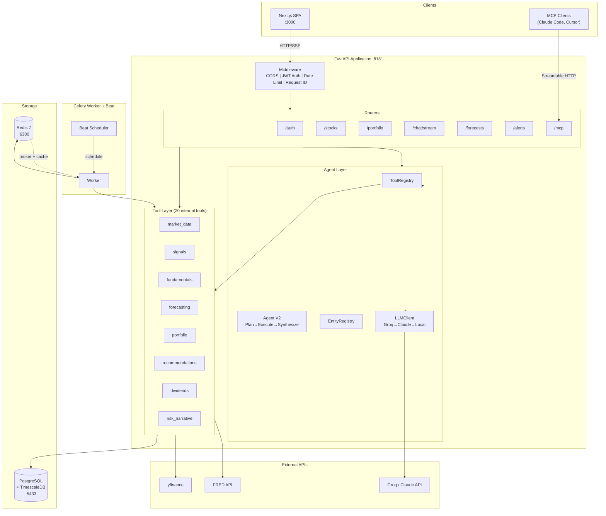
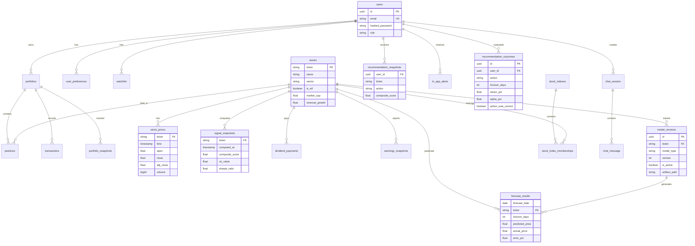
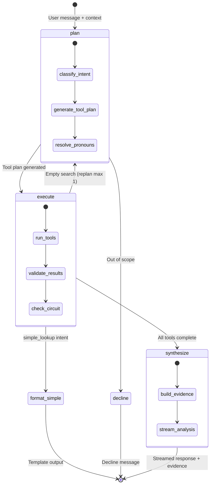
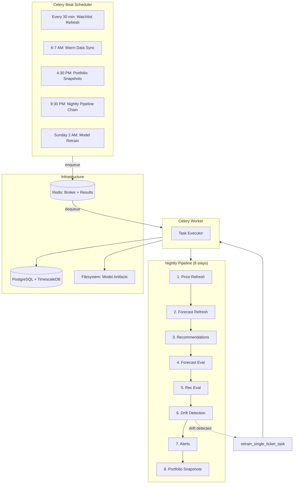
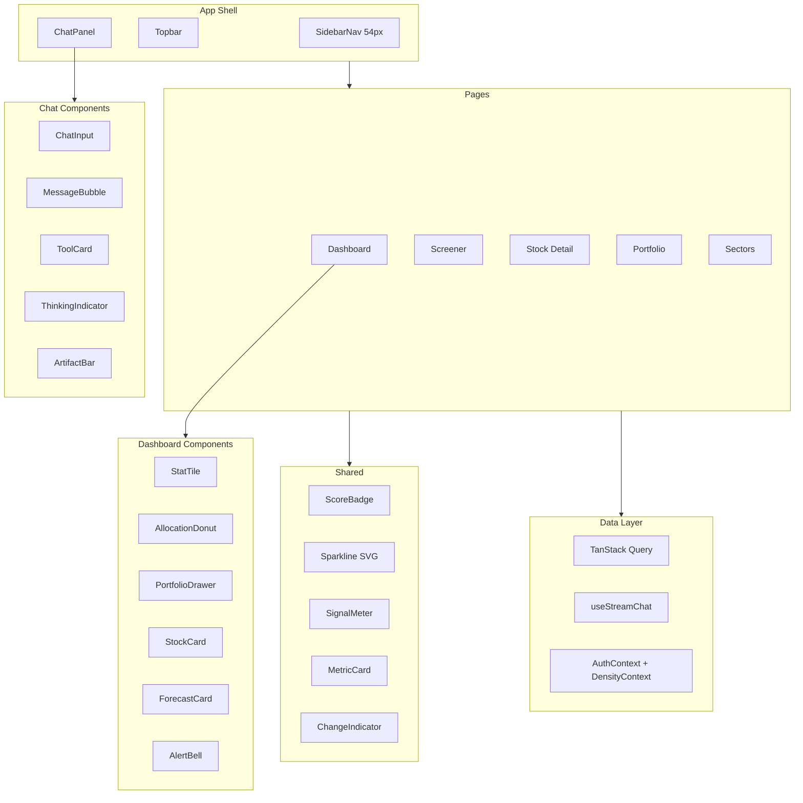
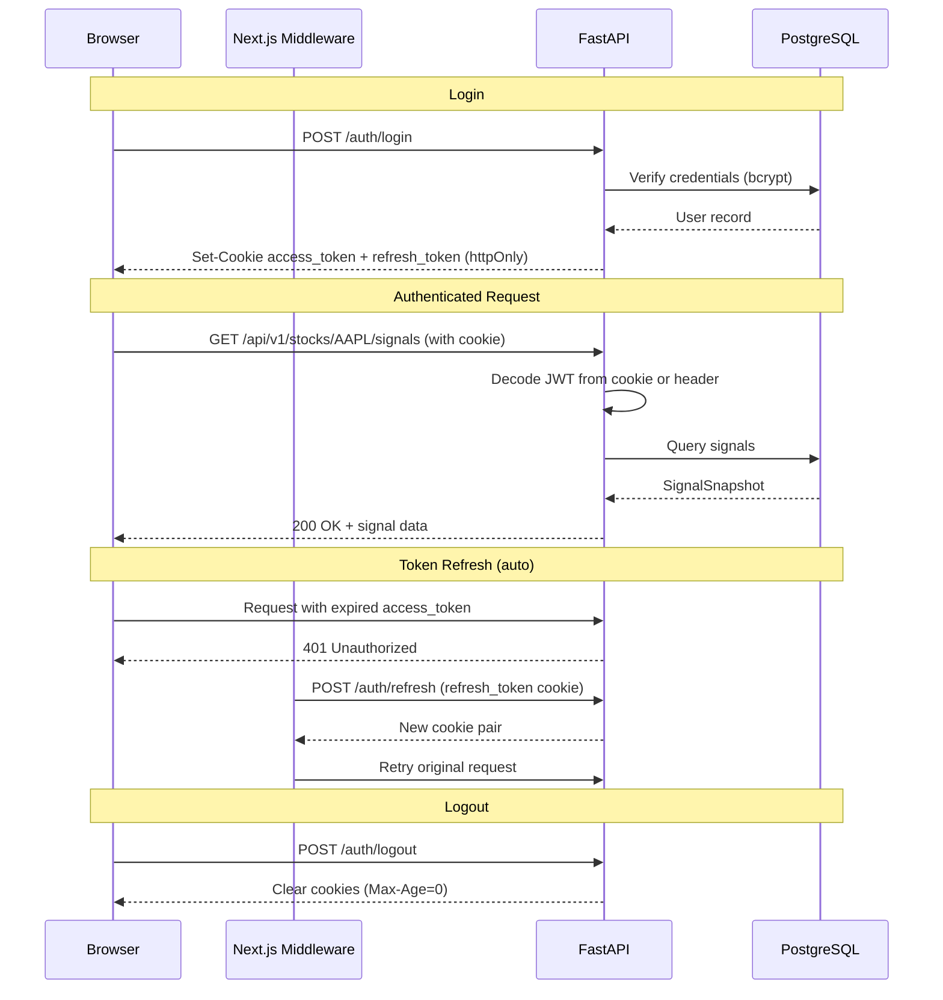
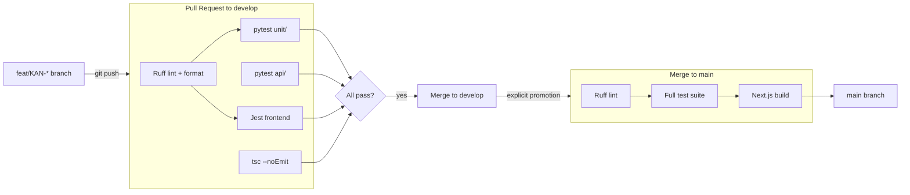

# Technical Design Document (TDD)

## Stock Signal Platform

**Version:** 1.1
**Date:** March 2026
**Status:** Living Document — Phase 1-5 complete, Phase 5.5/6 planned
**Prerequisite reading:** docs/PRD.md, docs/FSD.md, docs/data-architecture.md

---

## 1. Purpose

This document defines HOW the system is built. It covers component architecture,
API contracts, service layer patterns, integration details, and deployment
topology. The FSD defines WHAT the system does; this document defines HOW it
does it.

---

## 2. System Architecture

### 2.1 High-Level Overview



### 2.1.1 Database Entity Relationships



> 25 tables total. Hypertables: `stock_prices`, `signal_snapshots`, `portfolio_snapshots`. Full schema in `docs/data-architecture.md`.

### 2.2 Layer Responsibilities

| Layer | Responsibility | Example |
|-------|---------------|---------|
| **Routers** | HTTP handling, request validation, response serialization | Parse JWT, validate Pydantic schema, call service, return response |
| **Services** | Business logic orchestration, transaction management | Combine signal computation + recommendation generation in one flow |
| **Tools** | Domain logic, external API integration, data access | Compute RSI from price data, call yfinance, query TimescaleDB |
| **Agents** | LLM orchestration, tool selection, response synthesis | Interpret "Analyse AAPL", call signal + fundamental + forecast tools, synthesize |
| **Tasks** | Background job execution, scheduling | Nightly: fetch prices → compute signals → generate recommendations → check alerts |

### 2.3 Key Design Rules

1. **Routers never contain business logic.** They validate, call a service, and return.
2. **Services own transactions.** A service method = one database transaction boundary.
3. **Tools are stateless and independently testable.** Each tool is a pure function
   (data in → result out) that can be called by services, agents, or Celery tasks.
4. **Agents never access the database directly.** They call tools through ToolRegistry.
5. **No circular dependencies.** Direction is always: Router → Service → Tool.
   Agents sit alongside services, calling the same tools.

---

## 3. API Design

### 3.1 Base URL & Versioning

- Base: `/api/v1/`
- Versioning: URL-based. If breaking changes needed, create `/api/v2/` routers.
  Old version stays active for 3 months (migration period).

### 3.2 Authentication Endpoints

```
POST /api/v1/auth/register
  Request:  { email: string, password: string }
  Response: { id: uuid, email: string, created_at: datetime }
  Errors:   409 (email exists), 422 (validation)

POST /api/v1/auth/login
  Request:  { email: string, password: string }
  Response: { access_token: string, refresh_token: string,
              token_type: "bearer", expires_in: int }
  Errors:   401 (bad credentials)

POST /api/v1/auth/refresh
  Request:  { refresh_token: string }
  Response: { access_token: string, refresh_token: string,
              token_type: "bearer", expires_in: int }
  Errors:   401 (invalid/expired refresh token)

POST /api/v1/auth/logout
  Response: 204
  Behavior: Clears httpOnly cookies (Set-Cookie with Max-Age=0)

Note: Login and refresh also set httpOnly cookies (access_token + refresh_token).
Server reads tokens from cookies OR Authorization header (dual-mode auth).
```

### 3.3 Stock & Signal Endpoints

```
GET /api/v1/stocks/search?q={query}
  Response: [{ ticker, name, exchange, sector }]
  Auth:     Required

GET /api/v1/stocks/{ticker}/signals
  Response: { ticker, computed_at, rsi: { value, signal },
              macd: { value, histogram, signal }, sma: { sma_50, sma_200,
              signal }, bollinger: { upper, lower, position },
              returns: { annual_return, volatility, sharpe },
              composite_score, is_stale }
  Errors:   404 (ticker not found)

GET /api/v1/stocks/{ticker}/prices?period={1mo|3mo|6mo|1y|2y|5y|10y}
  Response: [{ time, open, high, low, close, volume }]
  Errors:   404 (ticker not found)

GET /api/v1/stocks/{ticker}/signals/history?period={1m|3m|6m|1y}
  Response: [{ computed_at, composite_score, rsi_value, macd_value }]

POST /api/v1/stocks/watchlist
  Request:  { ticker: string }
  Response: { id, ticker, added_at }
  Errors:   404 (ticker unknown), 409 (already in watchlist)

DELETE /api/v1/stocks/watchlist/{ticker}
  Response: 204

GET /api/v1/stocks/watchlist
  Response: [{ id, ticker, name, sector, composite_score, added_at }]
```

### 3.4 Recommendation Endpoints

```
GET /api/v1/stocks/recommendations?action={BUY|WATCH|AVOID}&confidence={HIGH|MEDIUM|LOW}
  Response: [{ ticker, action, confidence, composite_score,
               price_at_recommendation, reasoning: dict,
               generated_at, is_actionable }]
  Note: suggested_amount_usd, portfolio_weight_pct, target_weight_pct
        are Phase 3 additions (requires portfolio context)

POST /api/v1/recommendations/{id}/acknowledge — Planned for Phase 3
```

### 3.5 Portfolio Endpoints (Phase 3) ✅ IMPLEMENTED

```
POST /api/v1/portfolio/transactions          [201 Created]
  Request:  { ticker: str, transaction_type: "BUY"|"SELL",
              shares: Decimal, price_per_share: Decimal,
              transacted_at: datetime, notes?: str }
  Response: TransactionResponse
  Errors:   422 (SELL > held shares | ticker not in stocks table)

GET /api/v1/portfolio/transactions           [200 OK]
  Query:    ?ticker=AAPL (optional filter)
  Response: [TransactionResponse] sorted by transacted_at desc

DELETE /api/v1/portfolio/transactions/{id}  [204 No Content]
  Errors:   404 (not found or not owned), 422 (would strand a SELL)

GET /api/v1/portfolio/positions              [200 OK]
  Response: [{ ticker, shares, avg_cost_basis, current_price,
               market_value, unrealized_pnl, unrealized_pnl_pct,
               allocation_pct }]  — open positions only (closed_at IS NULL)

GET /api/v1/portfolio/summary                [200 OK]
  Response: { total_value, total_cost_basis, unrealized_pnl,
              unrealized_pnl_pct, position_count,
              sectors: [{ sector, market_value, pct, over_limit }] }

--- Phase 3.5 (implemented) ---
GET /api/v1/portfolio/history?days={N}                    (value history chart) ✅
GET /api/v1/portfolio/dividends/{ticker}                  (dividend summary + history) ✅

--- Phase 3.5 (implemented — divestment rules) ---
GET /api/v1/preferences                                   (user threshold preferences) ✅
PATCH /api/v1/preferences                                 (update threshold preferences) ✅
GET /portfolio/positions now returns alerts[] per position (divestment alerts) ✅
```

**Tool:** `backend/tools/portfolio.py`
- `_run_fifo(transactions)` — pure function, no DB, O(1) lot consumption via `deque`
- `_group_sectors(positions, total_value, max_sector_pct)` — pure function, groups by sector (null → "Unknown"), flags `over_limit` per user pref
- `get_or_create_portfolio(user_id, db)` — lazy portfolio creation on first use
- `recompute_position(portfolio_id, ticker, db)` — full FIFO recompute after every write; preserves `opened_at`
- `get_positions_with_pnl(portfolio_id, db)` — fetches latest price per position from StockPrice, includes sector
- `get_portfolio_summary(portfolio_id, db, max_sector_pct)` — aggregates KPIs + sector breakdown with user-configurable over_limit threshold
- `snapshot_portfolio_value(portfolio_id, db)` — daily snapshot with upsert
- `get_portfolio_history(portfolio_id, db, days)` — fetch time series snapshots

**Tool:** `backend/tools/dividends.py`
- `fetch_dividends(ticker)` — fetch from yfinance, returns list of {ex_date, amount}
- `store_dividends(ticker, dividends, db)` — upsert to DividendPayment table (ON CONFLICT DO NOTHING)
- `get_dividends(ticker, db)` — query stored dividend payments
- `get_dividend_summary(ticker, db, current_price)` — aggregate stats: total received, annual, yield, history

**Tool:** `backend/tools/divestment.py`
- `check_divestment_rules(position, sector_allocations, signal, prefs)` — pure function, returns list of alert dicts
  - 4 rules: stop_loss (critical, pnl ≤ -threshold), position_concentration (warning, alloc > max), sector_concentration (warning, sector > max), weak_fundamentals (warning, composite < 3)
  - Null-safe: skips rule when dependent value is None

**Router:** `backend/routers/preferences.py`
- `_get_or_create_preference(user_id, db)` — idempotent fetch/create helper (shared with portfolio router)
- `GET /api/v1/preferences` → `UserPreferenceResponse`
- `PATCH /api/v1/preferences` → partial update via `UserPreferenceUpdate` (Field gt=0, le=100)

### 3.6 Chat Endpoint (Phase 4)

```
POST /api/v1/chat/stream
  Request:  { message: string, session_id?: uuid, agent_type: "general"|"stock" }
  Response: NDJSON stream of events (see §3.6.1)
  Auth:     Required (httpOnly cookie)
  Behavior: When AGENT_V2=true, uses Plan→Execute→Synthesize graph (§5.5).
            When AGENT_V2=false, uses V1 ReAct graph (§5.3).
            User context (portfolio, preferences, watchlist) injected automatically.
            query_id (UUID) generated per request for trace correlation.
```

### 3.6.1 NDJSON Stream Events (Phase 4C + 4D)

```
V1 Events (ReAct graph):
  { type: "thinking", content: "Analyzing your question..." }
  { type: "tool_start", tool: "analyze_stock", params: {...} }
  { type: "tool_result", tool: "analyze_stock", status: "ok", data: {...} }
  { type: "token", content: "..." }                           # Streamed text
  { type: "done", usage: {...} }
  { type: "error", error: "..." }
  { type: "provider_fallback", content: "Switching to..." }

V2 Events (Plan→Execute→Synthesize graph, AGENT_V2=true):
  { type: "thinking", content: "Planning research approach..." }
  { type: "plan", content: "reasoning...", data: { steps: ["tool1", "tool2"] } }
  { type: "tool_result", tool: "...", status: "ok", data: {...} }
  { type: "tool_error", tool: "...", error: "API timeout" }
  { type: "evidence", data: [{ claim, source_tool, value, timestamp }] }
  { type: "decline", content: "I focus on financial analysis..." }
  { type: "token", content: "..." }                           # Synthesis text
  { type: "done", usage: {...} }
```

### 3.6.2 Feedback Endpoint (Phase 4D)

```
PATCH /api/v1/chat/sessions/{session_id}/messages/{message_id}/feedback
  Request:  { feedback: "up" | "down" }
  Response: { status: "ok", feedback: "up" | "down" }
  Auth:     Required (session must belong to user)
  Errors:   404 (session or message not found)
```

### 3.6.3 Extended Fundamentals Endpoint (Phase 4D)

```
GET /api/v1/stocks/{ticker}/fundamentals
  Response: { ticker, pe_ratio, peg_ratio, fcf_yield, debt_to_equity,
              piotroski_score, piotroski_breakdown,
              revenue_growth, gross_margins, operating_margins, profit_margins,
              return_on_equity, market_cap,
              analyst_target_mean, analyst_target_high, analyst_target_low,
              analyst_buy, analyst_hold, analyst_sell }
  Auth:     Required
  Note:     Enriched fields from Stock model (materialized during ingestion).
            P/E, PEG, FCF yield, Piotroski still fetched live from yfinance.
```

### 3.7 Index Endpoints (Phase 2)

```
GET /api/v1/indexes
  Response: [{ id, name, slug, description, stock_count }]
  Auth:     Required

GET /api/v1/indexes/{slug}/stocks
  Response: { index_name, total, items: [{ ticker, name, sector, exchange,
               latest_price, composite_score, rsi_signal, macd_signal }] }
  Auth:     Required
```

### 3.8 Data Ingestion Endpoint (Phase 2)

```
POST /api/v1/stocks/{ticker}/ingest
  Response: { ticker, name, rows_fetched, composite_score, status: "created"|"updated" }
  Auth:     Required
  Rate:     5 requests/minute (expensive: yfinance + signal computation)
  Behavior: If ticker has no data → full 10Y fetch
            If ticker has data → delta fetch from last_fetched_at
            Always recomputes signals after fetch
  Errors:   404 (invalid ticker on yfinance), 429 (rate limit)
```

### 3.9 Bulk Signals Endpoint (Phase 2)

```
GET /api/v1/stocks/signals/bulk?index_id={uuid}
                               &rsi_state={OVERSOLD|NEUTRAL|OVERBOUGHT}
                               &macd_state={BULLISH|BEARISH}
                               &sector={Technology|Healthcare|...}
                               &score_min={0-10}&score_max={0-10}
                               &sort_by={composite_score|sharpe_ratio|annual_return}
                               &sort_order={asc|desc}
                               &limit={50}&offset={0}
  Response: { total, items: [{ ticker, name, sector, rsi_value, rsi_signal,
               macd_signal, sma_signal, bb_position, annual_return,
               volatility, sharpe_ratio, composite_score, computed_at, is_stale,
               price_history: list[float] (last 30 daily closes, for sparkline charts) }] }
  Auth:     Required
  Query:    DISTINCT ON (ticker) ORDER BY computed_at DESC
  Perf:     <3 seconds for 500 stocks
```

### 3.10 Signal History Endpoint (Phase 2)

```
GET /api/v1/stocks/{ticker}/signals/history?days={90}&limit={100}
  Response: [{ computed_at, composite_score, rsi_value, rsi_signal,
               macd_value, macd_signal, sma_signal, bollinger_signal }]
  Auth:     Required
  Default:  90 days, max 365 days
```

### 3.11 Forecast Endpoints (Phase 5) ✅ IMPLEMENTED

```
GET /api/v1/forecasts/{ticker}
  Response: ForecastResponse { ticker, horizons: ForecastHorizon[], model_mape, model_status }
  Auth:     Required

GET /api/v1/forecasts/portfolio
  Response: PortfolioForecastResponse { horizons: PortfolioForecastHorizon[], ticker_count, vix_regime }
  Auth:     Required

GET /api/v1/forecasts/sector/{sector}
  Response: SectorForecastResponse { sector, etf_ticker, horizons[], user_exposure_pct, user_tickers_in_sector }
  Auth:     Required

GET /api/v1/recommendations/scorecard
  Response: ScorecardResponse { total_outcomes, overall_hit_rate, avg_alpha, buy_hit_rate, sell_hit_rate, worst_miss_pct, worst_miss_ticker, by_horizon[] }
  Auth:     Required
```

### 3.12 Alert Endpoints (Phase 5) ✅ IMPLEMENTED

```
GET /api/v1/alerts
  Response: AlertResponse[] { id, alert_type, severity, title, message, ticker, is_read, created_at, metadata }
  Auth:     Required

GET /api/v1/alerts/unread-count
  Response: { unread_count: int }
  Auth:     Required

PATCH /api/v1/alerts/read
  Body:     { alert_ids: string[] }
  Response: { updated: int }
  Auth:     Required
```

### 3.13 Admin Endpoints (Phase 6A) ✅ IMPLEMENTED

Superuser-only endpoints for managing LLM model cascade configuration.

```
GET /api/v1/admin/llm-models
  Response: LLMModelConfigResponse[] { id, provider, model_name, tier, priority, is_enabled, tpm_limit, rpm_limit, tpd_limit, rpd_limit, cost_per_1k_input, cost_per_1k_output, notes }
  Auth:     Required (role=ADMIN)
  Errors:   401 (unauthenticated), 403 (not admin)

PATCH /api/v1/admin/llm-models/{model_id}
  Body:     LLMModelConfigUpdate { priority?, is_enabled?, tpm_limit?, rpm_limit?, tpd_limit?, rpd_limit?, cost_per_1k_input?, cost_per_1k_output?, notes? }
  Response: LLMModelConfigResponse
  Auth:     Required (role=ADMIN)
  Errors:   401, 403, 404 (model not found)

POST /api/v1/admin/llm-models/reload
  Response: { status: "ok", tiers: int, models: int }
  Auth:     Required (role=ADMIN)
  Errors:   401, 403
  Notes:    Force-reloads model configs from DB into running cascade. Takes effect immediately.
```

### 3.14 Admin Observability Endpoints (Phase 6B) ✅ IMPLEMENTED

```
GET /api/v1/admin/llm-metrics
  Response: { requests_by_model, cascade_count, cascades_by_model, rpm_by_model, cascade_log }
  Auth:     Required (role=ADMIN)
  Notes:    Real-time in-memory metrics from ObservabilityCollector.

GET /api/v1/admin/tier-health
  Response: { tiers: [{ model, status, failures_5m, successes_5m, cascade_count, latency: { avg_ms, p95_ms } }], summary: { total, healthy, degraded, down, disabled } }
  Auth:     Required (role=ADMIN)
  Notes:    Per-model health classification (healthy/degraded/down/disabled).

POST /api/v1/admin/tier-toggle
  Body:     { model: string, enabled: boolean }
  Response: { status: "ok", model, enabled }
  Auth:     Required (role=ADMIN)
  Notes:    Runtime enable/disable of a model without redeploy.

GET /api/v1/admin/llm-usage
  Response: { total_requests, total_cost_usd, avg_latency_ms, models: [{ model, provider, request_count, cost_usd }], escalation_rate }
  Auth:     Required (role=ADMIN)
  Notes:    30-day aggregated usage from llm_call_log table. Escalation rate = Anthropic calls / total.
```

---

## 4. Service Layer Design

> **Implementation status:** The service layer pattern described below is ASPIRATIONAL. It is planned for Phase 3+. In the current implementation (Phases 1-2), routers call tools directly (e.g., `from backend.tools.signals import compute_signals`). The Redis caching strategy is also not yet implemented.

### 4.1 Service Pattern

Every service follows:

```python
class SignalService:
    def __init__(self, db: AsyncSession, redis: Redis):
        self.db = db
        self.redis = redis

    async def get_latest_signals(self, ticker: str) -> SignalResponse:
        """Get latest signals, compute if stale."""
        # 1. Check cache
        cached = await self.redis.get(f"signals:{ticker}")
        if cached:
            return SignalResponse.model_validate_json(cached)

        # 2. Query database
        snapshot = await self._get_latest_snapshot(ticker)
        if snapshot and not snapshot.is_stale:
            response = SignalResponse.from_orm(snapshot)
            await self.redis.set(f"signals:{ticker}", response.model_dump_json(), ex=3600)
            return response

        # 3. Compute fresh if stale or missing
        prices = await market_data_tool.fetch_prices(ticker)
        signals = signal_tool.compute_all(prices)
        await self._store_snapshot(ticker, signals)

        response = SignalResponse.from_signals(signals)
        await self.redis.set(f"signals:{ticker}", response.model_dump_json(), ex=3600)
        return response
```

### 4.2 Dependency Injection

FastAPI `Depends()` chain:

```python
# database.py
async def get_async_session() -> AsyncGenerator[AsyncSession, None]:
    async with async_session_factory() as session:
        yield session

# dependencies.py
async def get_redis() -> Redis:
    return Redis.from_url(settings.REDIS_URL)

async def get_current_user(
    token: str = Depends(oauth2_scheme),
    db: AsyncSession = Depends(get_async_session)
) -> User:
    # decode JWT, query user, return
    ...

async def get_signal_service(
    db: AsyncSession = Depends(get_async_session),
    redis: Redis = Depends(get_redis)
) -> SignalService:
    return SignalService(db, redis)
```

### 4.3 Caching Strategy

| Data | Cache Key | TTL | Invalidation |
|------|-----------|-----|-------------|
| Latest signals | `signals:{ticker}` | 1 hour | On new signal computation |
| Latest price | `price:{ticker}` | 5 minutes | On price fetch |
| Screener results | `screener:{hash_of_filters}` | 30 minutes | On nightly batch |
| Portfolio positions | `positions:{portfolio_id}` | 0 (no cache) | N/A (always fresh) |
| Recommendations | `recs:{user_id}:{date}` | Until next computation | On daily batch |

---

## 5. Agent Architecture

> **Implementation status:** Phase 4D ✅ (Plan→Execute→Synthesize, PRs #26-32) + Phase 6A ✅ (LLM Factory, PR #95). V1 ReAct loop removed in Phase 6A (KAN-140). Full spec: `docs/superpowers/specs/2026-03-20-phase-4d-agent-intelligence-design.md`.

### 5.1 Three-Layer Architecture

Layer 1: Consume external data sources (EdgarTools, Alpha Vantage, FRED, Finnhub — via API wrapper adapters, not MCP protocol)
Layer 2: Enrich in backend (Tool Registry + caching + cross-source analysis)
Layer 3: Expose as MCP server at `/mcp` (Streamable HTTP, JWT auth) — currently for external clients only; agent uses direct calls until Phase 5.6 (stdio MCP refactor)

### 5.2 Tool Registry

```python
class ToolRegistry:
    """Central registry — all tools (internal + MCP-proxied) discoverable here."""
    def register(tool: BaseTool) -> None
    def register_mcp(adapter: MCPAdapter) -> None
    def discover() -> list[ToolInfo]
    def get(name: str) -> BaseTool
    def execute(name: str, params: dict) -> ToolResult
    def schemas(filter: ToolFilter) -> list[dict]  # JSON schemas for LLM
    def by_category(*categories) -> list[BaseTool]
    def health() -> dict[str, bool]
```

Internal tools (20):
- **Original (9):** `analyze_stock`, `get_portfolio_exposure`, `screen_stocks`, `get_recommendations`, `compute_signals`, `get_geopolitical_events`, `web_search`, `search_stocks`, `ingest_stock`
- **Phase 4D (4):** `get_fundamentals`, `get_analyst_targets`, `get_earnings_history`, `get_company_profile` — read from DB, data materialized during `ingest_stock`
- **Phase 5 (7):** `get_forecast`, `get_sector_forecast`, `get_portfolio_forecast`, `compare_stocks`, `get_recommendation_scorecard`, `dividend_sustainability`, `risk_narrative`

Phase 5 tools: forecast tools read pre-computed Prophet data from DB. `dividend_sustainability` is the only runtime yfinance call (payout ratio not persisted). `risk_narrative` combines signals + fundamentals + forecast + sector ETF context.

**Entity Registry** (`backend/agents/entity_registry.py`): session-scoped ticker tracking for pronoun resolution ("compare them", "what about it?"). Wired into AgentStateV2 — execute_node extracts entities from tool results, plan_node resolves pronouns.

MCPAdapter proxied tools (4 adapters): EdgarAdapter (SEC filings), AlphaVantageAdapter (news), FredAdapter (macro), FinnhubAdapter (analyst/ESG)

Agent types = registry filters:
- Stock agent: all categories (analysis, data, portfolio, macro, news, sec)
- General agent: data + news only

### 5.3 Agentic Loop (two-phase per iteration)

1. Tool-calling phase: LLM called in non-streaming mode. Tool calls detected, executed with per-tool timeout (10s internal, 30s proxied). Safe execution wrapper handles timeouts/errors gracefully.
2. Synthesis phase: when LLM responds without tool calls, stream tokens to client.

Max 15 iterations. Few-shot prompted (prompt templates in `backend/agents/prompts/`).

### 5.4 LLM Client & Factory (Phase 6A) ✅ IMPLEMENTED

Provider-agnostic abstraction with data-driven multi-model cascade.

**LLM Factory Architecture:**
- `llm_model_config` table stores cascade configuration (provider, model, tier, priority, limits, costs)
- `ModelConfigLoader` (`backend/agents/model_config.py`) reads DB → groups by tier → caches in memory
- `TokenBudget` (`backend/agents/token_budget.py`) async sliding-window rate tracker (TPM/RPM/TPD/RPD, 80% threshold)
- `GroqProvider` (`backend/providers/groq.py`) cascades through models in priority order per tier

**Cascade flow:**
1. `LLMClient.chat(tier="planner")` → selects models for tier from `ModelConfigLoader` cache
2. For each model in priority order: check `TokenBudget` → if under limits, attempt call
3. On error: classify as `rate_limit`, `context_length`, `auth`, `transient`, `permanent`
4. `auth` errors stop cascade immediately; others try next model
5. If all models exhausted → `AllModelsExhaustedError`

**Tier configuration (seeded in migration 012):**
- `planner` tier: 5 cheap/fast models (Groq Llama, Gemma) — intent classification + tool planning
- `synthesizer` tier: 4 quality models (Groq Llama 70B, DeepSeek) — response synthesis

**Tool result truncation:** `_truncate_tool_results()` in synthesizer caps each tool result at `MAX_TOOL_RESULT_CHARS` (configurable) with truncation marker.

**Admin management:** Model configs changeable via `GET/PATCH/POST /admin/llm-models` without redeploy (see §3.13).

### 5.5 Agent V2 — Plan→Execute→Synthesize (Phase 4D) ✅ IMPLEMENTED

> **Full spec:** `docs/superpowers/specs/2026-03-20-phase-4d-agent-intelligence-design.md`
> V1 ReAct loop removed in Phase 6A (KAN-140). V2 is now the only agent architecture.

**Three-phase LangGraph StateGraph:**



**Phase 1 — Plan (`planner.py`):**
- LLM (tier=planner) classifies intent: stock_analysis, portfolio, market_overview, simple_lookup, out_of_scope
- Generates ordered list of tool calls (max 10 steps)
- Scope enforcement: financial-only, data-grounded. Speculative/non-financial queries declined.
- `$PREV_RESULT` references for chaining tool outputs
- Prompt: `backend/agents/prompts/planner.md` (13 few-shot examples)

**Phase 2 — Execute (`executor.py`):**
- **Mechanical** — no LLM calls. Runs tool plan via ToolRegistry.
- Resolves `$PREV_RESULT.ticker` references from prior tool outputs
- Retry: 1 retry per tool on failure
- Circuit breaker: 3 consecutive failures → exit to synthesis with partial data
- Wall clock timeout: 45 seconds
- Replan: empty `search_stocks` result triggers replan (max 1)
- Each result validated via `result_validator.py` (null check, staleness, source annotation)

**Phase 3 — Synthesize (`synthesizer.py`):**
- LLM (tier=synthesizer) produces structured analysis from validated tool results
- Output: confidence score (0-1), bull/base/bear scenarios, evidence tree, portfolio note
- Every claim must cite a tool result with timestamp (enforced by prompt)
- Gaps explicitly acknowledged when tools failed or data stale
- Prompt: `backend/agents/prompts/synthesizer.md`

**Simple path:** For `simple_lookup` intent (e.g., "What's AAPL price?"), skips synthesis entirely. Uses `simple_formatter.py` template-based output.

**State schema (`AgentStateV2`):**
```python
messages, phase, plan, tool_results, synthesis, iteration, replan_count,
start_time, user_context, query_id, skip_synthesis, response_text, decline_message
```

**User context injection:** `build_user_context(user_id, db)` queries portfolio positions, sector allocation, preferences, watchlist. Injected into planner + synthesizer prompts for personalization.

### 5.6 Database Schema Changes (Phase 4D)

**New table:** `earnings_snapshots` (PK: ticker+quarter)
- `eps_estimate`, `eps_actual`, `surprise_pct`, `reported_at`
- Materialized from yfinance during ingestion

**Extended `stocks` table (+15 columns):**
- Profile: `business_summary` (Text), `employees` (Int), `website` (String)
- Market: `market_cap` (Float)
- Growth: `revenue_growth`, `gross_margins`, `operating_margins`, `profit_margins`, `return_on_equity` (Float)
- Analyst: `analyst_target_mean/high/low` (Float), `analyst_buy/hold/sell` (Int)

**Extended `chat_message`:** `feedback` (String, "up"|"down")
**Extended `llm_call_log`:** `tier` (String), `query_id` (UUID, indexed)
**Extended `tool_execution_log`:** `query_id` (UUID, indexed)

**Migrations:** 009 (enriched stock data + earnings), 010 (feedback + tier + query_id)

---

## 6. Background Job Design

> **Implementation status:** ✅ Fully implemented. Celery worker, beat schedule, and 8-step nightly pipeline chain all operational.

### 6.1 Celery Architecture



### 6.2 Beat Schedule (US/Eastern)

| Time | Task | Frequency |
|------|------|-----------|
| 2:00 AM Sun | `model_retrain_all_task` | Biweekly |
| 2:00 AM Sun | `sync_institutional_holders_task` | Weekly |
| 6:00 AM | `sync_analyst_consensus_task` | Daily |
| 7:00 AM | `sync_fred_indicators_task` | Daily |
| Every 30 min | `refresh_all_watchlist_tickers_task` | Intraday |
| 4:30 PM | `snapshot_all_portfolios_task` | Daily |
| 9:30 PM | `nightly_pipeline_chain_task` (8 steps) | Daily |

All tasks are in `backend/tasks/`. Celery is configured in `backend/tasks/__init__.py`.
Timezone: `US/Eastern`. Tasks use `asyncio.run()` bridge for async code.

### 6.2 Task Error Handling

```python
@app.task(bind=True, max_retries=3, default_retry_delay=60)
def refresh_ticker(self, ticker: str):
    task_log = TaskLog(task_name="refresh_ticker", ticker=ticker, status="STARTED")
    try:
        data = yfinance.download(ticker, period="5d")
        store_prices(ticker, data)
        task_log.status = "SUCCESS"
    except Exception as e:
        task_log.status = "RETRY" if self.request.retries < 3 else "FAILED"
        task_log.error_message = str(e)
        task_log.retry_count = self.request.retries
        if self.request.retries < 3:
            raise self.retry(exc=e)
    finally:
        save_task_log(task_log)
```

---

## 7. Frontend Architecture

### 7.1 Directory Structure

```
frontend/
├── app/
│   ├── layout.tsx              # Root layout: Sora + JetBrains Mono fonts, Providers
│   ├── page.tsx                # Redirect to /dashboard
│   ├── providers.tsx           # ThemeProvider (forcedTheme="dark") + QueryProvider
│   ├── (authenticated)/        # Route group with auth guard
│   │   ├── layout.tsx          # Shell: "use client"; SidebarNav | flex-col(Topbar + main) | ChatPanel
│   │   ├── dashboard/page.tsx  # StatTile grid + AllocationDonut + PortfolioDrawer + watchlist
│   │   ├── screener/page.tsx   # Table/grid views + filters + density toggle
│   │   └── stocks/[ticker]/    # Stock detail (server + client components)
│   ├── login/page.tsx
│   └── register/page.tsx
├── components/
│   ├── ui/                     # shadcn/ui v4 primitives (@base-ui/react, not Radix)
│   ├── sidebar-nav.tsx         # 54px icon-only nav, CSS tooltips, Popover logout
│   ├── topbar.tsx              # Market status chip, signal count chip, AI toggle
│   ├── chat-panel.tsx          # Docked right panel, drag-resize, live streaming chat (Phase 4C)
│   ├── chat/                   # Chat sub-components (Phase 4C)
│   │   ├── thinking-indicator.tsx  # Pulsing dots animation
│   │   ├── error-bubble.tsx        # Error card with retry button
│   │   ├── message-actions.tsx     # Copy + CSV export hover bar
│   │   ├── markdown-content.tsx    # react-markdown wrapper with navy styling
│   │   ├── tool-card.tsx           # Running/completed/error/expanded tool states
│   │   ├── message-bubble.tsx      # User + assistant message rendering
│   │   ├── agent-selector.tsx      # Stock/general agent toggle
│   │   ├── session-list.tsx        # Session list with active/expired/delete
│   │   ├── chat-input.tsx          # Auto-growing textarea, Enter to send, stop button
│   │   └── artifact-bar.tsx        # Pinned tool results with shouldPin rules + CSV export
│   ├── stat-tile.tsx           # Dashboard KPI tile with accent gradient top border
│   ├── allocation-donut.tsx    # CSS conic-gradient donut; exported buildGradient()
│   ├── portfolio-drawer.tsx    # Bottom slide-up; right offset tracks chatIsOpen state
│   ├── stock-card.tsx          # Watchlist card with score badge + inline signal badge
│   ├── signal-badge.tsx        # RSI/MACD/SMA + BUY/HOLD/SELL label badge
│   ├── score-badge.tsx         # Composite score 0-10 with color
│   ├── screener-table.tsx      # TradingView-style tabs + sortable columns
│   ├── screener-grid.tsx       # Sparkline card grid view
│   ├── signal-cards.tsx        # RSI/MACD/SMA/Bollinger breakdown
│   ├── price-chart.tsx         # Recharts line + sentiment gradient
│   ├── signal-history-chart.tsx # Dual-axis composite + RSI over time
│   ├── risk-return-card.tsx    # Annualized return, volatility, Sharpe
│   ├── index-card.tsx          # S&P 500 / NASDAQ / Dow card (navy redesign)
│   ├── change-indicator.tsx    # Gain/loss with arrow + sign + color
│   ├── section-heading.tsx     # Semantic section label
│   ├── chart-tooltip.tsx       # Reusable Recharts tooltip
│   ├── error-state.tsx         # Error display with retry
│   ├── breadcrumbs.tsx         # Back navigation on detail pages
│   ├── sparkline.tsx           # Raw SVG <polyline> (jagged financial chart; no Recharts)
│   ├── signal-meter.tsx        # 10-segment horizontal score bar
│   └── metric-card.tsx         # Standardized KPI block
├── hooks/
│   ├── use-stocks.ts           # 15+ TanStack Query hooks (all API data, portfolio hooks extracted here)
│   ├── use-chat.ts             # TanStack Query hooks: useChatSessions, useChatMessages, useDeleteSession (Phase 4C)
│   ├── use-stream-chat.ts      # Streaming fetch + NDJSON parsing + RAF token batching + abort (Phase 4C)
│   ├── chat-reducer.ts         # Pure state machine: 11 action types, ChatState/ChatMessageUI/ToolCall types (Phase 4C)
│   └── use-container-width.ts  # ResizeObserver for responsive grids
├── lib/
│   ├── api.ts                  # Centralized fetch with cookie auth + auto-refresh
│   ├── auth.ts                 # AuthContext + useAuth hook
│   ├── ndjson-parser.ts        # parseNDJSONLines() with buffer carry-over for streaming (Phase 4C)
│   ├── csv-export.ts           # buildCSV() + downloadCSV() for tabular tool results (Phase 4C)
│   ├── storage-keys.ts         # Namespaced localStorage keys (CHAT_PANEL_WIDTH, DENSITY, ACTIVE_SESSION)
│   ├── signals.ts              # Sentiment classification, CSS var color mappings
│   ├── format.ts               # Currency, percent, volume, date formatters
│   ├── design-tokens.ts        # CSS variable name constants (expanded with Phase 4A tokens)
│   ├── chart-theme.ts          # useChartColors() hook + CHART_STYLE constants
│   ├── typography.ts           # Semantic type scale (PAGE_TITLE, METRIC_PRIMARY, etc.)
│   ├── density-context.tsx     # DensityProvider + useDensity() for screener
│   ├── storage-keys.ts         # Namespaced localStorage key registry (stocksignal: prefix)
│   └── market-hours.ts         # Pure isNYSEOpen() — IANA America/New_York, DST-correct
├── types/
│   └── api.ts                  # Shared TypeScript types
└── middleware.ts               # Auth guard (checks access_token cookie)
```

### 7.1.1 Component Hierarchy



### 7.1.2 Shell Architecture (Phase 4A)

The authenticated layout is a client component that composes three side-by-side panels:

```
┌────────────────────────────────────────────────────────────┐
│ SidebarNav (54px)  │ Topbar + <page content>  │ ChatPanel  │
│  --sw: 54px        │  flex-col, flex-1         │  --cp: 280px│
└────────────────────────────────────────────────────────────┘
```

- **SidebarNav** — icon-only, CSS tooltip on hover, active left-border indicator. Logout via `PopoverTrigger render={<button/>}` (base-ui v4 — not `asChild`)
- **Topbar** — market status (isNYSEOpen()), signal count, AI Analyst toggle that controls ChatPanel visibility
- **ChatPanel** — hides via `transform: translateX(100%)` so `--cp` CSS var stays set; drag-resize updates `--cp` directly via DOM (no React state); width persisted to `STORAGE_KEYS.CHAT_PANEL_WIDTH`

**CSS layout tokens** (set in `globals.css @theme inline`):
- `--sw: 54px` — sidebar width
- `--cp: 280px` — chat panel width (default; user can drag-resize)

**Font Loading** (`app/layout.tsx`):
- Sora + JetBrains Mono via `next/font/google`
- Set as CSS vars: `--font-sora`, `--font-jetbrains-mono`
- Applied via: `cn(sora.variable, jetbrainsMono.variable)` on `<body>`

**Component Inventory (Phase 4A):**

| Component | Purpose |
|-----------|---------|
| `SidebarNav` | Icon-only sidebar with tooltip labels |
| `Topbar` | Market status chip, signal count, AI toggle |
| `ChatPanel` | Live streaming chat — useStreamChat, NDJSON, tool cards, sessions, artifacts (Phase 4C) |
| `StatTile` | Dashboard KPI tile with accent gradient top border |
| `AllocationDonut` | CSS conic-gradient pie; no chart library |
| `PortfolioDrawer` | Bottom slide-up with PortfolioValueChart |

**Hook Locations:**

| Hook | File | Source |
|------|------|--------|
| `usePositions()` | `hooks/use-stocks.ts` | Extracted from portfolio-client |
| `usePortfolioSummary()` | `hooks/use-stocks.ts` | Extracted from portfolio-client |
| `usePortfolioHistory()` | `hooks/use-stocks.ts` | Extracted from portfolio-client |
| `useWatchlist()` | `hooks/use-stocks.ts` | Existing |

**localStorage Keys** (all in `lib/storage-keys.ts` with `stocksignal:` namespace prefix):

| Key | Constant | Purpose |
|-----|----------|---------|
| `stocksignal:cp-width` | `CHAT_PANEL_WIDTH` | Chat panel drag width |
| `stocksignal:density` | `SCREENER_DENSITY` | Screener compact/comfortable |

**Market Hours:**
- `lib/market-hours.ts` — pure `isNYSEOpen()` function
- Uses IANA `America/New_York` timezone (DST-correct)
- No API call — client-side only

### 7.2 State Management

- **Server state:** TanStack Query (React Query) for all API data
- **Client state:** React useState/useReducer (minimal — most state is server-derived)
- **Auth state:** React Context via AuthProvider
- **Density state:** React Context via DensityProvider (comfortable/compact, persisted to localStorage)
- **Theme state:** next-themes `forcedTheme="dark"` — dark-only, no system detection, no toggle
- **Chat panel width:** CSS var `--cp` updated directly via DOM in drag handler (not React state); persisted to localStorage via `STORAGE_KEYS.CHAT_PANEL_WIDTH`
- **No Redux, no Zustand** — complexity not justified for this scale

### 7.3 Data Fetching Pattern

```typescript
// hooks/useRecommendations.ts
export function useRecommendations(filters?: RecommendationFilters) {
  return useQuery({
    queryKey: ['recommendations', filters],
    queryFn: () => api.get('/recommendations', { params: filters }),
    staleTime: 5 * 60 * 1000,      // 5 min
    refetchInterval: 5 * 60 * 1000,  // auto-refresh
  });
}
```

---

## 8. Integration Patterns

### 8.1 yfinance Integration

```python
# tools/market_data.py
async def fetch_prices(ticker: str, period: str = "10y") -> pd.DataFrame:
    """Fetch OHLCV data from yfinance, store to TimescaleDB."""
    # yfinance is synchronous — run in thread pool
    loop = asyncio.get_event_loop()
    data = await loop.run_in_executor(
        None, lambda: yf.download(ticker, period=period, auto_adjust=False)
    )
    if data.empty:
        raise TickerNotFoundError(f"No data for {ticker}")

    # Upsert to StockPrice (ON CONFLICT DO NOTHING for idempotency)
    await bulk_upsert_prices(ticker, data)
    return data
```

**Rate limit handling:** yfinance is unofficial and rate-limited. We enforce:
- 2-second delay between tickers in batch operations
- Exponential backoff on HTTP 429 responses
- Maximum 5 concurrent yfinance requests

### 8.2 FRED API Integration (Phase 5)

```python
# tools/macro.py
FRED_SERIES = {
    "yield_curve_10y2y": "T10Y2Y",
    "vix": "VIXCLS",
    "unemployment_claims": "ICSA",
    "fed_funds_rate": "FEDFUNDS",
}

async def fetch_macro_indicators() -> dict:
    for name, series_id in FRED_SERIES.items():
        data = fred_client.get_series(series_id, limit=1)
        store_macro_snapshot(name, data)
```

### 8.3 Telegram Integration (Phase 5)

```python
# services/notification.py
async def send_telegram(user_id: uuid, message: str):
    prefs = await get_user_preferences(user_id)
    if not prefs.notify_telegram:
        return
    if is_quiet_hours(prefs):
        await schedule_for_after_quiet_hours(user_id, message)
        return
    await telegram_bot.send_message(chat_id=prefs.telegram_chat_id, text=message)
```

---

## 9. Security Design

### 9.1 JWT Token Flow (httpOnly Cookies)



**Dual-mode auth dependency**: `get_current_user` checks `Authorization: Bearer`
header first (for API clients, scripts). If absent, reads `access_token` cookie.
This allows both browser (cookie) and programmatic (header) access.

### 9.2 Rate Limiting Design

```python
# main.py
from slowapi import Limiter
from slowapi.util import get_remote_address

limiter = Limiter(key_func=get_remote_address, storage_uri=settings.REDIS_URL)

# Apply per-endpoint limits
@router.get("/stocks/{ticker}/signals")
@limiter.limit("60/minute")
async def get_signals(ticker: str, request: Request): ...

@router.post("/chat/stream")
@limiter.limit("10/minute")  # Expensive: LLM calls
async def chat_stream(request: Request): ...
```

---

## 10. Deployment Architecture (Phase 6)

### 10.0 CI/CD Pipeline



### 10.1 Local Development

```
Docker Compose:
  postgres (timescale/timescaledb:latest-pg16) → port 5433
  redis (redis:7-alpine) → port 6380

Native (not containerized):
  FastAPI (uvicorn --reload) → port 8181
  Next.js (npm run dev) → port 3000
  Celery worker + beat
```

### 10.2 Production (Azure)

```
Azure Container Apps:
  api (FastAPI) → 2 replicas, min 0 max 4
  worker (Celery) → 1 replica
  beat (Celery Beat) → 1 replica (singleton)
  frontend (Next.js static export or Node) → 1 replica

Azure Database for PostgreSQL Flexible Server:
  + TimescaleDB extension enabled
  Burstable B2s (2 vCPU, 4 GB) — scale up if needed

Azure Cache for Redis:
  Basic C0 (250 MB) — sufficient for cache + Celery broker

Azure Blob Storage:
  ML model artifacts (data/models/ equivalent)

Azure Container Registry:
  Docker images for all services

GitHub Actions:
  PR → lint + test
  Merge to main → build + push images → deploy to staging
  Tag → deploy to production
```

### 10.3 Monitoring & Observability

```python
# Structured logging throughout
import logging

logger = logging.getLogger(__name__)

@router.get("/stocks/{ticker}/signals")
async def get_signals(ticker: str, request: Request):
    logger.info("signal_request", ticker=ticker, user_id=request.state.user_id)
    ...
    logger.info("signal_response", ticker=ticker, composite_score=result.composite_score,
                duration_ms=elapsed)
```

- **Logs:** stdlib `logging` → stdout → Azure Monitor (production); structlog migration for later
- **Metrics:** OpenTelemetry instrumentation on FastAPI + Celery
- **Traces:** Correlation ID on every request (X-Request-ID header)
- **Alerts:** Azure Monitor alerts on error rate > 5%, P95 latency > 5s
- **Job health:** TaskLog table queried by dashboard widget
- **LLM Observability (Phase 6B):** `ObservabilityCollector` singleton tracks in-memory RPM, cascade events, per-model health (healthy/degraded/down/disabled), latency percentiles. Every LLM call and tool execution writes to `llm_call_log` / `tool_execution_log` TimescaleDB hypertables (fire-and-forget async). Admin endpoints: `GET /admin/llm-metrics`, `GET /admin/tier-health`, `POST /admin/tier-toggle`, `GET /admin/llm-usage`. ContextVars (`current_session_id`, `current_query_id`) flow request context without signature changes.

---

## 11. Testing Architecture

### 11.1 Test Pyramid

```
        ╱╲
       ╱E2E╲           Playwright: 3-5 critical user journeys
      ╱──────╲          (login → dashboard → screener → detail)
     ╱  API   ╲         httpx AsyncClient: every endpoint
    ╱──────────╲        (auth, happy path, errors)
   ╱Integration ╲       testcontainers: full pipeline
  ╱──────────────╲      (price fetch → signal compute → store)
 ╱    Unit Tests   ╲     Pure functions: signal math, scoring,
╱════════════════════╲   position sizing, FIFO cost basis
```

### 11.2 Test Infrastructure

```python
# tests/conftest.py

@pytest.fixture(scope="session")
def postgres_container():
    """Real Postgres + TimescaleDB via testcontainers."""
    with PostgresContainer("timescale/timescaledb:latest-pg16") as pg:
        yield pg

@pytest.fixture
async def db_session(postgres_container):
    """Fresh async session per test with automatic rollback."""
    engine = create_async_engine(postgres_container.get_connection_url())
    async with engine.begin() as conn:
        await conn.run_sync(Base.metadata.create_all)
    async with AsyncSession(engine) as session:
        yield session
        await session.rollback()

@pytest.fixture
def stock_factory(db_session):
    """Factory-boy factory for Stock model."""
    class StockFactory(factory.alchemy.SQLAlchemyModelFactory):
        class Meta:
            model = Stock
            sqlalchemy_session = db_session
        ticker = factory.Sequence(lambda n: f"TEST{n}")
        name = factory.Faker("company")
        sector = "Technology"
    return StockFactory
```

### 11.3 Coverage Requirements

- Minimum: 80% line coverage enforced by pytest-cov
- Critical paths requiring 100%: signal computation, composite scoring,
  recommendation decision rules, FIFO cost basis, position sizing
- Integration tests for: price fetch → signal compute → recommendation store pipeline
- Agent tests (weekly, uses real LLM): verify tool selection and response quality

---

## 12. MCP Architecture — Transport Evolution (Phase 4B → 5.6 → 6)

> **History:** MCP server pulled forward from Phase 6 to Phase 4B (same Tool Registry abstraction). Phase 5.6 refactors the agent to consume tools via MCP protocol (stdio). Phase 6 swaps transport to Streamable HTTP for cloud deployment.

### 12.1 Single MCP Tool Server

One server exposes ALL Tool Registry tools (not one server per tool group):

```python
# backend/mcp_server/server.py
from fastmcp import FastMCP

mcp = FastMCP("StockSignal Intelligence Platform")

# Tools auto-registered from ToolRegistry — not hardcoded here
for tool_info in registry.discover():
    tool = registry.get(tool_info.name)
    _register_tool(mcp, tool_info.name, tool_info.description, tool)
```

### 12.1.1 Parameter Passing Convention

FastMCP dispatches tool call arguments as keyword arguments to handler functions. Since our tools use a single `params: dict` interface, the MCP client wraps parameters before sending:

```python
# MCPToolClient.call_tool() wraps params for FastMCP dispatch:
wrapped = {"params": params} if params else {}
await session.call_tool(name, wrapped)

# Tool server handler receives the wrapped dict:
@mcp.tool(name=name, description=description)
async def _handler(params: dict = {}, _tool=tool) -> str:
    result = await _tool.execute(params)
    return result.to_json()
```

This convention ensures tools receive identical `dict` arguments whether called via MCP stdio, MCP HTTP (Phase 6), or direct `registry.execute()`.

### 12.2 Transport Strategy

**Phase 5.6 — stdio (local, zero latency):**
- MCP Tool Server runs as subprocess, spawned by FastAPI lifespan
- Agent executor calls tools via MCP client over stdio pipes
- Celery tasks stay direct (no MCP overhead for batch jobs)
- `/mcp` endpoint remains for external clients (Claude Code, Cursor)

```
FastAPI (port 8181)
  ├── /api/v1/...          ← REST API
  ├── /api/v1/chat/stream  ← chatbot (NDJSON)
  ├── /mcp                 ← MCP server (Streamable HTTP, external clients)
  └── spawns: MCP Tool Server (stdio subprocess, internal agent use)
```

**Phase 6 — Streamable HTTP (cloud, multi-client):**
- MCP Tool Server runs as separate container on :8282
- Agent, Celery, and all clients connect via Streamable HTTP
- Single config change (transport URL), no tool/schema changes

```
MCP Tool Server (:8282)         ← separate container
  └── 20+ tools, own DB pool, JWT auth

FastAPI (:8181)                  ← API + agent container
  ├── /api/v1/...
  ├── /api/v1/chat/stream
  └── Agent → MCP Client → HTTP → :8282

External clients (Claude Code, Telegram, mobile)
  └── MCP Client → HTTP → :8282
```

### 12.3 Current State (Phase 4B/4D)

The agent currently calls tools via **direct in-process Python calls** (`tool.execute(params)`). The `/mcp` Streamable HTTP endpoint exists and works but is only used by external MCP clients — the agent does not go through it. The "MCPAdapter" classes (EdgarAdapter, AlphaVantageAdapter, etc.) are plain API wrappers, not actual MCP clients.

### 12.4 Authentication

- JWT-based (same tokens as REST API)
- `MCPAuthMiddleware` in `backend/mcp_server/auth.py` validates Bearer token
- stdio transport (Phase 5.6): no auth needed (same-machine subprocess)
- Streamable HTTP (Phase 6): JWT required for all clients

---

## 12a. Design System Architecture (Phase 2.5)

### 12a.1 Color System
- Financial semantic CSS variables in `globals.css`: `--gain`, `--loss`, `--neutral-signal`, `--chart-price`, `--chart-volume`, `--chart-sma-50`, `--chart-sma-200`, `--chart-rsi`
- Defined in both `:root` (light) and `.dark` (dark) scopes using OKLCH color space
- Registered in `@theme inline` for Tailwind utility class generation (`text-gain`, `bg-loss`, etc.)
- Bloomberg-inspired dark mode: `oklch(0.145 0.005 250)` background with subtle blue undertone

### 12a.2 Chart Color Resolution
- Recharts cannot resolve CSS `var()` references — needs literal color strings
- `useChartColors()` hook in `lib/chart-theme.ts` reads CSS variables via `getComputedStyle`
- `MutationObserver` on `<html class>` attribute detects dark/light toggle, triggers re-read
- `ChartColors` interface includes: `price`, `volume`, `sma50`, `sma200`, `rsi`, `gain`, `loss`

### 12a.3 Component Library
| Component | Purpose | Key Props |
|-----------|---------|-----------|
| `ChangeIndicator` | Gain/loss display | `value, format: percent\|currency, size` |
| `SectionHeading` | Section label | `children, action?` |
| `ChartTooltip` | Recharts tooltip | `label, items: {name, value, color}[]` |
| `ErrorState` | Error with retry | `error, onRetry?` |
| `Breadcrumbs` | Back navigation | `items: {label, href}[]` |
| `Sparkline` | Inline mini chart | `data, width, height, sentiment` |
| `SignalMeter` | Score bar (0-10) | `score, size` |
| `MetricCard` | KPI block | `label, value, change?, sentiment?` |

### 12a.4 Animation System
- CSS keyframes: `fade-in` (opacity) and `fade-slide-up` (opacity + translateY)
- Tailwind utilities: `animate-fade-in`, `animate-fade-slide-up`
- Stagger via `--stagger-delay` CSS custom property (inline style)
- First-12 cap: only items at index 0-11 get stagger animation
- `@media (prefers-reduced-motion: reduce)` collapses all animations to 0.01ms

---

## 13. Document Cross-References

| Question | Document |
|----------|----------|
| What are we building and why? | docs/PRD.md |
| What does each feature do in detail? | docs/FSD.md (this doc's sibling) |
| How is the system architected? | docs/TDD.md (this doc) |
| What's the database schema? | docs/data-architecture.md |
| What tech stack and conventions? | CLAUDE.md |
| What's the build order? | project-plan.md |
| What has been built so far? | PROGRESS.md |
